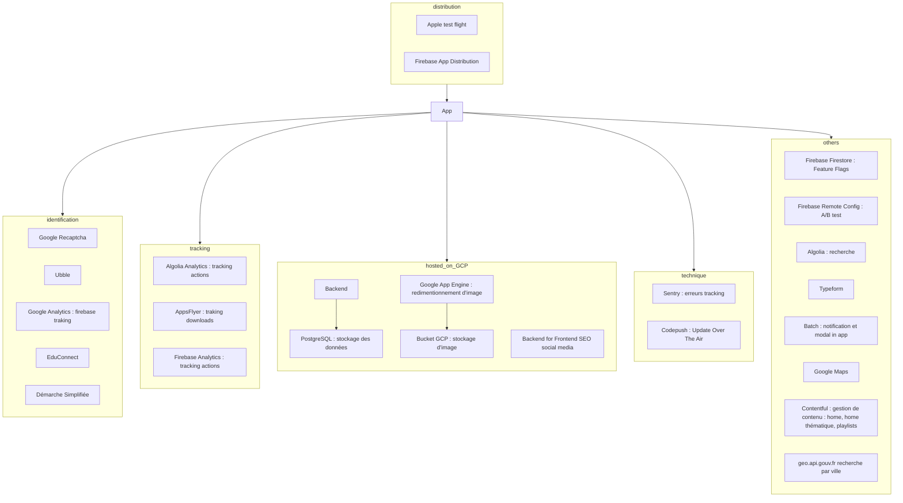
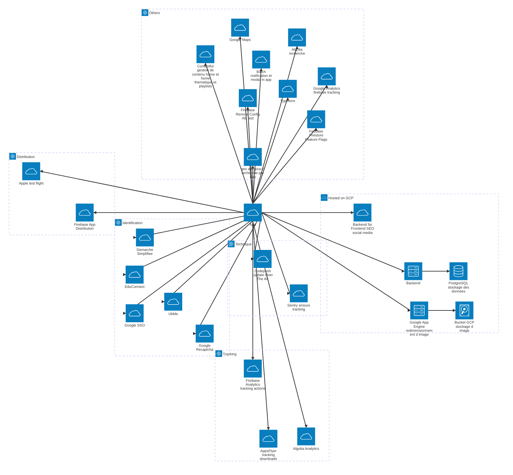

# Input / Output Externe

Graphique des appels réseaux vers des services externes

```mermaid
flowchart TB
  App["App"]
  subgraph identification
    Google_Recaptcha["Google Recaptcha"]
    Ubble["Ubble"]
    Google["Google SSO"]
    Educonnect["EduConnect"]
    DMS["Démarche Simplifiée"]
  end
  subgraph tracking
    Algolia_Analytics["Algolia Analytics : tracking actions"]
    AppsFlyer["AppsFlyer : traking downloads"]
    Firebase_Analytics["Firebase Analytics : tracking actions"]
  end
  subgraph hosted_on_GCP
    direction TB

    Backend["Backend"] --> Postgresql["PostgreSQL : stockage des données"]
    image_resize["Google App Engine : redimentionnement d'image"] --> bucket_image["Bucket GCP : stockage d'image"]
    Backend_for_Frontend["Backend for Frontend SEO social media"]
  end
  subgraph technique
    Sentry["Sentry : erreurs tracking"]
    Codepush["Codepush : Update Over The Air"]
  end
  subgraph distribution
    Apple["Apple test flight"]
    Firebase_App_Distribution["Firebase App Distribution"]
  end
  subgraph others
    Firebase_Firestore["Firebase Firestore : Feature Flags"]
    Firebase_Remote_Config["Firebase Remote Config : A/B test"]
    Google["Google Analytics : firebase traking"]
    Algolia["Algolia : recherche"]
    Typeform["Typeform"]
    Batch["Batch : notification et modal in app"]
    Google_Maps["Google Maps"]
    Contentful["Contentful : gestion de contenu : home, home thématique, playlists"]
    geo_api_gouv["geo.api.gouv.fr recherche par ville"]
  end
  distribution --> App
  App --> identification & tracking & hosted_on_GCP & technique & others
```

```mermaid
architecture-beta
  group technique(internet)[Technique]
  group distribution(internet)[Distribution]
  group identification(internet)[Identification]
  group tracking(internet)[Tracking]
  group hosted_on_GCP(cloud)[Hosted on GCP]
  group others(internet)[Others]

  service App(cloud)[App]

  service Google_Recaptcha(cloud)[Google Recaptcha] in identification
  service Ubble(cloud)[Ubble] in identification
  service Google(cloud)[Google SSO] in identification
  service Educonnect(cloud)[EduConnect] in identification
  service DMS(cloud)[Demarche Simplifiee] in identification

  App:R --> L:Google_Recaptcha
  App:R --> L:Ubble
  App:R --> L:Google
  App:R --> L:Educonnect
  App:R --> L:DMS

  service Algolia_Analytics(cloud)[Algolia Analytics] in tracking
  service AppsFlyer(cloud)[AppsFlyer tracking downloads] in tracking
  service Firebase_Analytics(cloud)[Firebase Analytics tracking actions] in tracking

  App:B --> T:Algolia_Analytics
  App:B --> T:AppsFlyer
  App:B --> T:Firebase_Analytics

  service Sentry(cloud)[Sentry erreurs tracking] in technique
  service Codepush(cloud)[Codepush Update Over The Air] in technique

  App:R --> L:Sentry
  App:R --> L:Codepush

  service Apple_TestFlight(cloud)[Apple test flight] in distribution
  service Firebase_App_Distribution(cloud)[Firebase App Distribution] in distribution

  App:L --> R:Apple_TestFlight
  App:L --> R:Firebase_App_Distribution

  service Firebase_Firestore(cloud)[Firebase Firestore Feature Flags] in others
  service Firebase_Remote_Config(cloud)[Firebase Remote Config AB test] in others
  service Google_Analytics(cloud)[Google Analytics firebase tracking] in others
  service Algolia(cloud)[Algolia recherche] in others
  service typeform(cloud)[Typeform] in others
  service batch(cloud)[Batch notification et modal in app] in others
  service Google_Maps(cloud)[Google Maps] in others
  service Contentful(cloud)[Contentful gestion de contenu home et home thematique et playlists] in others
  service geo_api_gouv(cloud)[geo api gouv fr recherche par ville] in others

  App:T --> B:Firebase_Firestore
  App:T --> B:Firebase_Remote_Config
  App:T --> B:Google_Analytics
  App:T --> B:Algolia
  App:T --> B:typeform
  App:T --> B:batch
  App:T --> B:Google_Maps
  App:T --> B:Contentful
  App:T --> B:geo_api_gouv

  service image_resize(server)[Google App Engine redimensionnement d image] in hosted_on_GCP
  service bucket_image(disk)[Bucket GCP stockage d image] in hosted_on_GCP
  App:R --> L:image_resize
  image_resize:R --> L:bucket_image

  service backend(server)[Backend] in hosted_on_GCP
  service Postgresql(database)[PostgreSQL stockage des donnees] in hosted_on_GCP

  App:R --> L:backend
  backend:R --> L:Postgresql

  service bff(cloud)[Backend for Frontend SEO social media] in hosted_on_GCP
  App:R --> L:bff
```
