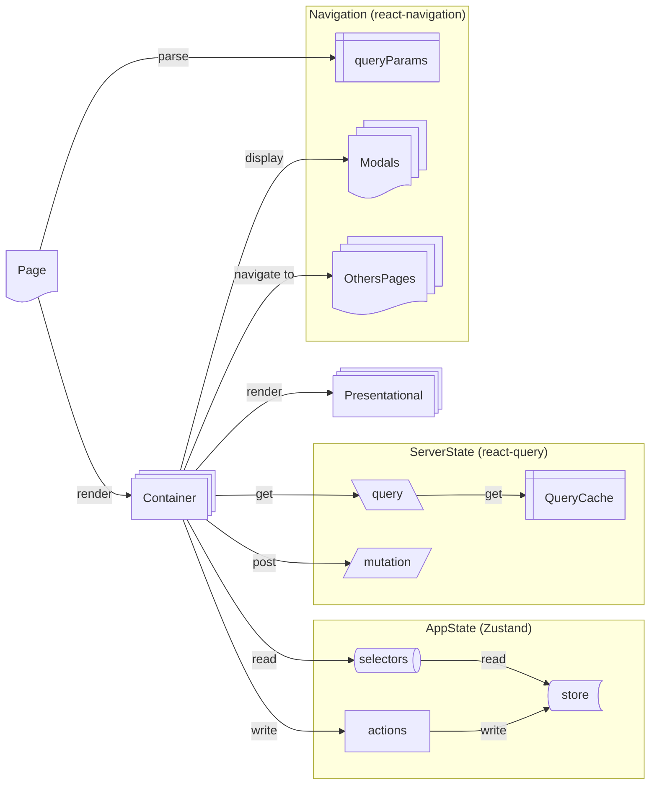

# Principes de l’architecture

## Introduction

Ce document a pour vocation de définir une architecture moderne et évolutive pour l'application native Pass Culture, alignée avec notre **Vision Tribe 2025** et les besoins produit croissants.

Avec une codebase de plus de 4 ans et l'évolution rapide de l'écosystème React Native, nous devons adapter notre architecture pour répondre aux nouveaux défis : **performance < 2s**, **accessibilité RGAA**, **autonomie des squads**, et **gestion responsable des ressources**.

L'objectif est d'établir des principes consensuels et éprouvés qui guident nos décisions techniques tout en servant notre mission : **faciliter l'accès à la culture pour tous**.

## Pourquoi une architecture ?

### Enjeux métier Pass Culture

Une architecture bien conçue répond directement aux besoins de notre service public culturel :

- **Scalabilité utilisateurs** : Supporter la croissance et diversification des publics (15-20 ans → tous âges)
- **Fiabilité critique** : Assurer un service stable pour l'accès à la culture (crash rate <0.1%)
- **Performance inclusive** : Temps de chargement < 2s sur tous appareils et réseaux
- **Maintenance efficace** : Réduire le coût de développement pour maximiser l'investissement dans les fonctionnalités

### Fondamentaux architecturaux logiciels

- **Séparation des responsabilités** : Chaque composant a un rôle unique et bien défini
- **Modularité** : Faciliter les évolutions sans impact en cascade, éventuellement aligné avec les périmètres de squads
- **Testabilité** : Permettre la validation comportementale sans couplage à l'implémentation, le plus proche du comportement de l’utilisateur
- **Prévisibilité** : Les développeurs savent intuitivement où placer et trouver le code
- **Évolutivité** : L'architecture grandit avec les besoins sans refonte majeure

## Qu'est-ce qu'une bonne architecture ?

### Critères de qualité pour Pass Culture

#### Autonomie des équipes

L'architecture doit permettre aux **3 squads** de développer en parallèle sans blocages :

- Modules découplés avec interfaces claires
- Dépendances explicites et minimales
- Standards partagés pour la cohérence

#### Prédictibilité du développement

Un développeur, quel que soit son niveau, doit savoir instinctivement :

- Où créer un nouveau composant selon sa responsabilité
- Comment accéder aux données (locales vs serveur)
- Quels patterns utiliser pour les cas courants

#### Robustesse en production

- **Environnement de test stable** : Un test simple doit toujours fonctionner
- **Contrôle des dépendances externes** : Isolation via mocks ou injection
- **Gestion d'erreur cohérente** : Comportement prévisible en cas d'échec
- **Monitoring intégré** : Visibilité sur la santé applicative (performances brutes, accessibilité, …)

# Les principes

## Vue d'ensemble

Notre architecture moderne repose sur **7 principes fondamentaux** qui garantissent la **modularité**, la **séparation des responsabilités**, et l'**optimisation des performances** tout en respectant les standards actuels de React Native et surtout les contraintes du service public :

1. **Structure modulaire par fonctionnalités** avec colocation des éléments liés (feature design)
2. **Gestion d'état spécialisée** selon la nature des données (serveur/local)
3. **Séparation UI/Logique/Navigation** pour une testabilité optimale (pattern MVC)
4. **Injection de dépendances** via Context pour la flexibilité
5. **Logiques portées par le backend** pour simplifier et sécuriser
6. **Standards qualité intégrés** avec TypeScript et tests automatisés
7. **Performance et accessibilité** dès la conception



## 1. Structure modulaire par fonctionnalités

### Pain points adressés

- **✅ 153 fichiers >200 lignes** : la colocation réduit la charge cognitive et facilite la navigation, même si les 200 lignes sont assez faibles au regard de certains composants.
- **✅ 97 commits context/provider** : une structure plus claire évite des modifications dispersées
- **✅ Maintenance burden** : des modules autonomes facilitent les évolutions et le debug

* **Responsabilité** : (continuer d’) organiser le code par domaine métier plutôt que par type technique
* **Colocation** : Regrouper composants, logique, tests et styles d'une même fonctionnalité
* **Utilisation typique** : Chaque feature (search, profile, offers) est autonome et testable isolément
* **Exemple** :

```txt
src/features/search/
  ├── pages/SearchPage.tsx
  ├── containers/SearchContainer.tsx
  ├── components/SearchFilters.tsx
  ├── queries/useSearchQuery.ts
  ├── stores/searchStore.ts
  ├── selectors/searchSelector.ts
  ├── fictures/searchFictures.ts
  ├── constants.ts
  ├── types.ts
  └── __tests__/
```

## 2. Gestion d'état spécialisée avec React Query et Zustand

### Pain points adressés

- **✅ 28 createContext identifiés** : React Query + Zustand remplacent la prolifération de contexts
- **✅ 22 providers actifs App.tsx** : État serveur/local séparé pour réduire drastiquement les providers
- **✅ Performance P95 ~4s** : Cache intelligent et re-renders optimisés pour améliorer les temps de chargement

#### React Query pour l'état serveur

* **Responsabilité** : Gérer cache, synchronisation, et états de chargement des données distantes
* **Colocation** : Queries dans le dossier `queries/` de chaque feature
* **Utilisation typique** : API calls, cache automatique, revalidation en arrière-plan

**Sélecteurs pour éviter les re-renders :**

Un sélecteur permet d’encapsuler la logique de retrait d’une valeur spécifique d’un state (une dérivée) pour améliorer les performances.

```tsx
// ✅ Bon pattern avec sélecteur
const selectArtistsNb = (artists: Artists) => artists.length

const ArtistContainer = () => {
  const { data: artistsNb } = useArtistsQuery({ select: selectArtistsNb })
  return <Text>{artistsNb}</Text>
}
```

**Contrat de query complet :**

```ts
// ✅ Retourner l'intégralité de la query
const useArtistsQuery = () => useQuery({ queryFn: fetchArtists, queryKey: ['artists'] })
```

**Gestion d'état déclarative avec Suspense :**

https://react.dev/reference/react/Suspense

https://react.dev/reference/react/Component#catching-rendering-errors-with-an-error-boundary

```jsx
// Au niveau navigation - erreurs dures
<ErrorBoundary fallback={<PageNotFound />}>
  <Suspense fallback={<LoadingPage />}>
    <SomePage />
  </Suspense>
</ErrorBoundary>

// Au niveau container - erreurs souples
<ErrorBoundary fallback={null}>
  <Suspense fallback={<LoadingContainer />}>
    <OptionalContainer />
  </Suspense>
</ErrorBoundary>
```

#### Zustand pour l'état local

* **Responsabilité** : Gérer l'état applicatif local (UI, préférences, navigation)
* **Colocation** : Stores dans `stores/` par domaine métier
* **Utilisation typique** : Éviter le prop drilling et les Context pour l'état

```ts
interface UserState {
  preferences: UserPreferences
  setPreferences: (prefs: UserPreferences) => void
}

export const useUserStore = create<UserState>((set) => ({
  preferences: defaultPreferences,
  setPreferences: (preferences) => set({ preferences }),
}))
```

## 3. Séparation des responsabilités : Pages, Containers, Components

### Pain points adressés

- **✅ Complexité cognitive SonarCloud de 58** : Séparation claire des responsabilités pour réduire la complexité
- **✅ Test environment instable** : Composants découplés de la logique pour faciliter les tests isolés
- **✅ 153 fichiers >200 lignes** : Composants plus petits et focalisés

#### Pages : Navigation et paramètres

* **Responsabilité** : Accéder aux paramètres de navigation et orchestrer les containers
* **Colocation** : Dans `src/features/<feature>/pages/`
* **Utilisation typique** : Point d'entrée d'un écran avec ses paramètres de route

```tsx
const ArtistsPage: FunctionComponent = () => {
  const route = useRoute<UseRouteType<'Artists'>>()
  return (
    <ArtistContainer artistId={route.params.artistId} />
  )
}
```

#### Containers : Données et logique métier

* **Responsabilité** : Gérer les données pour les composants enfants : consommer les hooks, gérer l'état et en définitive orchestrer les composants visuels
* **Colocation** : Dans `src/features/<feature>/containers/`
* **Utilisation typique** : Interface entre les données et l'affichage

```tsx
type Props = { artistId: string }

const ArtistsContainer: FunctionComponent<Props> = ({ artistId }) => {
  const { data: artist } = useArtistQuery(artistId)
  const onPress = () => analytics.logConsultOffer()

  return (
    <ArtistCard 
      name={artist.name}
      imageURL={artist.image}
      onPress={onPress}
    />
  )
}
```

#### Components : UI pure et réutilisable

* **Responsabilité** : Affichage uniquement, sans logique métier ni effets de bord
* **Colocation** : Dans `src/features/<feature>/components/` ou `src/shared/ui/`
* **Utilisation typique** : Composants réutilisables testables en isolation

```tsx
type Props = {
  name: string
  imageURL: string
  onPress: () => void
}

const ArtistCard: FunctionComponent<Props> = ({ name, imageURL, onPress }) => {
  return (
    <Pressable onPress={onPress}>
      <Image source={{ uri: imageURL }} />
      <Text>{name}</Text>
    </Pressable>
  )
}
```

**Principe anti-couplage API :**

```tsx
// ❌ Props couplées à l'API
type Props = { artist: ArtistResponse | null }

// ✅ Props découplées
type Props = { artistName: string; artistImageURL: string }
```

## 4. Context API pour l'injection de dépendances

L’injection de dépendance facilite la testabilité et l’évolutivité du système.

### Pain points adressés

- **✅ 28 contextes = maintenance nightmare** : Context réservé aux services (les services sont les dépendances àinjecter), pas à l'état
- **✅ Test environment instable** : Injection pour faciliter les mocks et les tests
- **✅ Éviter re-renders Context** : Plus d'état dans Context = plus de problèmes performance via les re-renders

* **Responsabilité** : Fournir des services et des abstractions, et ne pas gérer l'état
* **Colocation** : Dans `src/shared/providers/` pour les services transversaux
* **Utilisation typique** : Injection de services, configuration, thème

```tsx
// ✅ 
const UserServiceContext = createContext<UserService | null>(null)

export const UserProvider = ({ children }: { children: ReactNode }) => {
  const userService = useMemo(() => new UserService(), [])
  return (
    <UserServiceContext.Provider value={userService}>
      {children}
    </UserServiceContext.Provider>
  )
}

// ❌ Anti-pattern : Context comme store global
const UserStateContext = createContext({
  user: null,
  setUser: () => {},
  isLoading: false,
  setIsLoading: () => {},
  error: null,
  setError: () => {},
  preferences: {},
  setPreferences: () => {}
})

export const UserProvider = ({ children }) => {
  const [user, setUser] = useState(null)
  const [isLoading, setIsLoading] = useState(false)
  const [error, setError] = useState(null)
  const [preferences, setPreferences] = useState({})

  // Chaque changement re-render tous les enfants
  return (
    <UserStateContext.Provider 
      value={{ user, setUser, isLoading, setIsLoading, error, setError, preferences, setPreferences }}
    >
      {children}
    </UserStateContext.Provider>
  )
}

// ❌ Anti-pattern : Service recréé sans memoization
export const ApiProvider = ({ children }) => {
  // Nouvelle instance à chaque render = re-render cascade
  const apiService = new ApiService()
  const analyticsService = new AnalyticsService()
  
  return (
    <ApiContext.Provider value={{ apiService, analyticsService }}>
      {children}
    </ApiContext.Provider>
  )
}
```

## 5. Logiques portées par le backend

### Pain points adressés

- **✅ Complexité frontend excessive** : Calculs métier côté serveur pour réduire la complexité côté mobile et l’unicité des règles métier, voire le partage avec Pro…
- **✅ Performance P95 ~4s** : Données pré-formatées pour réduire les temps de traitement
- **✅ Bundle Android 18.7MB/iOS 33.8MB** : Moins de logique = moins de code = bundle plus petit

* **Responsabilité** : Déplacer la complexité métier côté serveur pour simplifier le frontend react
* **Colocation** : API endpoints dédiés avec données pré-formatées pour l'affichage
* **Utilisation typique** : Calculs complexes, règles métier, formatage données

**Avantages architecturaux :**

- **Testabilité améliorée** : Logique métier peut être testée sans couplage avec l’UI
- **Performance optimisée** : Calculs côté serveur, cache de données pré-calculées, données optimisées pour leur consommation côté mobile
- **Cohérence garantie** : Une seule source de vérité pour les règles métier
- **Évolutivité** : Modifications de règles métier sans redéploiement mobile

```tsx
// ❌ Calcul côté frontend
const useOfferPriority = (user: User, offers: Offer[]) => {
  return useMemo(() => {
    return offers.map(offer => ({
      ...offer,
      priority: calculatePriority(user.age, user.preferences, offer.category)
    }))
  }, [user, offers])
}

// ✅ Données pré-calculées par le backend
const usePersonalizedOffers = (userId: string) => {
  return useQuery({
    queryKey: ['offers', 'personalized', userId],
    queryFn: () => fetchPersonalizedOffers(userId) // API retourne offers avec priority
  })
}
```

## 6. Tests unitaires et isolation du système à tester

### Pain points adressés

- **✅ Test environment instable** : Isolation des dépendances pour garantir des tests fiables
- **✅ 97 commits context/provider** : Tests comportementaux qui résistent aux refactors
- **✅ Complexité maintenance** : Tests focalisés sur comportements vs implémentation (trophé de test)

* **Responsabilité** : Tester les comportements sans couplage à l'implémentation (mais à l’utilisateur)
* **Colocation** : Tests à côté du code testé dans chaque feature
* **Utilisation typique** : Isolation des dépendances externes, tests de comportement

**Test environment stable :**

```tsx
// ✅ Ce test doit toujours fonctionner
render(<ComplexComponent />)
expect(true).toBeTruthy()
```

```tsx
// ✅ Bon pattern : Test du comportement utilisateur
const ArtistContainer = () => {
  const { data: artist, isLoading } = useArtistQuery()
  
  if (isLoading) return <Loading />
  return <ArtistCard name={artist.name} />
}

// Test focalisé sur l'expérience utilisateur
test('should show loading then artist name', async () => {
  // Setup: API retourne des données réelles via MSW
  server.use(
    rest.get('/api/artists/123', (req, res, ctx) =>
      res(ctx.json({ name: 'Real Artist' }))
    )
  )

  render(<ArtistContainer artistId="123" />)
  
  // Comportement: utilisateur voit loading puis contenu
  expect(screen.getByText('Chargement...')).toBeInTheDocument()
  await waitFor(() => {
    expect(screen.getByText('Real Artist')).toBeInTheDocument()
  })
})

// ✅ Bon pattern : Mock les services externes, pas nos hooks
beforeEach(() => {
  // Mock la librairie externe, pas notre logique
  jest.mock('algoliasearch', () => ({
    search: jest.fn().mockResolvedValue({
      hits: [{ name: 'Artist from Algolia' }]
    })
  }))
})

test('should display search results from API', async () => {
  render(<SearchContainer query="artist" />)
  
  // Notre useSearchQuery utilise la vraie logique avec Algolia mocké
  await waitFor(() => {
    expect(screen.getByText('Artist from Algolia')).toBeInTheDocument()
  })
})
```

**Règles d'isolation :**

- Injecter un service de test (ou mocker) les librairies externes (`algoliasearch`), pas nos hooks
- Mocker le backend via MSW, pas les appels individuels
- Tester les comportements utilisateur, pas l'implémentation

### Anti-patterns à éviter pour les Tests

```tsx
// ❌ Anti-pattern : Test fragile couplé aux détails internes
const ArtistContainer = () => {
  const [loading, setLoading] = useState(false)
  const [data, setData] = useState(null)
  
  useEffect(() => {
    setLoading(true)
    fetchArtist().then(setData).finally(() => setLoading(false))
  }, [])
  
  return loading ? <Loading /> : <ArtistCard data={data} />
}

// Test cassant à chaque refactor
test('should set loading to true then false', () => {
  const { rerender } = render(<ArtistContainer />)
  expect(mockSetLoading).toHaveBeenCalledWith(true)
  expect(mockSetLoading).toHaveBeenCalledWith(false)
})

// ❌ Anti-pattern : Mock nos propres hooks = masque les régressions
test('should display artist name', () => {
  jest.mock('./useArtistQuery', () => ({
    useArtistQuery: () => ({ data: { name: 'Fake Artist' } })
  }))
  
  render(<ArtistContainer />)
  expect(screen.getByText('Fake Artist')).toBeInTheDocument()
})

// Si useArtistQuery casse, le test passe toujours
```

**Problèmes générés :**

- Tests cassent à chaque refactor (couplage/dépendance à l’implémentation)
- Fausse confiance (mocks cachent les vrais bugs)
- Maintenance test = 2x temps développement feature
- Environment instable = CI/CD non fiable

## 7. Performance et accessibilité intégrées

### Pain points adressés

- **✅ Bundle Android 18.7MB → objectif <15MB** : Architecture optimisée pour réduire le bundle
- **✅ Performance P95 ~4s → objectif <2s** : Patterns optimisés pour améliorer le temps de chargement et les performances d’affichages générales
- **✅ Accessibilité manquante** : Standards RGAA intégrés par le design, elle est intégrée dès la conception de l'architecture, pas ajoutée après coup

* **Responsabilité** : Respecter les objectifs Vision 2025 par notre design architectural
* **Colocation** : Standards appliqués dans chaque composant et feature
* **Utilisation typique** : RGAA AA, performance <2s, bundle <15MB android

**Composition > props drilling :**

```tsx
// ✅ Composition simple et performance
const Container: FunctionComponent<{ subtitle: string }> = ({ subtitle }) => {
  const onPress = useOnPress()
  const title = useGetTitle()

  return (
    <View>
      <Title>{title}</Title>
      {subtitle && <Text>{subtitle}</Text>}
      <Button title="action" onPress={onPress} />
    </View>
  )
}
```

### Anti-patterns à éviter pour Performance et Accessibilité

```tsx
// ❌ Anti-pattern : Props drilling + re-renders excessifs
const Container: FunctionComponent = () => {
  const [user, setUser] = useState()
  const [theme, setTheme] = useState()
  const [analytics, setAnalytics] = useState()
  
  return (
    <ArtistSection 
      user={user} 
      theme={theme} 
      analytics={analytics}
      onUserUpdate={setUser}
      onThemeChange={setTheme}
    />
  )
}

const ArtistSection = ({ user, theme, analytics, onUserUpdate, onThemeChange }) => {
  return (
    <ArtistCard 
      user={user}
      theme={theme} 
      analytics={analytics}
      onUserUpdate={onUserUpdate}
      onThemeChange={onThemeChange}
    />
  )
}

// Chaque changement user/theme re-render toute la hiérarchie

// ❌ Anti-pattern : Accessibilité comme afterthought
const OfferCard = ({ title, price }) => {
  return (
    <Pressable onPress={handlePress}>
      <Image source={offerImage} />
      <Text>{title}</Text>
      <Text>{price}€</Text>
      {/* Pas de labels, pas de roles, pas de hints */}
    </Pressable>
  )
}
```

**Problèmes générés :**

- Performance dégradée par re-renders inutiles
- Bundle alourdi par props drilling
- Accessibilité impossible à rattraper sans refactor complet
- Maintenance complexifiée par couplages

# Standards techniques et outils

## TypeScript strict

- Interfaces pour tous les props et types métier
- Pas de `any`, utilisation de types utilitaires
- Sécurité de type pour les appels API

## Conventions de nommage

- Queries : `useArtistsQuery.ts`
- Mutations : `useArtistsMutation.ts`
- Stores : `useArtistStore.ts`
- Components : `ArtistCard.tsx`

## Outils de qualité

- ESLint avec des règles strictes
- Tests avec React Native Testing Library
- Performance monitoring intégré, comparés, analysés
- Bundle analyzer pour optimisation
- Sonar pour analyser et suivre la qualité du code
