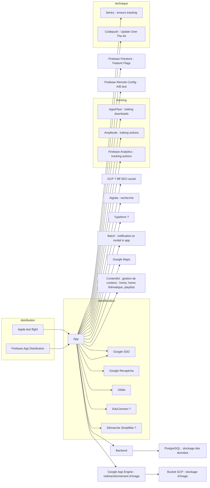

# Input / Output Externe

## Macro

```mermaid
flowchart LR
  App["App"]
  App --> Firebase_Firestore["Firebase Firestore : Feature Flags"]
  App --> Firebase_Remote_Config["Firebase Remote Config : A/B test"]
  App --> Backend["Backend"] --> Postgresql["PostgreSQL : stockage des données"]
  App --> Google["Google Analytics : firebase traking"]
  App --> image_resize["Google App Engine : redimentionnement d'image"] --> bucket_image["Bucket GCP : stockage d'image"]
  App --> GCP["GCP ? Bff SEO social"]
  App --> Algolia["Algolia : recherche"]
  App --> Typeform["Typeform ?"]
  App --> Batch["Batch : notification et modal in app"]
  App --> Google_Maps["Google Maps"]
  App --> Contentful["Contentful : gestion de contenu : home, home thématique, playlists"]
  subgraph identificiation
    App --> Google_Recaptcha["Google Recaptcha"]
    App --> Ubble["Ubble"]
    App --> Google["Google SSO"]
    App --> Educonnect["EduConnect ?"]
    App --> DMS["Démarche Simplifiée ?"]
  end
  subgraph tracking
    App --> AppsFlyer["AppsFlyer : traking downloads"]
    App --> Amplitude["Amplitude : traking actions"]
    App --> Firebase_Analytics["Firebase Analytics : tracking actions"]
  end
  subgraph technique
    App --> Sentry["Sentry : erreurs tracking"]
    App --> Codepush["Codepush : Update Over The Air"]
  end
  subgraph distribution
    Apple["Apple test flight"] --> App
    Firebase_App_Distribution["Firebase App Distribution"] --> App
  end
```

<!-- TODO refaire le diagram du dessus avec architecture-beta -->
