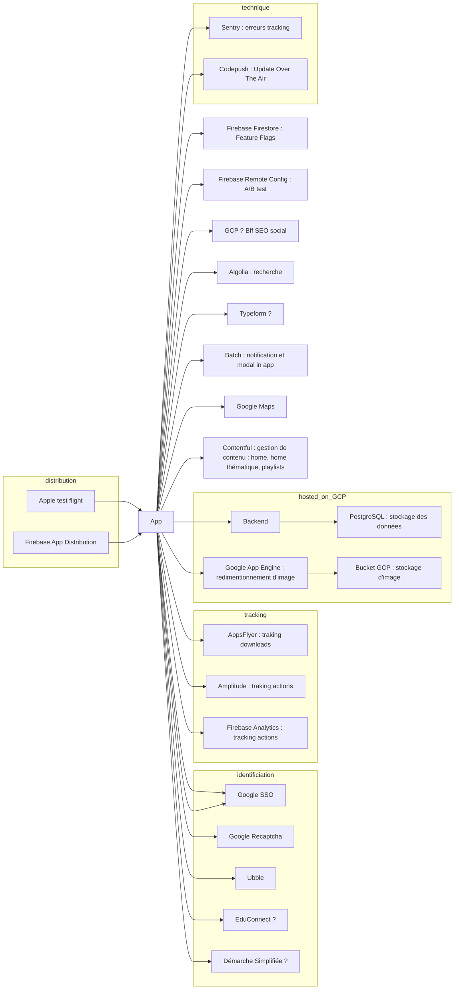
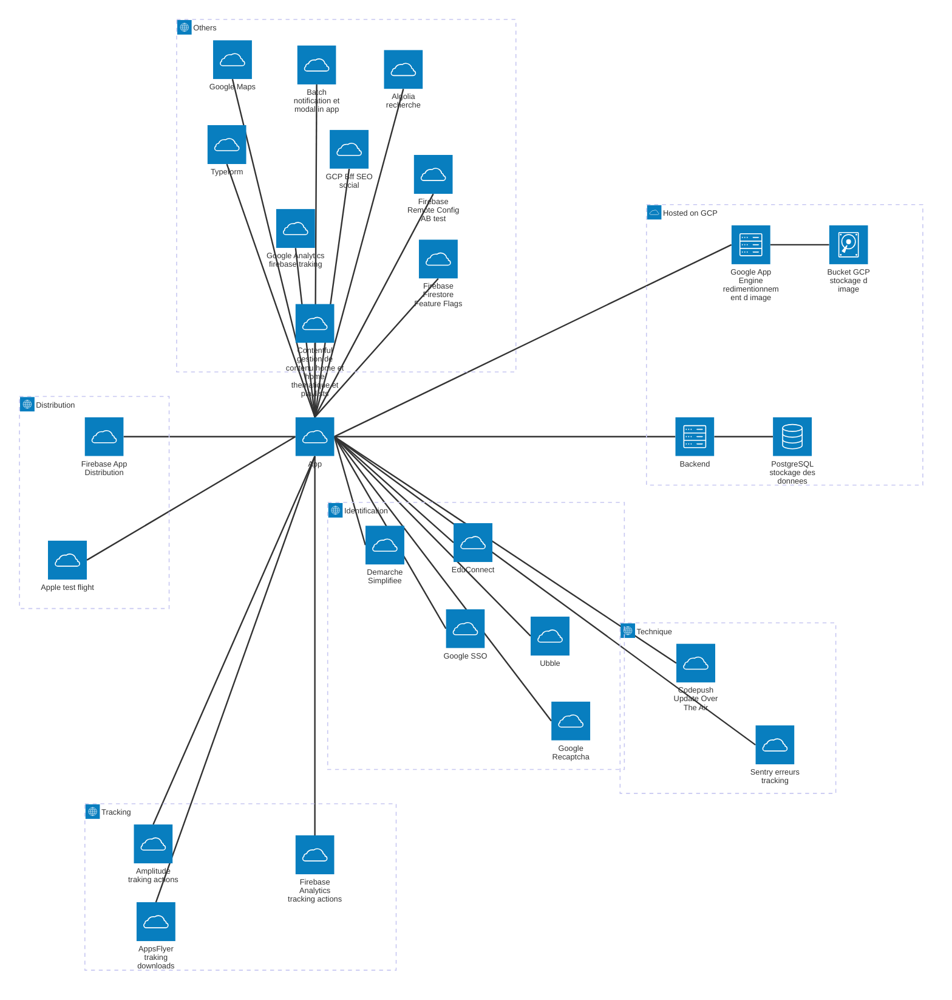

# Input / Output Externe

```mermaid
flowchart LR
  App["App"]
  Firebase_Firestore["Firebase Firestore : Feature Flags"]
  Firebase_Remote_Config["Firebase Remote Config : A/B test"]
  Google["Google Analytics : firebase traking"]
  GCP["GCP ? Bff SEO social"]
  Algolia["Algolia : recherche"]
  Typeform["Typeform ?"]
  Batch["Batch : notification et modal in app"]
  Google_Maps["Google Maps"]
  Contentful["Contentful : gestion de contenu : home, home thématique, playlists"]
  subgraph identificiation
    Google_Recaptcha["Google Recaptcha"]
    Ubble["Ubble"]
    Google["Google SSO"]
    Educonnect["EduConnect ?"]
    DMS["Démarche Simplifiée ?"]
  end
  subgraph tracking
    AppsFlyer["AppsFlyer : traking downloads"]
    Amplitude["Amplitude : traking actions"]
    Firebase_Analytics["Firebase Analytics : tracking actions"]
  end
  subgraph hosted_on_GCP
    Backend["Backend"] --> Postgresql["PostgreSQL : stockage des données"]
    image_resize["Google App Engine : redimentionnement d'image"] --> bucket_image["Bucket GCP : stockage d'image"]
  end
  subgraph technique
    Sentry["Sentry : erreurs tracking"]
    Codepush["Codepush : Update Over The Air"]
  end
  subgraph distribution
    Apple["Apple test flight"]
    Firebase_App_Distribution["Firebase App Distribution"]
  end
  Apple --> App
  Firebase_App_Distribution --> App
  App --> Firebase_Firestore
  App --> Firebase_Remote_Config
  App --> Backend
  App --> Google
  App --> image_resize
  App --> GCP
  App --> Algolia
  App --> Typeform
  App --> Batch
  App --> Google_Maps
  App --> Contentful
  App --> Google_Recaptcha
  App --> Ubble
  App --> Google
  App --> Educonnect
  App --> DMS
  App --> AppsFlyer
  App --> Amplitude
  App --> Firebase_Analytics
  App --> Sentry
  App --> Codepush
```

```mermaid
architecture-beta
  group technique(internet)[Technique]
  group distribution(internet)[Distribution]
  group identification(internet)[Identification]
  group tracking(internet)[Tracking]
  group hosted_on_GCP(cloud)[Hosted on GCP]
  group others(internet)[Others]

  service App(cloud)[App]

  service Google_Recaptcha(cloud)[Google Recaptcha] in identification
  service Ubble(cloud)[Ubble] in identification
  service Google(cloud)[Google SSO] in identification
  service Educonnect(cloud)[EduConnect] in identification %% ?
  service DMS(cloud)[Demarche Simplifiee] in identification %% ?

  App:R -- L:Google_Recaptcha
  App:R -- L:Ubble
  App:R -- L:Google
  App:R -- L:Educonnect
  App:R -- L:DMS

  service AppsFlyer(cloud)[AppsFlyer traking downloads] in tracking
  service Amplitude(cloud)[Amplitude traking actions] in tracking
  service Firebase_Analytics(cloud)[Firebase Analytics tracking actions] in tracking

  App:B -- T:AppsFlyer
  App:B -- T:Amplitude
  App:B -- T:Firebase_Analytics

  service Sentry(cloud)[Sentry erreurs tracking] in technique
  service Codepush(cloud)[Codepush Update Over The Air] in technique

  App:R -- L:Sentry
  App:R -- L:Codepush

  service Apple_TestFlight(cloud)[Apple test flight] in distribution
  service Firebase_App_Distribution(cloud)[Firebase App Distribution] in distribution

  App:L -- R:Apple_TestFlight
  App:L -- R:Firebase_App_Distribution

  service Firebase_Firestore(cloud)[Firebase Firestore Feature Flags] in others
  service Firebase_Remote_Config(cloud)[Firebase Remote Config AB test] in others
  service Google_Analytics(cloud)[Google Analytics firebase traking] in others
  service GCP(cloud)[GCP Bff SEO social] in others %% ?
  service Algolia(cloud)[Algolia recherche] in others
  service typeform(cloud)[Typeform] in others %% ?
  service batch(cloud)[Batch notification et modal in app] in others
  service Google_Maps(cloud)[Google Maps] in others
  service Contentful(cloud)[Contentful gestion de contenu home et home thematique et playlists] in others

  App:T -- B:Firebase_Firestore
  App:T -- B:Firebase_Remote_Config
  App:T -- B:Google_Analytics
  App:T -- B:GCP
  App:T -- B:Algolia
  App:T -- B:typeform
  App:T -- B:batch
  App:T -- B:Google_Maps
  App:T -- B:Contentful

  service image_resize(server)[Google App Engine redimentionnement d image] in hosted_on_GCP
  service bucket_image(disk)[Bucket GCP stockage d image] in hosted_on_GCP
  App:R -- L:image_resize
  image_resize:R -- L:bucket_image

  service backend(server)[Backend] in hosted_on_GCP
  service Postgresql(database)[PostgreSQL stockage des donnees] in hosted_on_GCP

  App:R -- L:backend
  backend:R -- L:Postgresql
```
