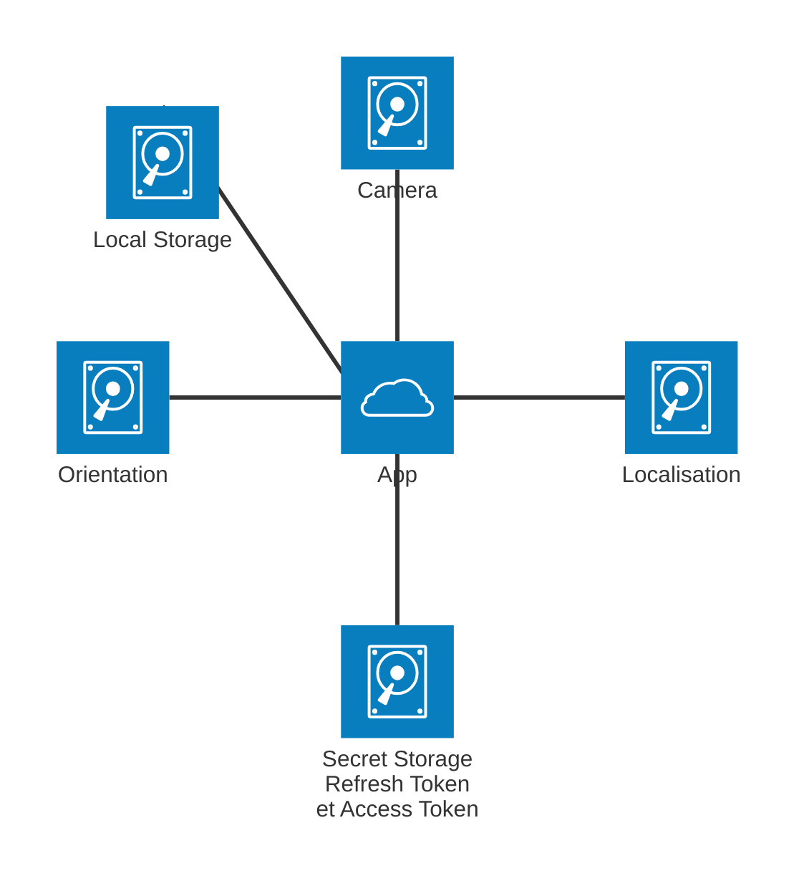

# Input / Output Local

```mermaid
architecture-beta
  service App(cloud)[App]

  service camera(disk)[Camera]
  service localisation(disk)[Localisation]
  service local_storage(disk)[Local Storage]
  service orientation(disk)[Orientation]
  service secret_storage(disk)[Secret Storage Refresh Token et Access Token]

  App:T -- B:camera
  App:R -- L:localisation
  App:L -- R:orientation
  App:B -- T:local_storage
  App:B -- T:secret_storage
```
