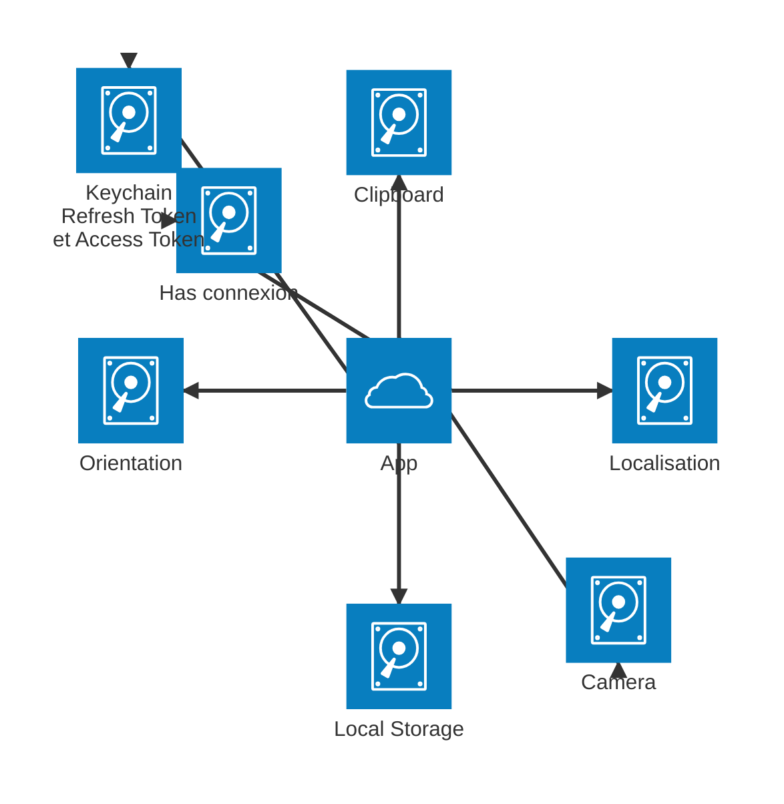

# Input / Output Local

```mermaid
architecture-beta
  service App(cloud)[App]

  service camera(disk)[Camera]
  service clipboard(disk)[Clipboard]
  service has_connexion(disk)[Has connexion]
  service keychain(disk)[Keychain Refresh Token et Access Token]
  service local_storage(disk)[Local Storage]
  service localisation(disk)[Localisation]
  service orientation(disk)[Orientation]

  App:T --> B:camera
  App:T --> B:clipboard
  App:R --> L:has_connexion
  App:B --> T:keychain
  App:B --> T:local_storage
  App:R --> L:localisation
  App:L --> R:orientation
```
