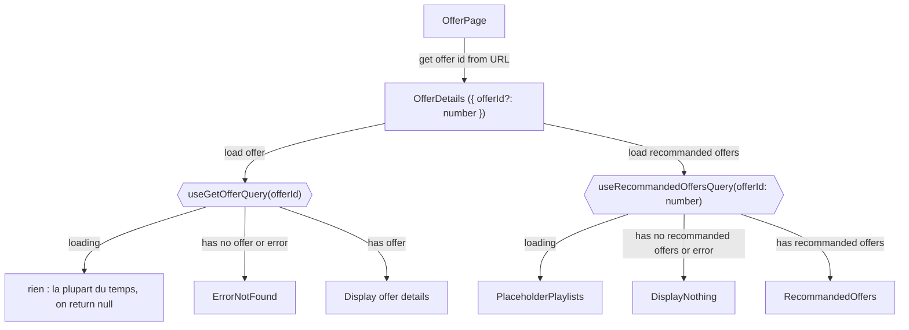
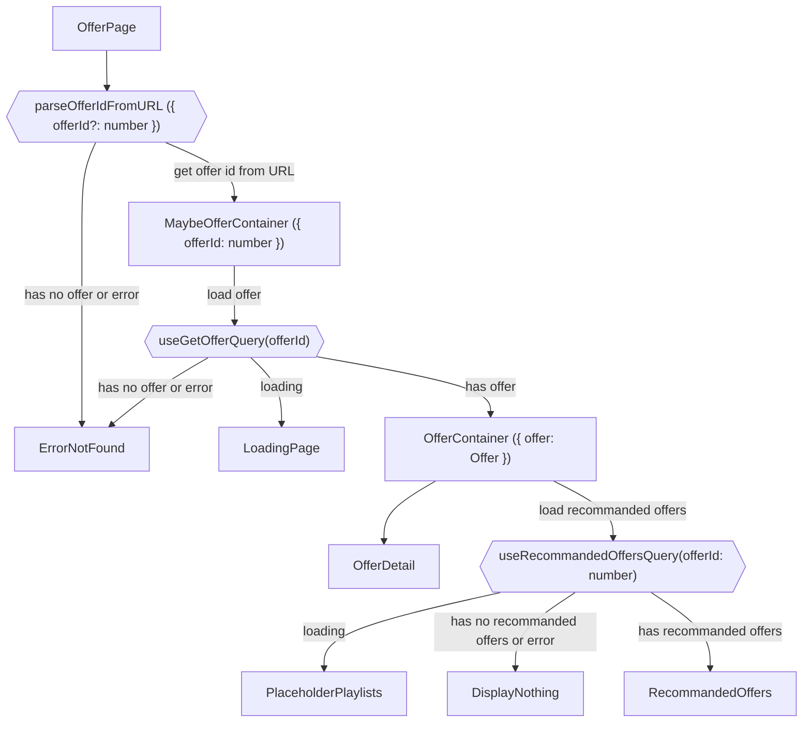
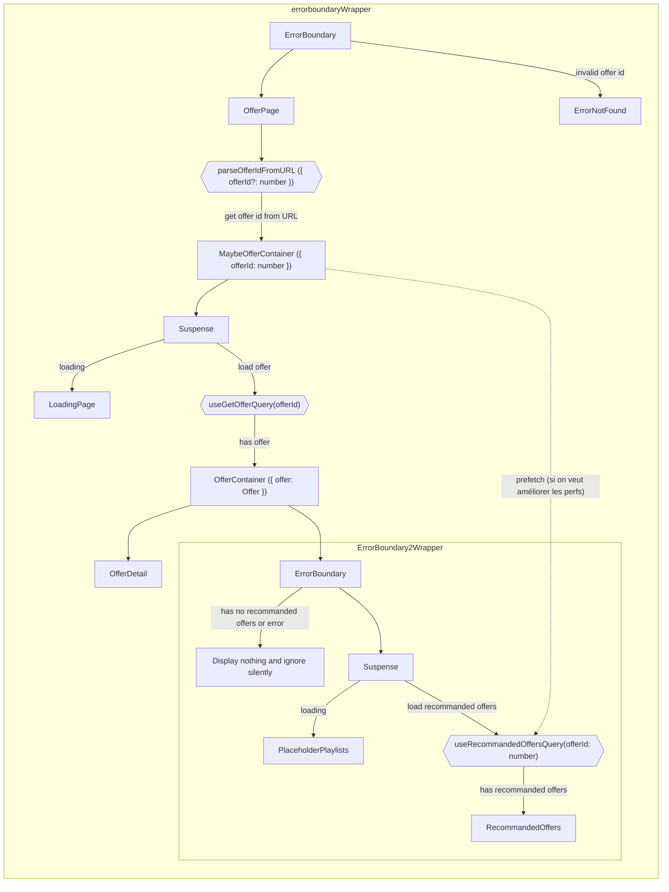
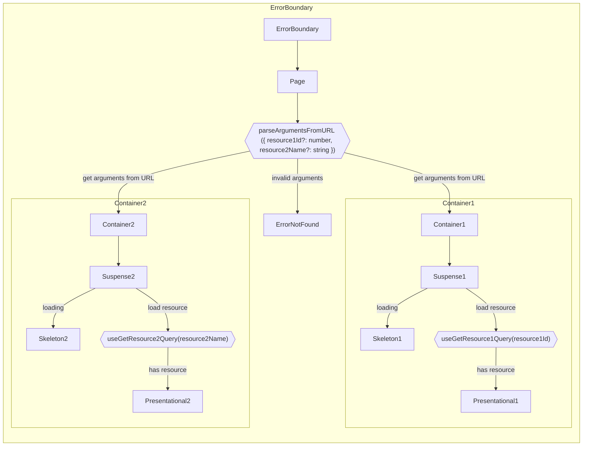
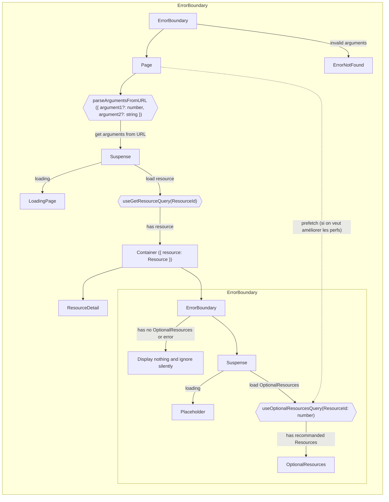

# Architecture Vision Cible

Exemple d'une page offre où on charge les données de l'offre puis on charge des offres recommandées associées

S'il n'y a pas d'offres recommandées ou s'il y a une erreur lors de leur chargement, on n'affiche rien

## Maintenant

Aujourd'hui, nos pages ressemblent +/- à ça

<small>Ce schéma ne représente pas réellement la page Offer actuelle mais représente les patterns qui apparaissent souvent</small>

## Intermédiaire

Découpage en

- Page
- Container
- Presentational Component

Pour plus d'information, [voir l'organisation des composants](./principes.md#lorganisation-des-composants)

Parfois une information détermine si on doit en charger une autre

-> découpage en sous container pour avoir un bon typage et éviter les `offer?.id` partout

## Archi cible

Avec `ErrorBoundary` et `Suspense`

Cold start

### Schéma généralisé

#### 2 données

Graphique montrant une page avec 2 données récupérées en parallèle

#### Donnée optionnelle

Graphique montrant une ressource principale nécessaire à la page et une ressource optionnelle

