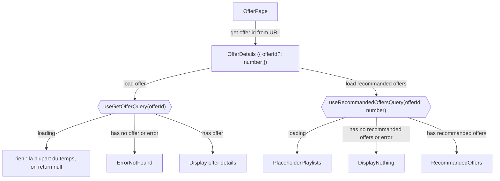
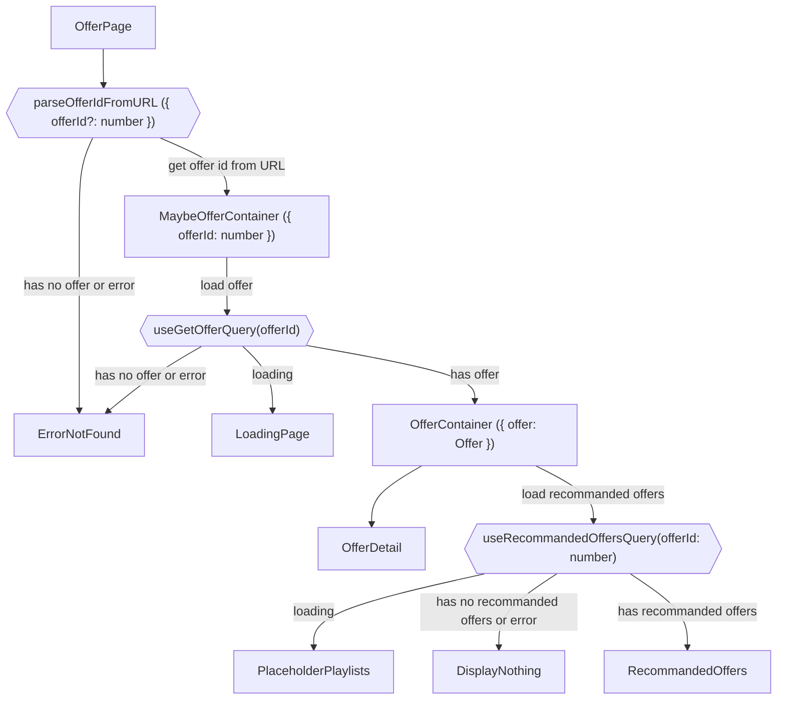
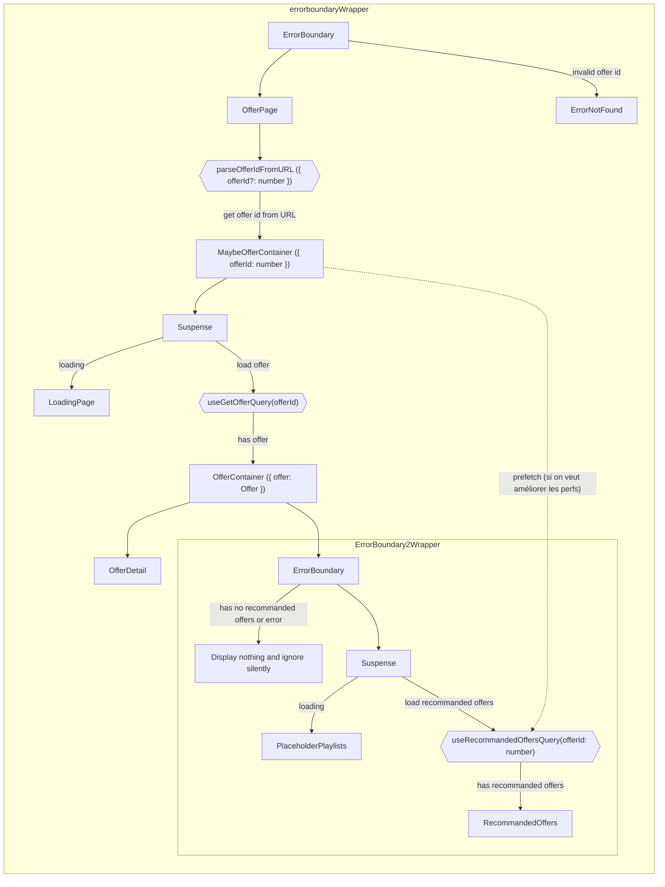

# Architecture Vision Cible

## Grossomodo maintenant

Aujourd'hui, nos pages ressemblent +/- à ça

##### Intermédiaire

Découpage en

- Page
- Container
- Dumb Component

Parfois une information détermine si on doit en charger une autre

-> découpage en sous container pour avoir un bon typage et éviter les `offer?.id` partout

##### Archi cible

Avec `ErrorBoundary` et `Suspense`

Cold start

