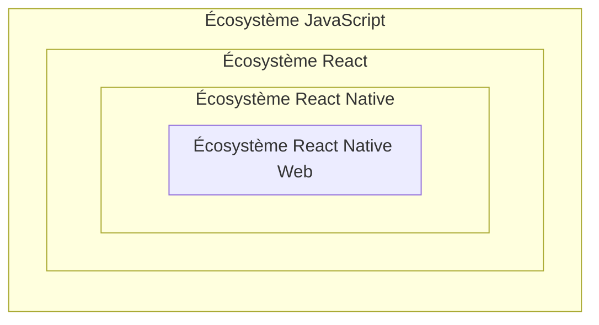

# Vision macro long terme

## Définition

Pour éviter de devoir redévelopper tout depuis zéro, nous utilisons du code écrit par des tiers.

Ces portions de code se concentrent sur la réalisation de tâche précise et générique (ex : afficher une date, afficher un calendrier...).

Pour fonctionner, notre application a besoin de ces portions de code, nous en sommes dépendant, on appelle ça des **dépendances** (aussi parfois appelé `bibliothèque`, `library`, `framework`).

## Constat

### Mise à jour de dépendances

Nous passons actuellement beaucoup de temps à mettre à jour des dépendances (React Native, React Native Web...).

La mise à jour des dépendances est difficile car il y a des problèmes en cascade qui implique de mettre à jour d'autres dépendances.

Chaque mise à jour de chaque dépendance entraîne des problèmes spécifiques, très difficilement anticipables, ce qui rend l'estimation du temps passé à faire une montée de version presque impossible.

Les mises à jour sont fastidieuses.

### Écosystème

Pour pouvoir partager le code entre Android et iOS nous utilisons React Native.

Pour pouvoir partager le code entre Android, iOS **et le web**, nous utilisons React Native **Web**.

Ce qui implique de choisir des dépendances qui soient compatibles avec React Native Web, ou de gérer des particularité au cas par cas pour faire des choses dédiées à Android et iOS et des choses dédiées au web.

#### Écosystème de niche

Cet écosystème est très de niche.



##### Choix

Les choix les plus populaires nous sont parfois inaccessibles car incompatible avec React Native Web et/ou React Native.

Il y a peu de choix.

Nous sommes contraints de :

1. Utiliser des dépendances peu éprouvées par la communauté
1. Utiliser des dépendances souvent peu / mal maintenues
1. Réinventer la roue

#### Développement

L'écosystème React Native évolue vite, l'écosystème web évolue bien plus vite.

Pour faire certains développements :

- il est parfois très difficile de le faire en restant compatible avec React Native
- il est parfois nécessaire de développer nous même des logiques complexes
- nous sommes parfois contraint de développer de la même manière qu'il y a 10 ans alors qu'entre temps les outils ont évoluées

### Fonctionnalité de l'appareil

Nous utilisons très peu de capteurs de l'appareil (caméra, bluetooth, micro, gyroscope ...).

Nous utilisons très peu de fonctionnalités propres aux applications natives.

### Déploiement

Nous devons déployer sur les stores, ce qui peut être long et contraignant.

## Besoins

### Accès aux droits

React Native nous impose d'abandonner le support des anciennes versions d'Android et iOS.

Nous avons besoin de conserver le site web pour un accès aux droits à un public plus large.

### Accessibilité

Un site web est par défaut accessible (les balises HTML sont conçus de manière accessible).

### pass pour tous

Pour étendre nos publics avec le projet du pass pour tous, nous pourrions vouloir mettre plus d'effort sur la partie web.

### Découvrabilité

Nous avons besoin d'une présence sur les stores (Google Play, Apple Store) pour pouvoir être découvert par nos jeunes.

## Recommandation

Il serait possible de se concentrer sur le développement sur la partie web (Progressive Web App).

Le site serait adapté à l'affichage mobile (Responsive Design).

Le site serait affiché dans l'application de manière relativement transparente pour l'utilisateur (`WebView`).

Nous pourrions transitionner lentement de manière transparente pour les utilisateurs.

## Conséquences

### Une plateforme principale à maintenir

La maintenance et l'évolution seraient facilitées : il y aura que le web à vérifier.

Android et iOS pourraient être vérifié d'une manière moins fréquente.

### Moins de dépendances

À terme, nous aurions moins de dépendances, car il resterait principalement les dépendances web (React DOM).

Notre dépendance à React Native Web serait supprimée.

Seul React Native et une petite sélection de dépendances liées à cet écosystème resterait.

#### Mise à jour facilitée

Sans l'écosystème React Native Web et avec une petite partie de l'écosystème React Native, les mises à jour de dépendance seraient plus faciles.

Nous passerons moins de temps à les faire, et on pourrait utiliser ce temps pour travailler sur d'autres sujets techniques de fond.

### Développement simplifié

Les possibilités de développement sur le web évoluent rapidement, il y a des choses qui deviennent facile à faire car les navigateurs web font de plus en plus de travail tout seul.

Exemple : `grid-template-areas` qui permettent de positionner les éléments graphiques de manière extrêmement simple ;
[exemple minimaliste](https://codepen.io/seyedi/full/bGoZjzX) : la disposition des différents éléments dans la page se fait simplement avec les lignes suivantes ; ce qui est bien plus simple, explicite et facile à faire que la manière dont on le ferait actuellement.

```css
grid-template-areas:
  'header header header'
  'left-sidebar main right-sidebar'
  'footer footer footer';
```

#### De nouvelles possibilités

Dans ces nombreuses évolutions, le web permet de faire des choses facilement qui auraient été extrêmement difficile à faire en React Native seul en étant compatible avec React Native Web.

Exemple : les `ViewTransition` qui permettent très facilement de faire une animation en passant d'une page à une autre ;
[exemple minimaliste](https://http203-playlist.netlify.app/) : quand on clique sur le lien, on change d'URL, on change de page, et il y a une transition pendant le changement de page.

##### Capteurs

Avec les nouvelles évolutions web, il est possibles d'accéder à de plus en plus de capteurs des appareils (ex : caméra, micro, bluetooth, géolocalisation ...).

Nos fonctionnalités seraient faisables en web uniquement.

Si on avait besoin de faire une fonctionnalité accessible uniquement depuis une app native, il serait toujours possible de le faire (injection de JS dans la `WebView` pour déléguer la fonction à l'app native).

### Déploiement Continu

Avec un site web, il serait possible de déployer plusieurs fois par jours très facilement.

Nous continuerons de déployer sur les stores de manière moins fréquente lorsque nous ferions les mises à jour React Native.
