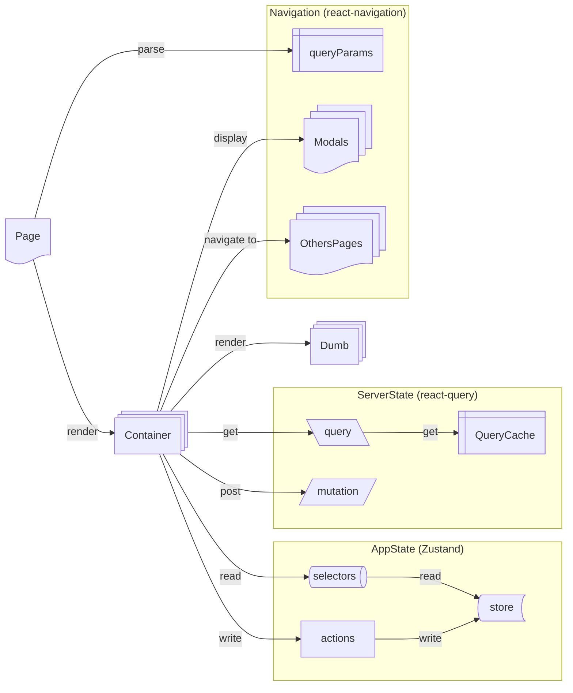
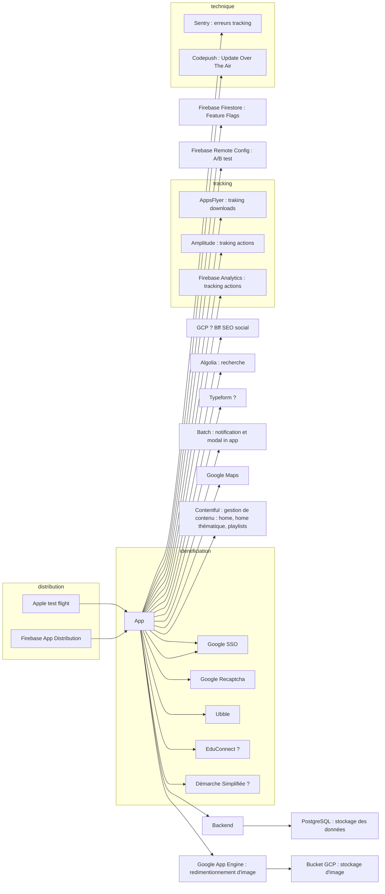
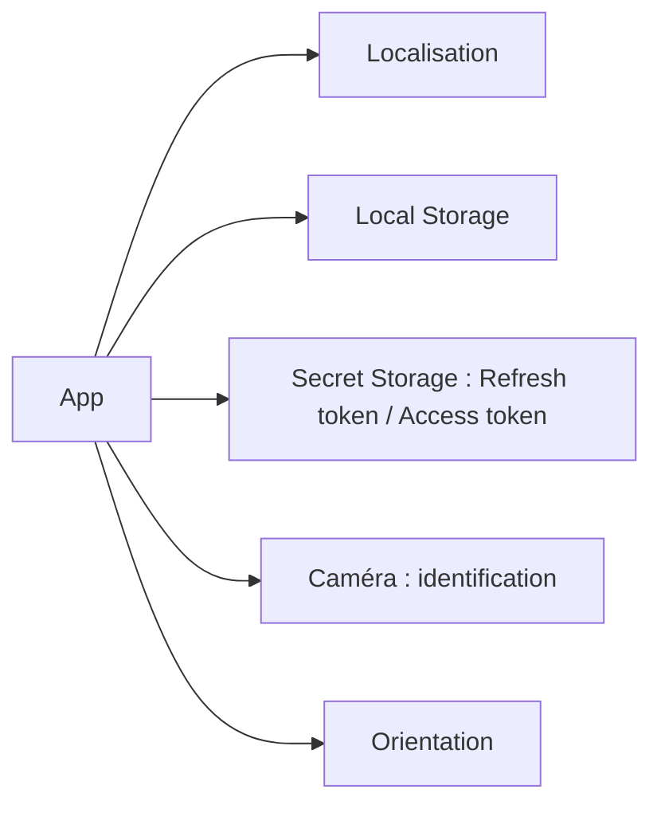
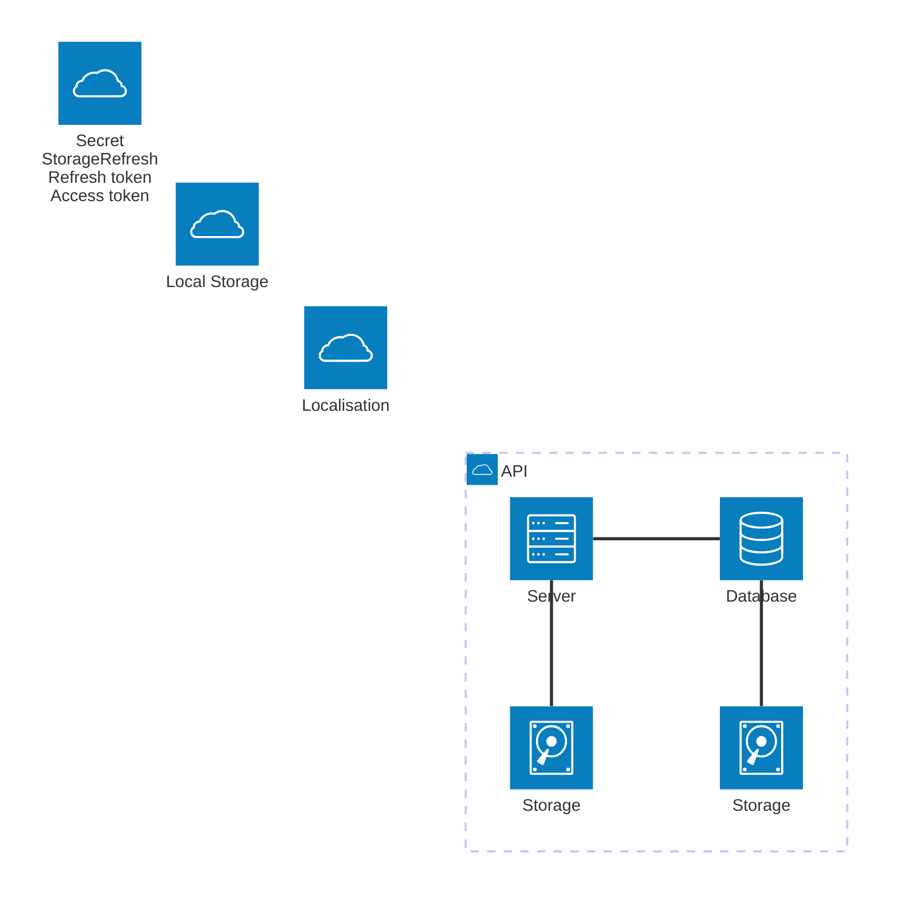
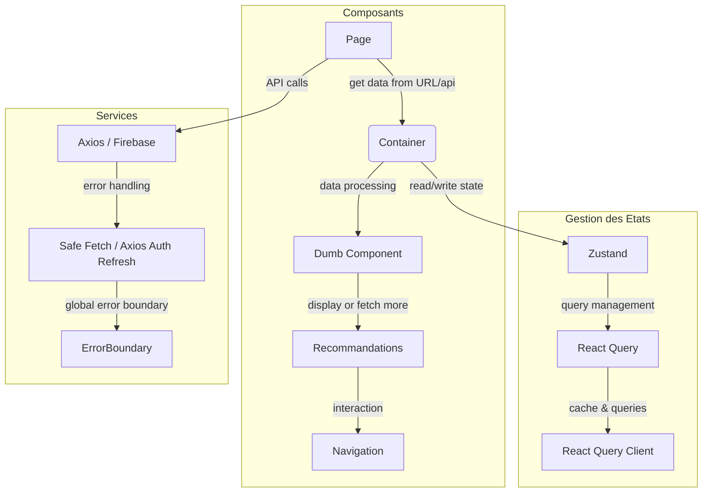

# Architecture

## Macro

```mermaid
flowchart LR
  subgraph AppState["AppState (Zustand)"]
    selectors@{ shape: das }
    actions
    store@{ shape: bow-rect }

    selectors -->|read| store
    actions -->|write| store
  end

  subgraph ServerState["ServerState (react-query)"]
    query@{ shape: lean-l }
    mutation@{ shape: lean-r }

    query -->|get| QueryCache@{ shape: win-pane }
  end

  subgraph Navigation["Navigation (react-navigation)"]
    queryParams@{ shape: win-pane }
    Modals@{ shape: processes }
    OthersPages@{ shape: processes }
  end

  Page@{ shape: doc }
  -->|render| Container@{ shape: processes }
  -->|render| Dumb@{ shape: processes }

  Page -->|parse| queryParams
  Container -->|read| selectors
  Container -->|write| actions
  Container -->|get| query
  Container -->|post| mutation
  Container -->|display| Modals@{ shape: docs }
  Container -->|navigate to| OthersPages@{ shape: docs }
```

```mermaid
flowchart LR
  App["App"]
  App --> Firebase_Firestore["Firebase Firestore : Feature Flags"]
  App --> Firebase_Remote_Config["Firebase Remote Config : A/B test"]
  App --> Backend["Backend"] --> Postgresql["PostgreSQL : stockage des données"]
  App --> Google["Google Analytics : firebase traking"]
  App --> image_resize["Google App Engine : redimentionnement d'image"] --> bucket_image["Bucket GCP : stockage d'image"]
  App --> GCP["GCP ? Bff SEO social"]
  App --> Algolia["Algolia : recherche"]
  App --> Typeform["Typeform ?"]
  App --> Batch["Batch : notification et modal in app"]
  App --> Google_Maps["Google Maps"]
  App --> Contentful["Contentful : gestion de contenu : home, home thématique, playlists"]
  subgraph identificiation
    App --> Google_Recaptcha["Google Recaptcha"]
    App --> Ubble["Ubble"]
    App --> Google["Google SSO"]
    App --> Educonnect["EduConnect ?"]
    App --> DMS["Démarche Simplifiée ?"]
  end
  subgraph tracking
    App --> AppsFlyer["AppsFlyer : traking downloads"]
    App --> Amplitude["Amplitude : traking actions"]
    App --> Firebase_Analytics["Firebase Analytics : tracking actions"]
  end
  subgraph technique
    App --> Sentry["Sentry : erreurs tracking"]
    App --> Codepush["Codepush : Update Over The Air"]
  end
  subgraph distribution
    Apple["Apple test flight"] --> App
    Firebase_App_Distribution["Firebase App Distribution"] --> App
  end
```

```mermaid
flowchart LR
  App --> Localisation["Localisation"]
  App --> local["Local Storage"]
  App --> Secret["Secret Storage : Refresh token / Access token"]
  App --> Caméra["Caméra : identification"]
  App --> Orientation["Orientation"]
```

```mermaid
architecture-beta
  group api(cloud)[API]

  service db(database)[Database] in api
  service disk1(disk)[Storage] in api
  service disk2(disk)[Storage] in api
  service server(server)[Server] in api

  db:L -- R:server
  disk1:T -- B:server
  disk2:T -- B:db
  service localisation(cloud)[Localisation]
  service local(cloud)[Local Storage]
  service secret(cloud)['Secret StorageRefresh Refresh token Access token']
  %% service caméra(cloud)["Caméra : identification"]
  %% service orientation(cloud)["Orientation"]
```

```mermaid
graph TD;
    subgraph "Composants"
        A[Page] -->|get data from URL/api| B(Container)
        B -->|data processing| C[Dumb Component]
        C -->|display or fetch more| D[Recommandations]
        D -->|interaction| E[Navigation]
    end

    subgraph "Gestion des Etats"
        B -->|read/write state| F[Zustand]
        F -->|query management| G[React Query]
        G -->|cache & queries| H[React Query Client]
    end

    subgraph "Services"
        A -->|API calls| I[Axios / Firebase]
        I -->|error handling| J[Safe Fetch / Axios Auth Refresh]
        J -->|global error boundary| K[ErrorBoundary]
    end
```
