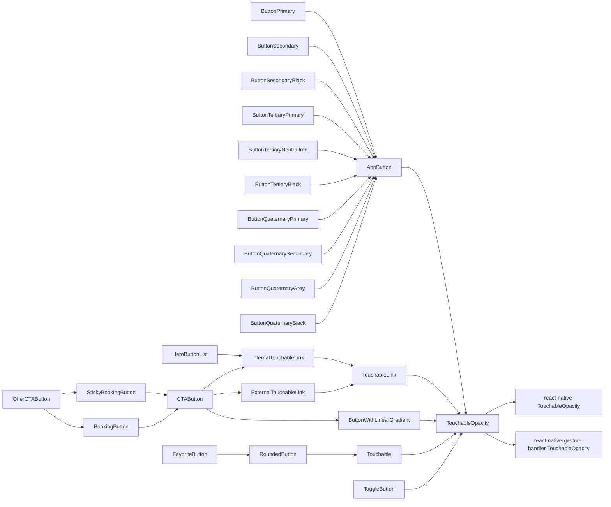

# Rapport d'Audit Technique – Projet pass Culture

## Table des matières

1.  [Introduction et Contexte](#1-introduction-et-contexte)
2.  [Méthodologie et Périmètre de l'Audit](#2-méthodologie-et-périmètre-de-laudit)
3.  [Synthèse des Observations et Constats](#3-synthèse-des-observations-et-constats)
    - [3.1 Architecture et Gestion de l'État](#31-architecture-et-gestion-de-létat)
    - [3.2 Performances et Expérience Utilisateur](#32-performances-et-expérience-utilisateur)
    - [3.3 Qualité du Code et Maintenabilité](#33-qualité-du-code-et-maintenabilité)
    - [3.4 Structure des Requêtes Réseau](#34-structure-des-requêtes-réseau)
    - [3.5 Tests et Fiabilité](#35-tests-et-fiabilité)
    - [3.6 Écosystème des Composants Boutons et Liens](#36-écosystème-des-composants-boutons-et-liens)
4.  [Recommandations et Priorisation](#4-recommandations-et-priorisation)
5.  [Plan d'Action Proposé](#5-plan-daction-proposé)
6.  [Annexes](#6-annexes)
    - [6.1 Annexe A : Complexité des Composants Bouton](#61-annexe-a--complexité-des-composants-bouton)
    - [6.2 Annexe B : Exemple de "Hook Hell" - `useCtaWordingAndAction`](#62-annexe-b--exemple-de-hook-hell---usectawordingandaction)
    - [6.3 Annexe C : Configuration React Query Problématique](#63-annexe-c--configuration-react-query-problématique)
    - [6.4 Annexe D : Liens vers les Fichiers Clés](#64-annexe-d--liens-vers-les-fichiers-clés)

---

## 1. Introduction et Contexte

Ce rapport présente les conclusions de l'audit technique mené sur l'application mobile `pass-culture-app-native`. L'objectif est d'identifier les axes d'amélioration structurels, de mettre en lumière les risques potentiels et de proposer des recommandations concrètes pour garantir la maintenabilité, la performance et la scalabilité du projet.

## 2. Méthodologie et Périmètre de l'Audit

L'audit s'est concentré sur une analyse ciblée du code source, en examinant plusieurs parcours utilisateurs clés :

- Chargement initial de l'application
- Navigation sur la page d'accueil
- Réalisation d'une recherche
- Réservation d'une offre

⚠️ **Exclusions :** Cet audit n'est pas exhaustif. Il se concentre sur certains points d'amélioration et n'inclut pas l'analyse du _Backend For Frontend_ (BFF).

## 3. Synthèse des Observations et Constats

### 3.1 Architecture et Gestion de l'État

#### Observations

- ⚠️ **Inflation de `Context` React :** L'application initialise plus de 20 `Contexts` React au démarrage. Cette approche, bien que simple à mettre en œuvre initialement, crée un couplage fort et des re-rendus en cascade qui dégradent les performances.

  - Mobile & Web
    - `ReactQueryClientProvider`
    - `ThemeWrapper`
    - `ThemeProvider`
    - `SafeAreaProvider`
    - `ErrorBoundary`
    - `SettingsWrapper`
    - `AuthWrapper`
    - `LocationWrapper`
    - `AccessibilityFiltersWrapper`
    - `FavoritesWrapper`
    - `SearchAnalyticsWrapper`
    - `SearchWrapper`
    - `SnackBarProvider`
    - `CulturalSurveyContextProvider`
    - `SubscriptionContextProvider`
    - `ScreenErrorProvider`
  - Mobile
    - `AnalyticsInitializer`
    - `NetInfoWrapper`
    - `FirestoreNetworkObserver`
    - `SplashScreenProvider`
    - `PushNotificationsWrapper`
    - `ShareAppWrapper`
    - `OfflineModeContainer`
  - Web
    - `SupportedBrowsersGate`
    - `GoogleOAuthProvider`
    - `AppWebHead`
    - `Suspense`

- ⚠️ **Source de Vérité Diffuse :** L'état de la recherche est un exemple parlant. Il est synchronisé manuellement entre les paramètres de l'URL et plusieurs `Contexts` via le hook `useSync.ts`, une source connue de bugs et de complexité.

- ⚠️ **Logique Frontend :** Des calculs coûteux, comme le mapping des sous-catégories dans `src/libs/subcategories/mappings.ts`, sont exécutés côté client à chaque rendu, alors que le serveur pourrait fournir ces données dans le format attendu.

#### Points de Vigilance

- **Risque de Performance :** L'usage intensif des `Contexts` peut provoquer des rafraîchissements inutiles et coûteux de l'interface, dégradant l'expérience utilisateur.
- **Maintenance Difficile :** La complexité de la synchronisation entre URL, `Contexts` et états locaux rend le code difficile à comprendre et à faire évoluer sans risque de régression.

### 3.2 Performances et Expérience Utilisateur

#### Observations

- ✅ **Identification des Problèmes :** Les outils de monitoring (Sentry) ont permis d'identifier des pages peu performantes, comme la page `accueil-thematique`.

- ⚠️ **Lenteurs Critiques :** La page `accueil-thematique`, très visitée, présente des temps de chargement très longs (**Largest Contentful Paint** jusqu'à 15s) et des gels d'interface (**Interaction to Next Paint** de 1s), comme le rapporte Sentry.

- ⚠️ **Configuration des Requêtes sous-optimale :** La configuration de `react-query` dans `src/libs/react-query/queryClient.ts` n'est pas résiliente :

  - `retry: 0` : L'application n'essaie pas de relancer une requête en cas d'échec réseau (ex: passage sous un tunnel), affichant une erreur immédiatement.
  - `useErrorBoundary: true` : Les erreurs réseau remontent systématiquement en plein écran, empêchant l'affichage partiel de la page même lorsque des données en cache ou par défaut sont disponibles.

- ⚠️ **Problèmes sur les Modales :** Des problèmes de performance ont été identifiés sur les modales, obligeant parfois à des contournements dans les tests (double-clic), ce qui indique un blocage du thread principal de l'interface.

#### Points de Vigilance

- **Impact Utilisateur :** Les mauvaises performances sur des écrans clés nuisent directement à la rétention et à la satisfaction des utilisateurs.
- **Manque de Résilience :** L'application ne gère pas gracieusement les erreurs réseau, affichant une page d'erreur là où une nouvelle tentative ou l'utilisation de données en cache serait préférable.

### 3.3 Qualité du Code et Maintenabilité

#### Observations

- ✅ **Conscience de la Dette :** L'équipe a identifié des zones de code très complexes ("Hook Hell"), comme le hook `useCtaWordingAndAction`.

- ⚠️ **Complexité Cognitive Élevée :** Ce même hook (`useCtaWordingAndAction.ts`) est composé d'une fonction pure avec un score de complexité cognitive de 58. Un tel score rend toute modification hasardeuse et coûteuse en temps d'analyse.

- ⚠️ **Complexité des Composants :** L'écosystème de boutons et de liens est un labyrinthe de composants héritant les uns des autres, avec de la duplication de code et des abstractions difficiles à maintenir (ex: la propriété `as`). **(Voir Annexe A)**.

#### Points de Vigilance

- **Risque d'Erreurs Métier :** La complexité du code augmente la probabilité d'introduire des bugs dans des parcours critiques (ex: afficher le mauvais bouton de réservation).
- **Vélocité Réduite :** Un code complexe et difficile à tester ralentit les développements futurs et augmente le coût de chaque nouvelle fonctionnalité.

### 3.4 Structure des Requêtes Réseau

#### Observations

- ✅ **Code Généré :** L'utilisation d'OpenAPI pour générer le code d'appel à l'API backend est une bonne pratique.

- ⚠️ **Maintenance Difficile :** L'organisation du code est complexe, avec de nombreux allers-retours entre le code généré automatiquement (`src/api/gen/api.ts`) et le code écrit manuellement (`src/api/apiHelpers.ts`), ce qui complique la maintenance et le suivi des appels.

#### Points de Vigilance

- **Complexité de Maintenance :** Les allers-retours entre code généré et code manuel rendent difficile le suivi des flux de données et la résolution des problèmes.

### 3.5 Tests et Fiabilité

#### Observations

- ✅ **Bonne Couverture Globale :** Le projet affiche un taux de couverture de tests unitaires de 90% sur SonarCloud.

- ⚠️ **Pertinence des Tests :** Les tests actuels vérifient souvent des **détails d'implémentation** plutôt que des **comportements métier**. Un simple refactoring, sans impact fonctionnel, casse fréquemment les tests, ce qui décourage l'amélioration continue du code.

- ⚠️ **Manque de Tests sur l'Ancien Code :** Le code le plus ancien et souvent le plus fondamental (briques transverses) est le moins bien testé, car il n'a pas été conçu pour être testable.

#### Points de Vigilance

- **Faux Sentiment de Sécurité :** Une couverture de tests élevée ne garantit pas l'absence de régressions si les tests ne valident pas les bonnes choses.
- **Frein au Refactoring :** La fragilité des tests décourage les efforts de refactoring nécessaires pour améliorer la qualité du code.

### 3.6 Écosystème des Composants Boutons et Liens

#### Observations

- ⚠️ **Complexité de l'Arborescence :** L'application contient de nombreux composants de boutons et de liens avec une hiérarchie complexe (ex: `ButtonSecondaryBlack`, `ButtonQuaternaryPrimary`, etc.).

- ⚠️ **Propriété `as` Problématique :** La propriété `as` permet d'avoir des composants avec un comportement de lien et une apparence d'un autre composant, mais rend le code complexe et oblige à mal typer.

- ⚠️ **Nommage Descriptif vs Sémantique :** Certains composants sont nommés de manière descriptive (`ButtonSecondaryBlack`) plutôt que sémantique, ce qui nuit à la cohérence.

#### Points de Vigilance

- **Duplication de Code :** L'arborescence complexe entraîne de la duplication et rend la maintenance difficile.
- **Complexité de Typage :** La propriété `as` complique le système de types et peut introduire des erreurs.

## 4. Recommandations et Priorisation

💡 **Philosophie Directrice :** Simplifier l'architecture, clarifier les responsabilités et renforcer la résilience de l'application.

| Priorité    | Thème                   | Recommandation                                                                                                                                                                              | Impact Attendu                  |
| :---------- | :---------------------- | :------------------------------------------------------------------------------------------------------------------------------------------------------------------------------------------ | :------------------------------ |
| **Haute**   | **Architecture & État** | 🔹 Remplacer la majorité des `Contexts` par un store centralisé (**Zustand**). 🔹 Utiliser **React Query** pour tout l'état serveur. 🔹 Établir l'**URL comme source de vérité**.     | **Performance, Maintenabilité** |
| **Haute**   | **Performances**        | 🔹 Reconfigurer **React Query** pour activer les `retries` et gérer les erreurs localement. 🔹 Implémenter une gestion robuste de l'expiration du token.                                 | **Expérience Utilisateur**      |
| **Moyenne** | **Qualité du Code**     | 🔹 Refactorer les hooks complexes (ex: `useCtaWordingAndAction`) en suivant le découpage `Page / Container / Composant pur`. 🔹 Réduire la complexité cognitive des fonctions critiques. | **Maintenabilité, Vélocité**    |
| **Moyenne** | **API & Requêtes**      | 🔹 Faire évoluer le BFF pour qu'il retourne des données pré-formatées. 🔹 Mettre en place un PoC avec **Orval** pour simplifier la génération du code d'appel API.                       | **Performance, Maintenabilité** |
| **Basse**   | **Composants & Tests**  | 🔹 Rationaliser l'écosystème de `Button` et `Link`. 🔹 Orienter les tests vers la validation des **comportements métier**.                                                               | **Fiabilité, Cohérence**        |

## 5. Plan d'Action Proposé

### Phase 1 - Fondation (Court Terme)

**Objectif :** Gains de performance rapides et amélioration de la résilience.

**Actions :**

- Mettre en place **Zustand** et migrer les premiers `Contexts` liés à l'état UI (`ThemeWrapper`, `LocationWrapper`, `AccessibilityFiltersWrapper`, `SearchAnalyticsWrapper`, `SubscriptionContextProvider`).
- Ajuster la configuration de **React Query** (`retry`, gestion des erreurs) et implémenter une gestion robuste de l'expiration du token.
- Remplacer les `Contexts` par react-query pour `SettingsWrapper`, `AuthWrapper`, `FavoritesWrapper`.

### Phase 2 - Refactoring Ciblé (Moyen Terme)

**Objectif :** Réduire la dette technique sur des parcours critiques.

**Actions :**

- Refactorer intégralement le parcours de **Recherche** en utilisant l'URL comme source de vérité et en supprimant `useSync.ts`.
- Simplifier le hook `useCtaWordingAndAction` en isolant la logique métier dans des fonctions pures et testables. **(Voir Annexe B)**.
- Établir l'URL comme source de vérité pour `SearchWrapper` et `CulturalSurveyContextProvider`.

### Phase 3 - Rationalisation (Long Terme)

**Objectif :** Améliorer la cohérence et la maintenabilité globale du projet.

**Actions :**

- Auditer et consolider l'ensemble des composants `Button` et `Link` pour réduire la complexité et la duplication.
- Collaborer avec l'équipe backend pour optimiser les formats de données retournés par l'API.
- Orienter les nouveaux tests vers la validation des **comportements métier** plutôt que des détails d'implémentation.

## 6. Annexes

### 6.1 Annexe A : Complexité des Composants Bouton

L'arborescence des composants de type "bouton" ou "lien cliquable" est révélatrice de la complexité accumulée. De nombreux composants héritent les uns des autres, parfois avec des noms descriptifs (`ButtonSecondaryBlack`) plutôt que sémantiques, et l'utilisation de la prop `as` ajoute une couche de complexité de typage.

**Recommandation :** Aplatir cette hiérarchie, définir un nombre limité de variantes sémantiques (ex: `primary`, `secondary`, `danger`, `quiet`) et utiliser la composition plutôt que l'héritage et la prop `as`.

### 6.2 Annexe B : Exemple de "Hook Hell" - `useCtaWordingAndAction`

Ce hook est l'exemple parfait de la complexité qui peut émerger lorsque la logique métier est mélangée à la récupération de données dans la vue.

**Partie 1 : Le "Hook Hell"**  
Le hook lui-même est une longue liste d'appels à d'autres hooks pour agréger des données de sources multiples (contexte d'authentification, état de l'offre, favoris, etc.).

**Partie 2 : La Logique Impénétrable**  
Ces données sont ensuite passées à une fonction pure, `getCtaWordingAndAction`, qui contient une structure conditionnelle extrêmement dense (switch, if/else imbriqués) pour déterminer quel libellé et quelle action associer au bouton. Sa complexité cognitive de 58 signifie qu'il est statistiquement très probable d'y introduire un bug à chaque modification.

**Recommandation de refactoring :**

1.  **Container :** La page de l'offre récupère toutes les données nécessaires via `react-query`.
2.  **Fonctions Pures :** La logique de `getCtaWordingAndAction` est éclatée en plusieurs petites fonctions pures, testables unitairement, chacune responsable d'une seule règle métier (ex: `isBookable`, `isExpired`, `isFavorite`).
3.  **Composant :** Le composant de la page appelle ces fonctions pures avec les données récupérées et affiche le bouton approprié.

### 6.3 Annexe C : Configuration React Query Problématique

La configuration actuelle de React Query présente deux problèmes majeurs :

**1. `retry: 0`**  
Supprimé historiquement lors de la mise en place du refresh token pour éviter de faire des requêtes multiples lors de l'expiration du token. Cependant, cela signifie qu'en cas d'échec réseau (passage sous un tunnel, mauvaise connexion), l'application n'essaie pas de relancer la requête et affiche immédiatement une erreur.

**2. `useErrorBoundary: true`**  
Pour des raisons historiques, lorsqu'une requête échoue, l'application affiche systématiquement une page d'erreur au lieu de gérer l'erreur localement. Même si des valeurs par défaut sont définies, l'erreur remonte au niveau global.

**Impact :** Ces configurations rendent l'application fragile aux instabilités réseau et nuisent à l'expérience utilisateur.

### 6.4 Annexe D : Liens vers les Fichiers Clés

Pour référence, voici des liens directs vers les fichiers mentionnés dans ce rapport :

- **Configuration React Query :** [`src/libs/react-query/queryClient.ts`](https://github.com/pass-culture/pass-culture-app-native/blob/master/src/libs/react-query/queryClient.ts)
- **Hook de synchronisation de la recherche :** [`src/features/search/helpers/useSync/useSync.ts`](https://github.com/pass-culture/pass-culture-app-native/blob/master/src/features/search/helpers/useSync/useSync.ts)
- **Hook complexe de réservation :** [`src/features/offer/helpers/useCtaWordingAndAction/useCtaWordingAndAction.ts`](https://github.com/pass-culture/pass-culture-app-native/blob/master/src/features/offer/helpers/useCtaWordingAndAction/useCtaWordingAndAction.ts)
- **Mapping des sous-catégories :** [`src/libs/subcategories/mappings.ts`](https://github.com/pass-culture/pass-culture-app-native/blob/master/src/libs/subcategories/mappings.ts)
- **Rapport de complexité CodeScene :** [Lien vers l'analyse CodeScene du hook](https://codescene.io/projects/45999/jobs/4034898/results/files/hotspots?file-name=pass-culture-app-native%2Fsrc%2Ffeatures%2Foffer%2Fhelpers%2FuseCtaWordingAndAction%2FuseCtaWordingAndAction.ts#hotspots)
- **Rapport de couverture SonarCloud :** [Lien vers la couverture du projet](https://sonarcloud.io/component_measures?id=pass-culture_pass-culture-app-native&metric=coverage&view=list)
- **Rapport Sentry page accueil-thematique :** [Lien vers les performances Sentry](https://pass-culture.sentry.io/insights/frontend/pageloads/overview/?environment=production&project=4508839229718608&statsPeriod=7d&transaction=%2Faccueil-thematique)
