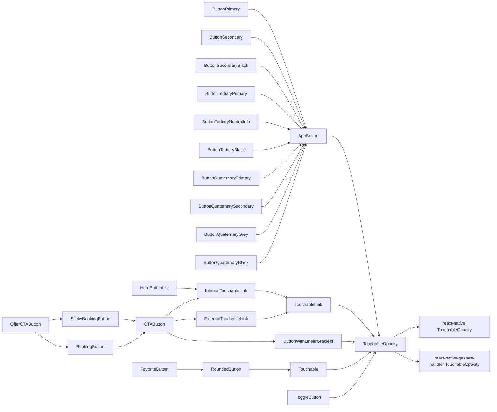

# Audit Technique du Code

⚠️ Cet audit ce concentre uniquement sur les points d'améliorations ⚠️

## Audit de différents parcours

### Chargement Initial

#### Observations

- Nous avons actuellement beaucoup de `Provider` / `Context`
  - Mobile & Web
    - `ReactQueryClientProvider`
    - `ThemeWrapper`
    - `ThemeProvider`
    - `SafeAreaProvider`
    - `ErrorBoundary`
    - `SettingsWrapper`
    - `AuthWrapper`
    - `LocationWrapper`
    - `AccessibilityFiltersWrapper`
    - `FavoritesWrapper`
    - `SearchAnalyticsWrapper`
    - `SearchWrapper`
    - `SnackBarProvider`
    - `CulturalSurveyContextProvider`
    - `SubscriptionContextProvider`
    - `ScreenErrorProvider`
  - Mobile
    - `AnalyticsInitializer`
    - `NetInfoWrapper`
    - `FirestoreNetworkObserver`
    - `SplashScreenProvider`
    - `PushNotificationsWrapper`
    - `ShareAppWrapper`
    - `OfflineModeContainer`
  - Web
    - `SupportedBrowsersGate`
    - `GoogleOAuthProvider`
    - `AppWebHead`
    - `Suspense`

#### Points de Friction

- Utiliser des contextes peut engendrer des problèmes de performance en causant des re-render d'une grande partie de l'arborescence de composants

#### Recommandations

- Remplacer les contextes
  - À garder
    - `ReactQueryClientProvider`
    - `ThemeProvider`
    - `SafeAreaProvider`
    - `ErrorBoundary` il faudrait expérimenter d'en ajouter à des niveaux plus bas, sur les parties qui peuvent échouer indépendamment sans impacter le reste de l'app
    - `AppWebHead`
  - À remplacer par un store Zustand
    - `ThemeWrapper`
    - `LocationWrapper`
    - `AccessibilityFiltersWrapper`
    - `SearchAnalyticsWrapper`
    - `SubscriptionContextProvider`
  - À remplacer par react-query
    - `SettingsWrapper`
    - `AuthWrapper` à rediscuté pour le refresh token qui est stocké
    - `FavoritesWrapper`
  - Source de vérité venant des query params / URL
    - `SearchWrapper`
    - `CulturalSurveyContextProvider` et / ou react-hook-form, ou Zustand, ou faire une requete au backend pour envoyer la réponse partielle, ou au minimum mettre ce Context qu'au niveau du Navigator
  - probablement une fonction à appeler directement dans App
    - `AnalyticsInitializer`
    - `FirestoreNetworkObserver`
  - TBD mécanisme global
    - `SnackBarProvider`
      - supprimer ces contexts au passage
        - `OfflineModeContainer` supprimer complètement lorsqu'on retravaillera l'offline
    - pareil pour les modales
      - supprimer ces contexts au passage
        - `PushNotificationsWrapper`
        - `ShareAppWrapper`
    - `NetInfoWrapper` centraliser les requêtes
  - TBD lorsqu'on s'en occupera
    - `Suspense` à supprimer ? à bouger top level ?
    - `ScreenErrorProvider` je ne sais pas encore mais pas de cette manière
    - `SplashScreenProvider` revoir le splash screen et la navigation pour supprimer ce context
    - `SupportedBrowsersGate`
      - revoir le wording du bouton qui est trop long
      - vérifier que ça fonctionne sur ces browsers
      - bump aux versions réellement supportées
        - aligner le reste du projet
          - `src/cheatcodes/pages/others/CheatcodesNavigationNotScreensPages.tsx`
          - la [config `browserslist`](https://browsersl.ist/) utilisée par vite
    - `GoogleOAuthProvider` est-ce qu'il ne pourrait pas être bougé au moins dans le bundle qui contient l'inscription et la connexion ?

### Accueil

#### Observations

- Le fichier `src/features/home/pages/Home.tsx` contient de nombreux hooks dont plusieurs `useEffect`
- on a des durées éparpillées dans la codebase
  - `src/features/home/constants.ts`
- sur [Sentry, `accueil-thematique`](https://pass-culture.sentry.io/insights/frontend/pageloads/overview/?environment=production&project=4508839229718608&statsPeriod=7d&transaction=%2Faccueil-thematique) fait parti des pages avec un score de performance faible et pourtant très visité
  - Largest Contentful Paint ~10s : 10s parfois jusqu'à 15s pour complètement charger la page
  - Interaction to Next Paint 1s : l'app freeze pendant 1s

#### Points de friction

- Utiliser de nombreux hooks peut engendrer des problèmes de performance en causant de nombreux re-render

#### Recommandations

- Utiliser un state manager (comme Zustand) pour centraliser les états de l'application et limiter le nombre de hooks utiliser pour limiter le nombre de re-render

### Réalisation d’une Recherche

#### Observations

- `src/features/search/helpers/useSync/useSync.ts` hook permettant de synchroniser la navigation avec les états des contextes de recherche et de localisation
- sur la page thématique search `src/features/gtlPlaylist/hooks/useGTLPlaylists.ts` il y a une cascade de requêtes

#### Points de friction

- `src/features/search/helpers/useSync/useSync.ts` difficile à maintenir, source de bug
- les hooks en cascades sont complexes à gérer
  - notamment à cause des données absentes lors du premier rendus

#### Recommandations

- l'URL devrait être la source de vérité
- pour les états locaux (ex : localisation), le stata manager (Zustand) devrait être la source de vérité
- les requêtes devraient être gérées au niveau de la page

### Réserve d’une Offre

#### Observations

- sur une page offre, pour déterminer quel bouton afficher (ex : "Réserver") le comportement que le bouton doit avoir, on utilise le hook `src/features/offer/helpers/useCtaWordingAndAction/useCtaWordingAndAction.ts`
  - ce hook est décomposé en 2 parties
    - un hook qui montre le hook hell dans lequel nous sommes : un hook qui appelle plein de hooks pour récupérer toutes les informations nécessaires et les passer à la fonction suivante
    - une fonction pure avec niveau de complexité cognitive de 58
- [des problèmes de performances ont été identifié sur les modales avec les boutons primary](https://github.com/pass-culture/pass-culture-app-native/pull/8064#discussion_r2065954706), obligeant les tests end to end à faire certains click 2 fois pour être certains que ça passe

#### Points de friction

- le hook `src/features/offer/helpers/useCtaWordingAndAction/useCtaWordingAndAction.ts` est [trop complexe](https://codescene.io/projects/45999/jobs/4034898/results/files/hotspots?file-name=pass-culture-app-native%2Fsrc%2Ffeatures%2Foffer%2Fhelpers%2FuseCtaWordingAndAction%2FuseCtaWordingAndAction.ts#hotspots), le rendant [difficile à maintenir](https://codescene.io/projects/45999/jobs/4034898/results/code/hotspots/biomarkers?name=pass-culture-app-native%2Fsrc%2Ffeatures%2Foffer%2Fhelpers%2FuseCtaWordingAndAction%2FuseCtaWordingAndAction.ts) et difficile de dire avec assurance quel bouton sera affiché dans telle situation

#### Recommandations

### Activation d’un Compte

#### Observations

#### Points de Friction

#### Recommandations

### Test

#### Observations

Nos tests vérifient souvent des détails d'implémentations

Un refactoring sans aucun changement de comportement casse souvent les tests

Nous vérifions peu les comportements métier

Les tests sont souvent écrit après l'implem :

- rendant les tests difficiles à écrire
- il y a des règles métiers qui ne sont pas testés
  - rendant les refactoring et évolution dangereuses car pouvant casser des comportements sans le signaler

#### Points de Friction

C'est très verbeux d'écrire des tests sur des composants

C'est difficile de faire du tests first sur notre codebase avec les hooks hells qui rendent les mocks difficiles à écrire

#### Recommandations

Il faudrait :

- tester en vérifiant des comportements métiers
- avoir au moins un test qui vérifie le bon usage d'un container dans un dumb component :
  - vérifier que la glue entre les règles métiers et l'UI est bien faite
  - dans les cas simples, tester directement l'UI via le container
  - dans les cas complexes, tester un peu la glue et tester la combinatoire dans une fonction pure isolée

## Autres

### Boutons et liens

#### Observations

Nous avons beaucoup de composants de boutons et de liens

Ceci est un aperçu non exhaustif

La propriété `as` permet d'avoir des composants avec un comportement de lien et une apparence d'un autre composant (généralement un bouton)

#### Points de Friction

L'arborescence des composants est complexes, avec beaucoup de duplication

La propriété `as` rend le code complexe et oblige a mal typer

`ButtonQuaternaryPrimary` & `ButtonQuaternarySecondary` 🤔

#### Recommandations

- Avoir moins de types de boutons
- Renommer les composants sémantiquement pas en les décrivant (`Black`, `Grey`)
- Réduire la complexité
- Réduire la duplication
- Remplacer la propriété `as`
  - peut être par [le pattern `asChild`](https://grafikart.fr/tutoriels/aschild-props-react-2287)

### Restructuration des données

#### Observations

Nous avons fréquemment des calculs fait coté frontend pour formatter les données dans une structure directement utilisable par nos composants

Exemple la restructuration des catégories en arborescences : `src/libs/subcategories/mappings.ts`

#### Points de Friction

On fait des calculs sur les end devices qui sont majoritairement moins performant que nos serveurs

On fait les calculs à chaque requête

On a tendance à utiliser le backend comme si on ne pouvait pas le changer, comme si cette API était utilisée par des tiers, ce qui n'est pas le cas, l'API est uniquement utilisée par notre code frontend

#### Recommandations

- Notre API devraient retourner les datas au format le plus proche des besoins frontend
- On pourrait mettre en cache les restructurations des données pour éviter de le faire à chaque appel

### Requêtes

#### Observations

On pour chaque route exposée par le backend via le schema OpenAPI on génère du code 🤖 qui s'occupe de faire les appels

Ce code fini par appelé du code non généré🧑‍💻

Exemple avec `/native/v1/settings`

- 🧑‍💻 `src/features/auth/context/SettingsContext.tsx` `useAppSettings()`
  - 🤖 `src/api/gen/api.ts` `DefaultApi.getNativeV1Settings()`
    - 🤖 `src/api/gen/api.ts` `DefaultApiFp.getNativeV1Settings()`
      - 🤖 `src/api/gen/api.ts` `DefaultApiFetchParamCreator.getNativeV1Settings()`
      - 🧑‍💻 `src/api/apiHelpers.ts` `safeFetch`
      - 🧑‍💻 `src/api/apiHelpers.ts` `handleGeneratedApiResponse`

#### Points de Friction

L'organisation du code est complexe faisant des allers-retours avec le code généré 🤖 et le code écrit par des humains 🧑‍💻

La maintenance est difficile

#### Recommandations

- Faire un PoC avec [Orval](https://orval.dev) pour générer ce code

### Requêtes config react query

#### Observations

On a [une config de prod de react-query](https://github.com/pass-culture/pass-culture-app-native/blob/25d03eaf31efb53cd50d71a973c8561f419d18b1/src/libs/react-query/queryClient.ts#L9) qui n'est pas bonne pour des raisons historiques :

##### `retry: 0`

En mettant en place le refresh token, [on a supprimé les retries](https://github.com/pass-culture/pass-culture-app-native/pull/234/commits/64e9c2a0227c061df857b366d352718fd26718b5#diff-26ad4b834941d9b19ebf9db8082bd202aaf72ea0ddea85f5a8a0cb3c729cc6f2R53)

@bpeyrou-pass a émis l'hypothèse que c'est pour éviter de faire des requêtes plusieurs fois lorsque le token est expiré

Si une requête échoue (ex : mauvais réseau, je suis dans le train, je passe sous un tunnel), l'app ne réessaie pas de faire la requête

Par défaut, react-query [réessaie chaque requête 3 fois](https://tanstack.com/query/latest/docs/framework/react/guides/query-retries), ce qui pourrait faire diminuer nos erreurs liés aux réseaux ([top 1 🥇 erreurs sur Sentry](https://pass-culture.sentry.io/issues/?environment=production&groupStatsPeriod=auto&project=4508839229718608&query=&referrer=issue-list&sort=freq&statsPeriod=30d) en nombre d'occurrences d'erreurs)

##### `useErrorBoundary: true`

Pour [une raison encore plus historique](https://github.com/pass-culture/pass-culture-app-native/pull/125/files#diff-26ad4b834941d9b19ebf9db8082bd202aaf72ea0ddea85f5a8a0cb3c729cc6f2R30), lorsqu'une requête échoue, on affiche une page d'erreur

On n'essaie pas de la gérer localement

Pour [certaines requêtes définissent des valeurs par défaut](https://github.com/pass-culture/pass-culture-app-native/blob/e235c64aae55b08c1e29f695ed63f68486de6895/src/libs/subcategories/useSubcategories.ts#L17), qui sont utilisées lors du premier render (avant que la requête soit finie) et en cas d'erreurs

Meme si on fourni une valeur par défaut qui non-idéale mais suffisante, lorsqu'il y a une erreur, on affiche la page d'erreur

Si on veut utiliser la valeur par défaut en cas d'erreur, avec notre config actuelle, [il faut le demander explicitement](https://github.com/pass-culture/pass-culture-app-native/blob/4401026df896c9b97a823a01712ebcb3469cabd7/src/libs/firebase/remoteConfig/queries/useRemoteConfigQuery.ts#L32)

#### Points de Friction

#### Recommandations

@mmeissonnier-pass a créé [un ticket](https://passculture.atlassian.net/browse/PC-36132) pour profiter du retry par défaut sans spammer pour rien lorsque le refresh token expire

- Essayer l'une de ces pistes pour gérer les cas d'erreur liés à l'expiration du refresh token
  - [axios-auth-fetch](https://www.npmjs.com/package/axios-auth-refresh)
  - [XHRInterceptor](https://nikunj09.medium.com/intercept-http-request-in-react-native-1f07754e12d1)
- Supprimer de [`safeFetch`](https://github.com/pass-culture/pass-culture-app-native/blob/be07b683df6bb2364bfcdd16841b7ed5ab350ec2/src/api/apiHelpers.ts#L59)
- Supprimer le `retries: 0`

### Autre

#### Observations

#### Points de Friction

#### Recommandations

## Conclusion

### Recommandations

- Suivre les préconisations de la guilde architecture
  - découper :
    - composant Page : qui fait les requêtes
    - composant Container : qui centralise les logiques en appelant des fonctions pures
    - composant débile pure : qui ne font que de l'affichage
  - gestion des états
    - URL comme source de vérité
    - utilisation de react-query pour toutes les requêtes
    - cache de react-query utilisés pour éviter de refaire des requêtes inutiles tout en limitant le cache en mémoire
    - utilisation de Zustand pour centraliser les états locaux de l'app

## TODO

Android iOS permission
Audit greenspector

useSafeState

sonar / CodeScene

"quels sont les principes qui vont devoir être mis en place" il nous faut clairement "comment ils vont être mis en place"
