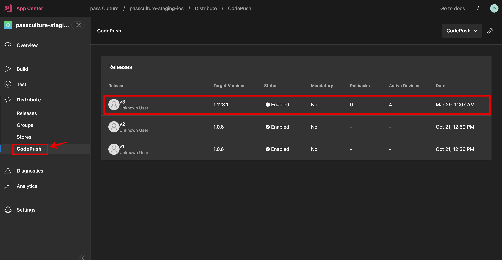

# ⚙️ Deployment process

See [notion documentation][1] for more information.

We use 3 environments for the mobile application: `testing` > `staging` > `production`.

There are two types of deployments: **soft** and **hard**:

- a **soft** deployment is typically the most frequent scenario, occurring when only the JavaScript code has been modified.
- a **hard** deployment is only required if the native code has changed:
- environment variable changed or added
- new native library
- new build step
- ...

Deployments are triggered using tags and pushing them to the remote repository. The CI detects if the tag contains a certain keyword (for example `patch` or `prod-hard-deploy`) and starts the appropriate deployment.

 
<strong>What is semver ?</strong>

  
SemVer (Semantic Versioning) is a standardized versioning system used to label software versions in a clear and predictable way. It follows the format MAJOR.MINOR.PATCH (e.g., 1.4.2), where:

<ul>
<li><strong>MAJOR</strong> (<mark>X</mark>.y.z): Incremented when there are <mark>incompatible changes</mark> or breaking changes. Example: 2.0.0 -> 3.0.0</li>
<li><strong>MINOR</strong> (x.<mark>Y</mark>.z): Incremented when <mark>new features</mark> are added that are backward compatible. Example: 2.1.0 -> 2.2.0</li>
<li><strong>PATCH</strong> (x.y.<mark>Z</mark>): Incremented for <mark>bug fixes or minor changes</mark> that don't affect the API.Example: 2.1.1 -> 2.1.2</li>
<li><strong>BUILD or REVISION</strong> (x.y.z.<mark>W</mark>): Incremented with <mark>every build or release iteration</mark>, often used internally to distinguish between minor changes or bug fixes within the same patch version.</li>
</ul>

<strong>Example</strong> 
A version update from 1.4.2 to 1.5.0 introduces new features without breaking existing functionality, while an update from 1.4.2 to 2.0.0 introduces incompatible changes.

## Testing

You can review & download the **testing** apps on AppCenter for [iOS][2] & [Android][3] of using this [url][4].

### ⚡️ Soft deploy (automatic)

Most of the time, when developing a feature, you probably didn't change the native code: if you changed only javascript code, the deployment to the testing application will be **automatic** on the **CI** (see [`deploy-soft-testing`](../../.github/workflows/dev_on_push_workflow_main.yml#L103) job).

Then the build is faster as only the javascript code is published. The download and installation of the modification will be automatic when you open the app.

#### Troubleshooting

 
I don't see my changes on testing

If you don't see your changes, try to check if the codepush was correctly downloaded. To do so, go to "CheatCodes", and click on the "check update" button.

3 possibilities:

- it displays "no update found": you are up-to-date
- it shows "New version available on AppCenter" you need to go to AppCenter for [iOS][5] & [Android][6]
- it downloads the update and restarts the app

### Hard deploy (manual)

If you modified native code, you need to hard deploy:

- `yarn trigger:testing:deploy`

This will bump the patch number, create a tag `testing/vX.Y.Z+1` and push it.
The **CI** will detect the tag and launch the lanes [`hard-deploy-android-testing`](../../.github/workflows/dev_on_push_workflow_main.yml#L133) & [`dhard-eploy-ios-testing`](../../.github/workflows/dev_on_push_workflow_main.yml#L143).

## Staging (MES)

You can review & download the **staging** apps on AppCenter for [iOS][5] & [Android][6] of using this [url][7].

### Hard deploy

Once a week we hard deploy a version of staging from a Jira automation. The version is tagged on a specific commit.

It will bump the `minor` version, create a tag `vX.Y+1.Z` and push it.

#### Troubleshooting

 
Problem during MES automation

In case there is a problem with the automation when you want to deploy the new staging version from a specific commit you can manually trigger the [GithubAction][9] :

- Click the `Run workflow` button select the `master` branch and give the commit from which you want to create a version

This will bump the `minor` version, create a tag `vX.Y+1.Z` and push it.

### Patch staging with additional commits

Pull master to make sure you have all the commits you need to patch.
Checkout the tag you want to start from.

- `git checkout vX.Y.Z` or `git checkout patch/vX.Y.Z` if a patch has already been made
- list all commits you want to patch to your tag.
- run `git cherry-pick <commit-hash>` for all commits **in the order they were merged to `master`** to avoid conflicts.
- build and deploy the patch by running the following script: `trigger:staging:deploy:patch`

This will bump the `patch` version, create a tag `patch/vX.Y.Z+1` and push it.
The CI will detect the tag `patch/vX.Y.Z` and launch the lanes `deploy-ios-staging-hard` & `deploy-android-staging-hard` (see `.github/workflows/dev_on_push_workflow_main.yml` file).

## Production (MEP)

### Hard deploy (when MEP wanted, manual)

- Figure out which version (and then tag) you want to deploy. If you patched a version Staging, it could be `patch/v1.Y.Z`
- `yarn trigger:production:deploy <tag>`

This will create a tag `prod-hard-deploy`. The CI will detect the tag and launch the lane [`hard-deploy-android-production`](../../.github/workflows/dev_on_push_workflow_main.yml#L173) & [`hard-deploy-ios-production`](../../.github/workflows/dev_on_push_workflow_main.yml#L183)

## Hotfix (this is for production as CodePush, see 'Patch staging with additional commits' for staging)

### When

> ⚠️ Only if there is a bug really urgent in production, that we need to fix very quickly.
If not urgent (but still can't wait until the next MEP), it's better for the user experience to release a new version (see Production/Hard deploy to release a new production version).

### How

- List all tags of the version `X.Y.Z`, tags of type: `vX.Y.Z-W` (`git fetch --tag`and then `git tag | grep vX.Y`)
- Two cases:
  - There is already a previous hotfix on this version (`hotfix-production-vX.Y.Z.W`): checkout on the tag with the biggest `W`
  - It is the first hotfix on this version : Checkout on the tag `vX.Y.Z` (could be `patch/vX.Y.Z`) with the biggest minor `Y`
- Cherry-pick all the commits of the feature `git cherry-pick <commit-hash>`
- Check if tests are OK `yarn test`
- `git tag hotfix-staging-vX.Y.Z-(W+1)`
- `git push origin hotfix-staging-vX.Y.Z-(W+1) --no-verify`: this will deploy it to `staging`
- Validate the fix with the PO on staging app (version X.Y.Z)
- If it is OK for the PO, deploy it to production:
  - `git tag hotfix-production-vX.Y.Z-(W+1)`
  - `git push origin hotfix-production-vX.Y.Z-(W+1) --no-verify`: this will deploy it to `production`
  - ⚠️ Check your code push targets the actual production version (one code push targets only one version)

### Troubleshooting

 
I don't see my CodePush on staging/prod app

Check if you can find it on AppCenter. Example for [staging iOS][8].

## Sprints, MeS and MeP

Iteration 300.

- tag is 300
- Testing is under version number 301
- Staging is under version number 300
- Prod is under version number 300

We run processes for 301 (MeS).

- Set Tag under version « 301 »
- Testing is under version number 302, compilation and merges on master prepare the 302's future version well
- Staging is compiled from tag's 301, we are testing version 301
- Prod is under version number 300
- New iteration goes on 302

We run processes for 302 (MeS and MeP).

- Set Tag under version « 302 »
- Testing is under version number 303, compilation and merges on master prepare the 303's future version well
- Staging is compiled from tag's 302, we are testing version 302
- Prod is compiled from tag's 302, we publish result of 301+302
- New iteration goes on 303

Nous lançons la mes de la version 303 (MeS).

- Set Tag under version « 303 »
- Testing is under version number 304, le compilation et les merges sur master préparent bien la future version 304
- Staging is compiled from tag's 303, we are testing version 303
- Prod is under version number 302
- New iteration goes on 304

[1]: https://www.notion.so/passcultureapp/Processus-d-ploiement-MES-MEP-App-Native-bc75cbf31d6146ee88c8c031eb14b655
[2]: https://appcenter.ms/orgs/pass-Culture/apps/passculture-testing-ios
[3]: https://appcenter.ms/orgs/pass-Culture/apps/passculture-testing-android
[4]: https://app.testing.passculture.team/accueil
[5]: https://appcenter.ms/orgs/pass-Culture/apps/passculture-staging-ios
[6]: https://appcenter.ms/orgs/pass-Culture/apps/passculture-staging-android
[7]: https://app.staging.passculture.team/accueil
[8]: https://appcenter.ms/orgs/pass-Culture/apps/PassCulture-staging-ios/distribute/code-push
[9]: https://github.com/pass-culture/pass-culture-app-native/actions/workflows/jira_create_and_push_staging_testing_deploy_tags.yml
