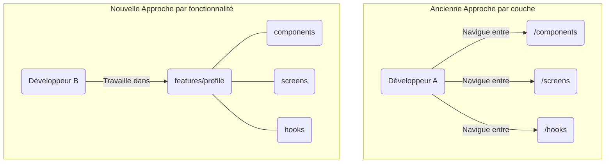

# DR010 : Structure modulaire par fonctionnalités (Vertical Slices)

> Statut : Adopté

## Décision

**Tout le code relatif à une fonctionnalité sera regroupé dans un seul et même dossier.** Nous confirmons l’organisation par domaine métier (ex: `features/profile`, `features/search`).

**Exemple** :

```txt
src/features/{featureName}/
  ├── pages/         # Écrans de la feature
  ├── components/    # Composants React spécifiques à la feature
  ├── queries/       # ou api/ : appels API et hooks associés
  ├── store/         # Gestion d'état (Zustand, Redux)
  ├── helpers/       # Fonctions utilitaires spécifiques
  ├── fixtures/      # Données de test
  ├── types.ts       # Types spécifiques à la feature
  └── constants.ts   # Constantes
```

**Note sur les exceptions** : La structure ci-dessus est la convention pour les fonctionnalités "métier" (vertical slices). Cependant, certaines fonctionnalités transverses ou techniques peuvent avoir une structure différente, adaptée à leur rôle spécifique. C'est notamment le cas de `features/navigation`, qui est organisée par navigateurs plutôt que par composants ou pages. Les fonctionnalités plus petites peuvent également n'implémenter qu'un sous-ensemble des dossiers présentés.

## Contexte

Notre analyse a révélé un **couplage massif** entre les fonctionnalités, avec **4 457 imports cross-features** et un score de couplage de 16.44%, bien au-delà du seuil critique de 10%. L'organisation actuelle donne une fausse impression d'autonomie et rend la maintenance difficile. Pour modifier une simple fonctionnalité, un développeur doit naviguer entre de multiples dossiers, ce qui augmente la charge cognitive et le risque d'erreurs.

## Alternatives considérées

- **Créer des librairies partagées massives :** Mettre toute la logique partagée dans un seul dossier `/shared`. Rejeté car cela risquerait de recréer un nouveau monolithe déguisé.

## Justification

1. **Autonomie des équipes :** Les équipes peuvent travailler en parallèle sur des fonctionnalités différentes avec un risque minimal de conflits.
2. **Maintenance simplifiée :** Un bug dans le profil ? Le code est au même endroit.
3. **Intégration rapide :** Un nouveau développeur peut devenir productif rapidement en se concentrant sur le périmètre d'une seule fonctionnalité.

### **Pain points adressés**

- **✅ 153 fichiers >200 lignes** : la colocation réduit la charge cognitive et facilite la navigation, même si les 200 lignes sont assez faibles au regard de certains composants.
- **✅ 97 commits context/provider** : une structure plus claire évite des modifications dispersées
- **✅ Maintenance burden** : des modules autonomes facilitent les évolutions et le debug
- **Responsabilité** : (continuer d’) organiser le code par domaine métier plutôt que par type technique
- **Colocation** : Regrouper composants, logique, tests et styles d'une même fonctionnalité
- **Utilisation typique** : Chaque feature (search, profile, offers) est autonome et testable isolément

## Conséquences

- **Positives :** Réduction du couplage, augmentation de la vélocité, maintenance plus facile.
- **Négatives :** Nécessite une discipline pour bien définir les frontières entre les fonctionnalités et gérer la logique réellement partagée (qui ira dans un dossier `shared/` ou `libs/`).

## Diagramme

Extrait de code



## Actions à implémenter

1. Toute nouvelle fonctionnalité doit suivre cette structure.
2. Lors du refactoring d'un module legacy, il devra être migré vers cette structure.
3. Le code transverse (partagé par plusieurs fonctionnalités) sera placé dans `libs/` ou `shared/` en respectant la distinction suivante :
    - **`libs/`** : Pour le code purement technique, agnostique du métier de l'application (ex: helpers de parsing, clients API génériques, intégration de librairies tierces comme Firebase ou Algolia).
    - **`shared/`** : Pour le code qui, bien que partagé, contient une logique métier (ex: types de données métier, fonctions utilitaires liées aux offres ou aux utilisateurs).

## Output

Une structure de répertoires claire et standardisée qui favorise l'autonomie et la maintenabilité.
