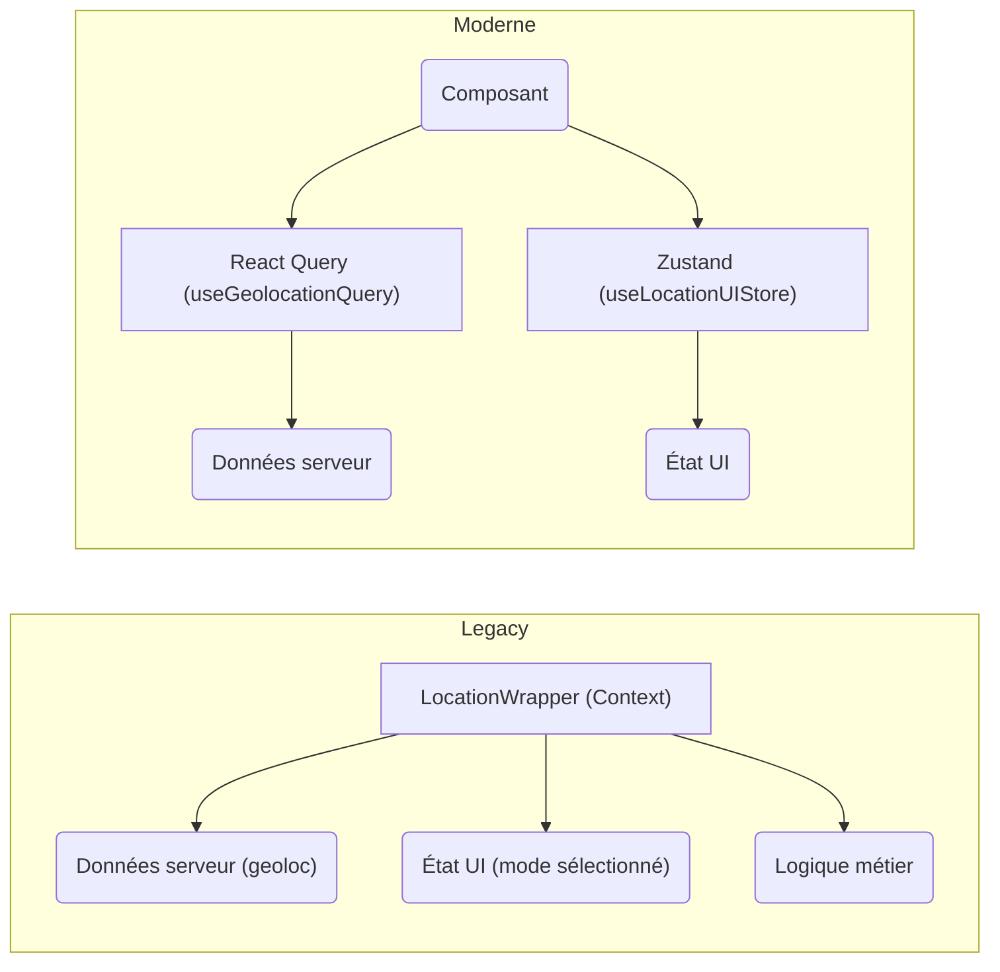

#### DR011 : Séparation des états (Serveur vs Client)

> Statut : Adopté

##### Décision

Nous utiliserons systématiquement **React Query** pour gérer l'état serveur (données API) et **Zustand** pour l'état client (état de l'UI). L'usage de React Context sera limité à l'injection de dépendances simples et stables.

##### Contexte

Nos `Context Wrappers` legacy, comme `LocationWrapper` (113 usages, 20+ propriétés) et `AuthWrapper`, sont surdimensionnés. Ils mélangent état serveur, état client, et logique métier. Cela provoque des re-renders inutiles, une complexité de dépendances élevée et rend le code difficile à suivre et à tester.

##### Alternatives considérées

- **Continuer avec React Context pour tout :** Rejeté en raison des problèmes de performance bien connus liés aux re-renders en cascade lorsque l'état change fréquemment.
- **Utiliser Redux :** Rejeté car considéré comme trop verbeux pour nos besoins d'état client, et React Query est bien plus adapté que Redux Toolkit Query pour la gestion de l'état serveur.

##### Justification

- **React Query** est le standard de l'industrie pour l'état serveur. Il gère nativement le cache, la synchronisation en arrière-plan, les retries, et l'invalidation, ce qui simplifie énormément notre code.
- **Zustand** est une solution légère, rapide et simple pour gérer l'état de l'UI sans "provider hell". Il permet des sélections optimisées pour éviter les re-renders inutiles.
- Cette séparation clarifie l'intention de chaque état.

##### Diagramme

Extrait de code

##### Actions à implémenter (non exhaustif)

1. Lors de la migration du `LocationWrapper`, l'état de géolocalisation et de permissions ira dans React Query.
2. L'état des modes de localisation et des rayons ira dans un store Zustand `useLocationUIStore`.
3. Le `FavoritesWrapper` (quick win) sera migré vers Zustand.

##### Output

Des règles claires pour la gestion de l'état, menant à une meilleure performance et une plus grande maintenabilité.