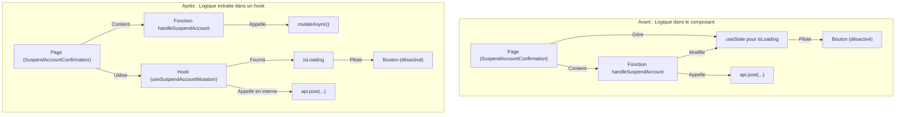
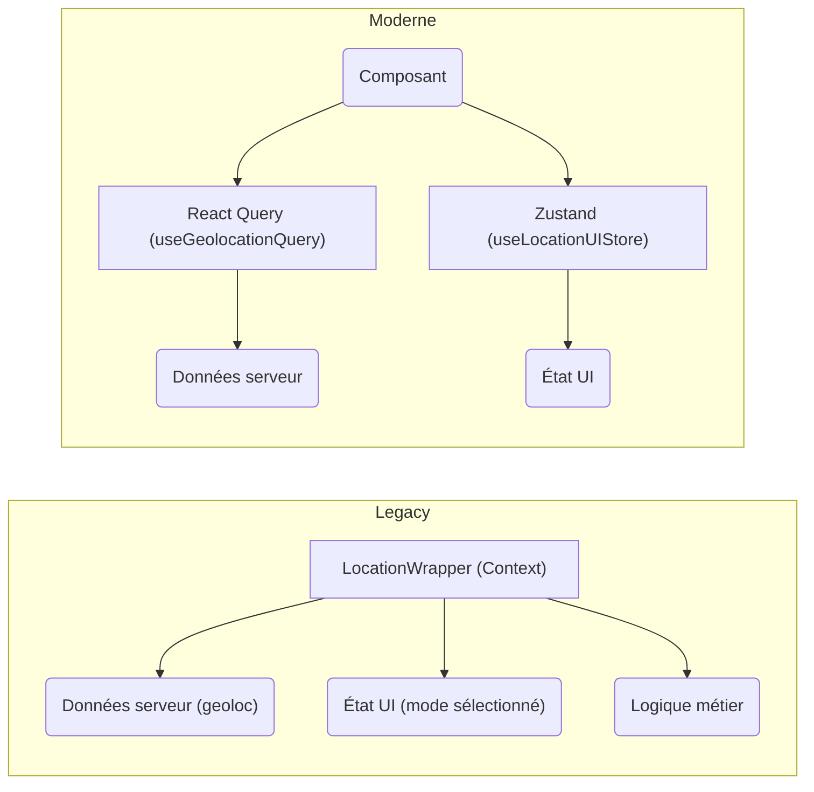

# DR011 : Séparation des états (Serveur vs Client)

> Statut : Adopté

## Décision

Nous utiliserons systématiquement **React Query** pour gérer l'état serveur (données API) et **Zustand** pour l'état client (état de l'UI). L'usage de React Context sera limité à l'injection de dépendances simples et stables.

### **React Query pour l'état serveur**

- **Responsabilité** : Gérer cache, synchronisation, et états de chargement des données distantes
- **Colocation** : Queries dans le dossier `queries/` de chaque feature
- **Utilisation typique** : API calls, cache automatique, revalidation en arrière-plan

**Sélecteurs pour éviter les re-renders :**

Un sélecteur permet d’encapsuler la logique de retrait d’une valeur spécifique d’un state (une dérivée) pour améliorer les performances.

```tsx
 // ✅ Bon pattern avec sélecteur
 const selectArtistsNb = (artists: Artists) => artists.length
 
 const ArtistContainer = () => {
   const { data: artistsNb } = useArtistsQuery({ select: selectArtistsNb })
   return <Text>{artistsNb}</Text>
 }
```

**Contrat de query complet :**

```tsx
 // ✅ Retourner l'intégralité de la query
 const useArtistsQuery = () => useQuery({ queryFn: fetchArtists, queryKey: ['artists'] })
```

**Gestion d'état déclarative avec Suspense :**

[**https://react.dev/reference/react/Suspense**](https://react.dev/reference/react/Suspense)

[**https://react.dev/reference/react/Component#catching-rendering-errors-with-an-error-boundary**](https://react.dev/reference/react/Component#catching-rendering-errors-with-an-error-boundary)

```tsx
 // Au niveau navigation - erreurs dures
 <ErrorBoundary fallback={<PageNotFound />}>
   <Suspense fallback={<LoadingPage />}>
     <SomePage />
   </Suspense>
 </ErrorBoundary>
 
 // Au niveau container - erreurs souples
 <ErrorBoundary fallback={null}>
   <Suspense fallback={<LoadingContainer />}>
     <OptionalContainer />
   </Suspense>
 </ErrorBoundary>
```

### **Zustand pour l'état client**

- **Responsabilité** : Gérer l'état "client" (état de l'UI, préférences, processus multi-écrans). "Client" ou "local" signifie ici "local au téléphone de l'utilisateur", par opposition à l'état "serveur".
- **Colocation** : Stores dans `stores/` par domaine métier.
- **Utilisation typique** : Éviter le "prop drilling" et partager un état entre plusieurs composants ou écrans sans complexité.

**Cas d'usage typique : Formulaire en plusieurs étapes**

Un store Zustand est idéal pour gérer un état qui doit persister sur plusieurs écrans. Par exemple, pour un formulaire d'inscription en 3 étapes :

1. On crée un `useSignupFormStore` pour stocker les données du formulaire.
2. Chaque écran du formulaire lit et écrit dans ce même store.
3. À la dernière étape, un composant récupère l'état complet du store et l'envoie au serveur via une mutation React Query.

Cela évite de passer des données complexes via les paramètres de navigation.

```tsx
 interface SignupFormState {
   firstName: string;
   email: string;
   // ... autres champs
   setField: (field: keyof SignupFormState, value: string) => void;
 }
 
 export const useSignupFormStore = create<SignupFormState>((set) => ({
   firstName: '',
   email: '',
   setField: (field, value) => set({ [field]: value }),
 }))
```

### Exemples Concrets

#### React Query pour l'état serveur

**Exemple : `useArtistQuery`**

Pour afficher les informations d'un artiste, qui sont stockées sur le serveur.

```typescript
// Fichier : src/features/artist/queries/useArtistQuery.ts
import { useQuery } from '@tanstack/react-query'
import { api } from 'api/api'
import { QueryKeys } from 'libs/queryKeys'

export const useArtistQuery = (artistId: string) =>
  useQuery({
    // Clé unique pour cette donnée, utilisée par React Query pour le cache.
    queryKey: [QueryKeys.ARTIST, artistId],
    // Fonction qui appelle l'API pour récupérer les données.
    queryFn: async () => api.getNativeV1ArtistsartistId(artistId),
  })
```

Un composant utilise ce hook pour obtenir les données de l'artiste, et React Query gère les états de chargement, les erreurs et la mise en cache.

```typescript
// ArtistPage.tsx
import { useArtistQuery } from 'features/artist/queries/useArtistQuery'

function ArtistPage({ artistId }) {
  const { data: artist, isLoading, isError } = useArtistQuery(artistId)

  if (isLoading) {
    return <Text>Chargement...</Text>
  }

  if (isError) {
    return <Text>Une erreur est survenue.</Text>
  }

  return (
    <View>
      <Text>{artist.name}</Text>
      <Text>{artist.description}</Text>
    </View>
  )
}
```

#### Zustand pour l'état client

**Exemple : `useVenueMapStore`**

Pour gérer l'état d'une carte interactive (zoom, lieu sélectionné, etc.), qui est un état propre à l'interface utilisateur.

```typescript
// Fichier : src/features/venueMap/store/venueMapStore.ts
import { create } from 'zustand'

type VenueMapStoreState = {
  selectedVenue?: GeolocatedVenue | null // Le lieu que l'utilisateur a cliqué
  region?: Region // La région visible de la carte
  // ... autres états de l'UI
}

const DEFAULT_STATE: VenueMapStoreState = { /* ... */ }

export const useVenueMapStore = create<VenueMapStoreState>()(() => DEFAULT_STATE)

// Fonctions pour modifier l'état
export const setSelectedVenue = (selectedVenue: GeolocatedVenue) =>
  useVenueMapStore.setState({ selectedVenue })
```

Les composants se connectent à ce "store" pour lire ou modifier l'état de la carte, sans avoir à se passer des `props`.

```typescript
// VenueMarker.tsx (composant qui modifie le store)
import { setSelectedVenue } from 'features/venueMap/store/venueMapStore'

function VenueMarker({ venue }) {
  return (
    <TouchableOpacity onPress={() => setSelectedVenue(venue)}>
      <MapPin />
    </TouchableOpacity>
  )
}

// SelectedVenueInfo.tsx (composant qui lit depuis le store)
import { useVenueMapStore } from 'features/venueMap/store/venueMapStore'

function SelectedVenueInfo() {
  // On sélectionne uniquement la donnée dont on a besoin pour optimiser les re-renders.
  const selectedVenue = useVenueMapStore(state => state.selectedVenue)

  if (!selectedVenue) {
    return null
  }

  return <Text>Lieu sélectionné : {selectedVenue.name}</Text>
}
```

### Exemple de Refactoring : Anti-pattern et Solution

Pour illustrer la démarche, analysons un composant qui ne respecte pas le principe et voyons comment le refactorer.

**Anti-pattern : `SuspendAccountConfirmation.tsx`**

Ce composant de page gère lui-même l'état de chargement d'un appel API avec un `useState`, mélangeant ainsi état de l'UI et état serveur.

```typescript
// Anti-pattern : Le composant gère lui-même l'état de l'opération serveur.
const [isLoading, setIsLoading] = useState(false)

const handleSuspendAccount = useCallback(async () => {
    setIsLoading(true) // Gestion manuelle du début
    try {
      await mutate() // Appel API
    } catch (error) {
      // Gestion manuelle de l'erreur
    } finally {
      setIsLoading(false) // Gestion manuelle de la fin
    }
}, [/* ... */])
```

**Solution : Extraire la logique dans un hook de mutation**

1. **Créer le hook `useSuspendAccountMutation`** avec `useMutation` de React Query pour encapsuler l'appel API et ses états (chargement, erreur, succès).

    ```typescript
    // src/features/profile/queries/useSuspendAccountMutation.ts
    export const useSuspendAccountMutation = () => {
      return useMutation({
        mutationFn: ({ token }) => api.postNativeV1ProfileEmailUpdateCancel({ token }),
      })
    }
    ```

2. **Simplifier le composant de page** pour qu'il se contente d'utiliser le hook.

    ```typescript
    // Le composant devient plus simple et déclaratif
    import { useSuspendAccountMutation } from 'features/profile/queries/useSuspendAccountMutation'

    export function SuspendAccountConfirmation(props) {
      // Le hook fournit l'état `isLoading` et la fonction pour muter.
      const { mutateAsync, isLoading } = useSuspendAccountMutation()

      const handleSuspendAccount = useCallback(async () => {
        try {
          await mutateAsync({ token: params.token }) // On ne se soucie plus de isLoading
          // ...
        } catch (error) {
          // ...
        }
      }, [/* ... */])

      // Le `isLoading` est directement connecté au bouton
      return <Button disabled={isLoading} />
    }
    ```

**Diagramme de la transformation**



## Contexte

Nos `Context Wrappers` legacy, comme `LocationWrapper` (113 usages, 20+ propriétés) et `AuthWrapper`, sont surdimensionnés. Ils mélangent état serveur, état client, et logique métier. Cela provoque des re-renders inutiles, une complexité de dépendances élevée et rend le code difficile à suivre et à tester.

## Alternatives considérées

- **Continuer avec React Context pour tout :** Rejeté en raison des problèmes de performance bien connus liés aux re-renders en cascade lorsque l'état change fréquemment.
- **Utiliser Redux :** Rejeté car considéré comme trop verbeux pour nos besoins d'état client, et React Query est bien plus adapté que Redux Toolkit Query pour la gestion de l'état serveur.

## Justification

- **React Query** est le standard de l'industrie pour l'état serveur. Il gère nativement le cache, la synchronisation en arrière-plan, les retries, et l'invalidation, ce qui simplifie énormément notre code.
- **Zustand** est une solution légère, rapide et simple pour gérer l'état de l'UI sans "provider hell". Il permet des sélections optimisées pour éviter les re-renders inutiles.
- Cette séparation clarifie l'intention de chaque état.

### **Pain points adressés**

- **✅ 28 createContext identifiés** : React Query + Zustand remplacent la prolifération de contexts
- **✅ 22 providers actifs App.tsx** : État serveur/local séparé pour réduire drastiquement les providers
- **✅ Performance P95 ~4s** : Cache intelligent et re-renders optimisés pour améliorer les temps de chargement

## Diagramme

Extrait de code



## Actions à implémenter (non exhaustif)

1. Lors de la migration du `LocationWrapper`, l'état de géolocalisation et de permissions ira dans React Query.
2. L'état des modes de localisation et des rayons ira dans un store Zustand `useLocationUIStore`.
3. Le `FavoritesWrapper` (quick win) sera migré vers Zustand.
4. Définir et documenter des standards d'utilisation pour React Query (création des queries, mutations, gestion des clés, etc.) afin d'assurer une implémentation homogène dans tout le projet.

## Décisions associées

- **[DR016 : Logiques portées par le Backend](./DR016%20%20Logiques%20portées%20par%20le%20Backend.md)** : Ce principe de séparation des états est complété par la décision de déplacer les logiques métier complexes et les orchestrations d'appels côté backend, afin de garder le client léger.

- **[DR020 : Méthodologie de Refactorisation Legacy (Strangler Fig)](./DR020%20%20Méthodologie%20de%20Refactorisation%20Legacy%20(Strangler%20Fig).md)** : La migration des anciens `Context Wrappers` (qui mélangent les états) vers la nouvelle architecture définie ici se fera en suivant le pattern Strangler Fig, comme décrit dans cet ADR.

## Output

Des règles claires pour la gestion de l'état, menant à une meilleure performance et une plus grande maintenabilité.
