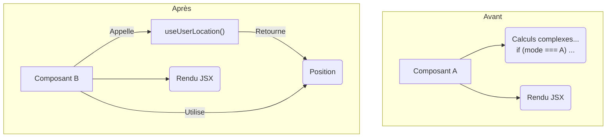

#### DR012 : Hooks composés pour la logique métier pure

> Statut : Adopté

##### Décision

La logique métier **pure et testable** sera systématiquement extraite dans des **hooks composés** dédiés. Ces hooks ne devront pas avoir d'effets de bord.

##### Contexte

Actuellement, la logique métier est souvent mélangée au sein des `Context Wrappers` (ex: calcul de la position utilisateur dans `LocationWrapper`) ou directement dans les composants. Cela la rend difficile à tester de manière isolée et à réutiliser.

##### Alternatives considérées

- **Laisser la logique dans les composants :** Rejeté car cela conduit à des composants volumineux et viole le principe de responsabilité unique.
- **Utiliser des classes de service :** Rejeté car l'approche par hooks est plus idiomatique dans un écosystème React et s'intègre mieux avec le reste de nos principes.

##### Justification

- **Testabilité :** Un hook pur, qui ne dépend que de ses entrées, est extrêmement simple à tester unitairement, sans avoir besoin de mocker un environnement de rendu React.
- **Réutilisabilité :** La même logique peut être facilement partagée entre plusieurs composants.
- **Lisibilité :** Les composants deviennent plus simples, se concentrant sur le rendu et la gestion des interactions, tandis que la complexité métier est encapsulée dans le hook.

##### Diagramme

Extrait de code

##### Actions à implémenter

1. Lors de la migration du `LocationWrapper`, la logique de calcul de `userLocation` sera extraite dans le hook `useUserLocation`.
2. Les développeurs devront identifier la logique métier dans les composants qu'ils modifient et l'extraire dans des hooks dédiés.

##### Output

Un code métier plus robuste, testable et réutilisable.