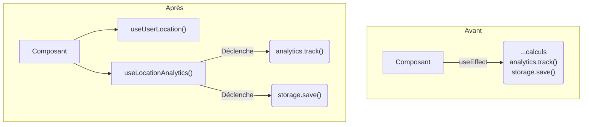

#### DR013 : Isolation des effets de bord

> Statut : Adopté

##### Décision

Les effets de bord (analytics, storage, etc.) doivent être isolés dans des **hooks dédiés**. Ils ne doivent pas être mélangés avec la logique métier ou l'état de l'UI.

##### Contexte

Dans notre code legacy, les effets de bord sont souvent cachés dans des `useEffect` au sein de composants ou de wrappers. Par exemple, `LocationWrapper` sauvegarde des données dans le storage et envoie des événements analytics en même temps qu'il gère la logique de localisation. Cela rend les effets de bord difficiles à tracer et à contrôler.

##### Alternatives considérées

- **Continuer avec des `useEffect` dispersés :** Rejeté car cela manque d'intentionnalité et rend le code difficile à déboguer. Un `useEffect` peut faire beaucoup de choses, un hook `useTrackEvent` n'en fait qu'une.

##### Justification

- **Clarté :** L'utilisation d'un hook `useLocationAnalytics()` rend l'intention explicite. On sait que ce hook est responsable du tracking.
- **Contrôle :** Isoler les effets de bord permet de les activer/désactiver facilement (par exemple en mode test) ou de les remplacer par des mocks.
- **Séparation des préoccupations :** Un composant ne devrait pas se soucier de la manière dont un événement est tracé. Il doit juste dire "trace cet événement". Le hook s'occupe du "comment".

##### Diagramme

Extrait de code

##### Actions à implémenter

1. Lors de la migration du `LocationWrapper`, les appels à `analytics` et `storage` seront encapsulés dans un hook `useLocationAnalytics`.
2. Ce pattern sera appliqué à toutes les nouvelles fonctionnalités.

##### Output

Un code plus prévisible et facile à tester, où les effets de bord sont explicites et contrôlés.