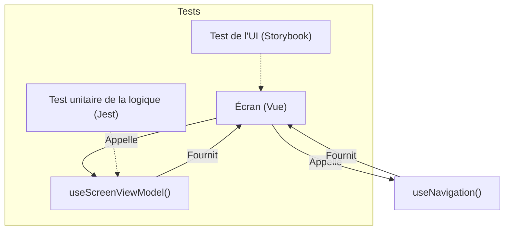

#### DR014 : Séparation UI / Logique / Navigation

> Statut : Adopté

##### Décision

Nous allons structurer nos composants d'écran en séparant systématiquement trois responsabilités distinctes :

1. **La Vue (UI) :** Le composant React qui se charge de l'affichage (JSX). Il doit être aussi "bête" que possible.
2. **La Logique (ViewModel/Controller) :** Un hook personnalisé (ex: `useProfileViewModel`) qui gère l'état de l'écran, la logique métier et les interactions.
3. **La Navigation :** Les actions de navigation sont gérées par les hooks fournis par la librairie de navigation et ne sont pas mélangées à la logique métier.

##### Contexte

Plusieurs de nos composants sont devenus trop volumineux et complexes, mélangeant de multiples responsabilités. Le composant `Profile.tsx`, avec ses 414 lignes, est un exemple typique où l'affichage, la gestion d'état, la logique de déconnexion et la navigation sont fortement couplés. Cela rend les composants difficiles à comprendre, à maintenir et surtout à tester.

##### Alternatives considérées

- **Conserver des composants monolithiques :** Rejeté car c'est la source de notre dette technique actuelle. Cette approche ne passe pas à l'échelle.
- **Utiliser des design patterns plus complexes (ex: MVC pur) :** Rejeté car l'approche par hooks (Vue/ViewModel) est plus simple, plus moderne et s'intègre naturellement à notre écosystème React.

##### Justification

- **Testabilité :** Cette séparation nous permet de tester chaque partie de manière isolée. L'UI peut être testée visuellement avec Storybook, la logique métier du hook peut être testée unitairement avec Jest, et la navigation peut être facilement mockée.
- **Lisibilité et Maintenance :** Les composants plus petits et focalisés sur une seule chose sont plus simples à lire et à maintenir.
- **Réduction de la charge cognitive :** Un développeur peut se concentrer sur l'UI sans avoir à comprendre toute la complexité de la logique métier sous-jacente.

##### Diagramme

Extrait de code

##### Actions à implémenter

1. Toutes les nouvelles fonctionnalités d'écran devront adopter cette séparation.

##### Output

Des composants plus clairs, plus faciles à tester et à maintenir, et un pattern de développement standardisé pour les écrans.