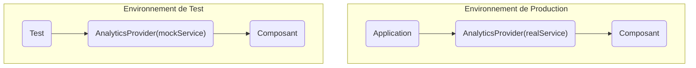

#### DR015 : Injection de Dépendances via Context

> Statut : Adopté

##### Décision

Nous utiliserons le **Context React principalement pour l'injection de dépendances (DI)**. Il servira à fournir des services ou des configurations stables dans l'arbre de composants, mais ne devra plus être utilisé pour gérer de l'état applicatif qui change fréquemment.

##### Contexte

Notre application souffre d'une "explosion de contextes" (19 pour le seul module `AUTH`) et d'une hiérarchie de 17 niveaux de providers. Cette utilisation abusive du Context pour de l'état volatile est une source majeure de problèmes de performance (re-renders en cascade).

##### Alternatives considérées

- **Imports directs (hard-coding) :** Importer les services directement dans les composants. Rejeté car cela crée un couplage fort et rend les tests (où l'on a besoin de mocks) très difficiles.
- **Passer les dépendances par les props (prop drilling) :** Rejeté car c'est verbeux et peu pratique pour des dépendances utilisées à plusieurs niveaux de profondeur.

##### Justification

- **Flexibilité et Testabilité :** L'injection de dépendances nous permet de remplacer une implémentation réelle par un mock dans nos tests. Par exemple, on peut injecter un `MockAnalyticsService` qui ne fait rien, au lieu du vrai service qui enverrait des événements.
- **Découplage :** Les composants ne dépendent plus d'une implémentation concrète d'un service, mais d'une abstraction fournie par le contexte.
- **Clarification du rôle du Context :** Cette décision, combinée à l'DR011 (React Query/Zustand), clarifie que le Context n'est pas un gestionnaire d'état global, mais un outil d'injection.

##### Diagramme

Extrait de code

##### Actions à implémenter

1. Identifier les Contexts actuels qui servent à l'injection (ex: `AnalyticsInitializer`) et les conserver.
2. Lors de la refonte des `Context Wrappers` comme `AuthWrapper`, séparer la partie injection de la partie état.

##### Output

Une utilisation saine et performante du Context React, alignée avec les meilleures pratiques de l'industrie.