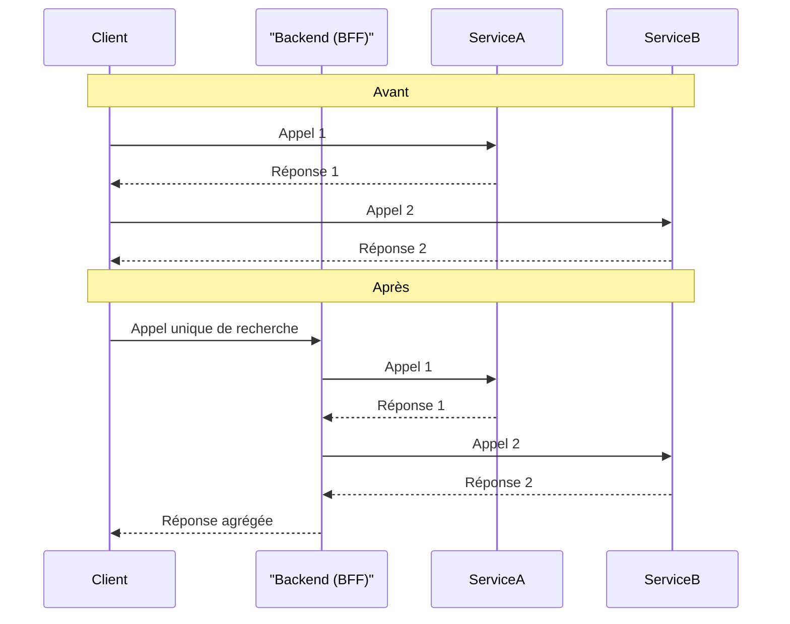

#### DR016 : Logiques portées par le Backend

> Statut : Adopté

##### Décision

Toute logique métier complexe, orchestration de multiples appels API, ou traitement de données sensibles doit être **portée par le backend**. Le client React Native doit rester aussi simple que possible et se concentrer sur la présentation.

##### Contexte

Nous avons des exemples où le client est trop "intelligent", ce qui nuit à la performance et à la sécurité. Le module `SEARCH` qui effectue 7 appels séquentiels à Algolia est un cas d'école : le client est trop verbeux et attend la fin de chaque appel, ce qui dégrade l'expérience utilisateur.

##### Alternatives considérées

- **Continuer à implémenter la logique côté client :** Rejeté. Cela augmente la taille du bundle, le nombre d'allers-retours réseau, la complexité du code client et expose potentiellement des règles métier qui devraient rester confidentielles.

##### Justification

- **Performance :** Un seul appel à un backend (qui orchestre ensuite les autres services) est bien plus performant que de multiples appels depuis le client, surtout sur des réseaux mobiles.
- **Simplicité du client :** Un client "bête" est plus facile à développer, à maintenir et à tester.
- **Sécurité :** Les règles de gestion complexes et les clés d'API ne sont pas exposées dans le code du client.
- **Évolutivité :** Le backend peut faire évoluer la logique d'orchestration sans nécessiter une nouvelle version de l'application mobile.

##### Diagramme

Extrait de code

##### Actions à implémenter

1. Le chantier de refactorisation du module `SEARCH` doit inclure la création d'un point de terminaison backend qui orchestrera les appels à Algolia.
2. Pour toute nouvelle fonctionnalité, la question "Est-ce que cette logique doit vivre sur le client ?" doit être systématiquement posée.

##### Output

Des applications clientes plus légères, plus rapides et plus sécurisées.