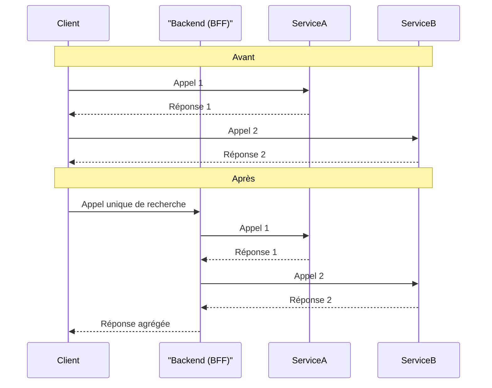

# DR016 : Logiques portées par le Backend

> Statut : Adopté

## Décision

Toute logique métier complexe, orchestration de multiples appels API, ou traitement de données sensibles doit être **portée par le backend**. Le client React Native doit rester aussi simple que possible et se concentrer sur la présentation.

## Contexte

Nous avons des exemples où le client est trop "intelligent", ce qui nuit à la performance et à la sécurité. Le module `SEARCH` qui effectue 7 appels séquentiels à Algolia est un cas d'école : le client est trop verbeux et attend la fin de chaque appel, ce qui dégrade l'expérience utilisateur.

## Alternatives considérées

- **Continuer à implémenter la logique côté client :** Rejeté. Cela augmente la taille du bundle, le nombre d'allers-retours réseau, la complexité du code client et expose potentiellement des règles métier qui devraient rester confidentielles.

## Justification

- **Performance :** Un seul appel à un backend (qui orchestre ensuite les autres services) est bien plus performant que de multiples appels depuis le client, surtout sur des réseaux mobiles.
- **Simplicité du client :** Un client "bête" est plus facile à développer, à maintenir et à tester.
- **Sécurité :** Les règles de gestion complexes et les clés d'API ne sont pas exposées dans le code du client.
- **Évolutivité :** Le backend peut faire évoluer la logique d'orchestration sans nécessiter une nouvelle version de l'application mobile.

**Avantages architecturaux :**

- **Testabilité améliorée** : Logique métier peut être testée sans couplage avec l’UI
- **Performance optimisée** : Calculs côté serveur, cache de données pré-calculées, données optimisées pour leur consommation côté mobile
- **Cohérence garantie** : Une seule source de vérité pour les règles métier
- **Évolutivité** : Modifications de règles métier sans redéploiement mobile

### Pain points adressés

- **✅ Complexité frontend excessive** : Calculs métier côté serveur pour réduire la complexité côté mobile et l’unicité des règles métier, voire le partage avec Pro…
- **✅ Performance P95 ~4s** : Données pré-formatées pour réduire les temps de traitement
- **✅ Bundle Android 18.7MB/iOS 33.8MB** : Moins de logique = moins de code = bundle plus petit
- **Responsabilité** : Déplacer la complexité métier côté serveur pour simplifier le frontend react
- **Colocation** : API endpoints dédiés avec données pré-formatées pour l'affichage
- **Utilisation typique** : Calculs complexes, règles métier, formatage données

## Exemple de principe (Avant/Après)

```tsx
// ❌ Calcul côté frontend
const useOfferPriority = (user: User, offers: Offer[]) => {
  return useMemo(() => {
    return offers.map(offer => ({
      ...offer,
      priority: calculatePriority(user.age, user.preferences, offer.category)
    }))
  }, [user, offers])
}

// ✅ Données pré-calculées par le backend
const usePersonalizedOffers = (userId: string) => {
  return useQuery({
    queryKey: ['offers', 'personalized', userId],
    queryFn: () => fetchPersonalizedOffers(userId) // API retourne offers avec priority
  })
}
```

## Diagramme

Extrait de code



## Actions à implémenter

1. Le chantier de refactorisation du module `SEARCH` doit inclure la création d'un point de terminaison backend qui orchestrera les appels à Algolia.
2. Pour toute nouvelle fonctionnalité, la question "Est-ce que cette logique doit vivre sur le client ?" doit être systématiquement posée.
3. Il faut aussi envisager une migration progressive de certains états de l'app dérivés de l'état server directement dans l'état server, avoir des routes API plus dédiées au Front et qui gère le contexte utilisateur pour éviter de le faire dans le front.
4. Le chantier de refactorisation du module `SEARCH` doit inclure la création d'un point de terminaison backend qui orchestrera les appels à Algolia.
5. Pour toute nouvelle fonctionnalité, la question "Est-ce que cette logique doit vivre sur le client ?" doit être systématiquement posée.

## Décisions associées

- **[DR022 : Principe de Responsabilité Unique (SRP)](./DR022%20%20Principe%20de%20Responsabilité%20Unique%20(SRP).md)** : Le SRP est le principe fondamental qui sous-tend la décision de déplacer la logique métier complexe vers le backend, garantissant que chaque unité de code (frontend ou backend) a une responsabilité unique.

## Output

Des applications clientes plus légères, plus rapides et plus sécurisées.
