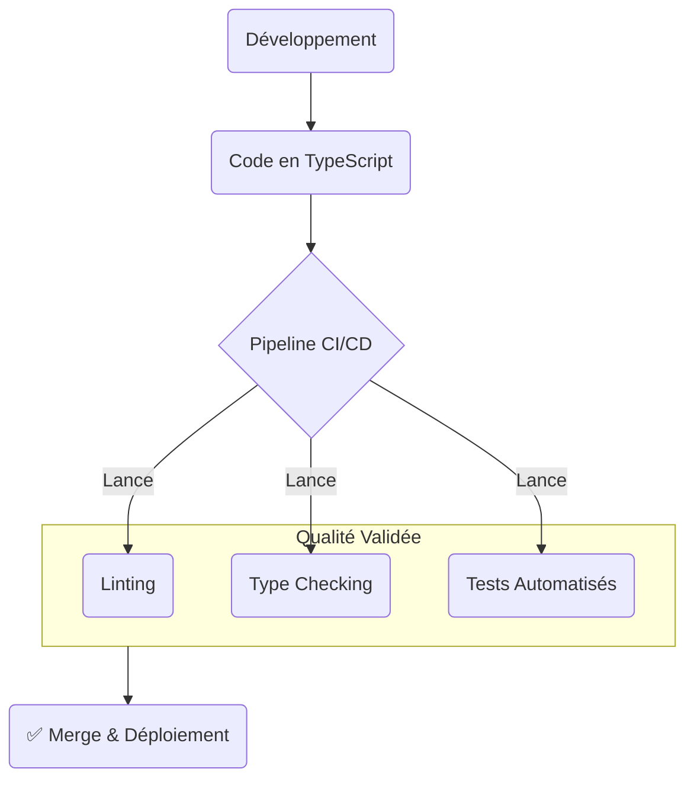

# DR017 : Standards de Qualité Intégrés

> Statut : Adopté

## Décision

La qualité n'est pas une option. Tout le code produit doit respecter les standards suivants :

1. **TypeScript Stricte :** Le typage doit être utilisé de manière exhaustive pour garantir la sécurité de type.

### Tests

Malgré un nombre important de tests unitaires (>10k) et une couverture de code élevée, des bugs persistent, indiquant que nos tests actuels ne sont pas suffisamment pertinents. Nous allons donc adopter une approche de "qualité plutôt que quantité" pour notre stratégie de tests.

La nouvelle répartition sera la suivante :

* **Tests Unitaires (U)** : Pour les fonctions individuelles.
* **Tests d'Intégration** : Pour les pages et les composants complexes.
* **Tests End-to-End (e2e)** : Pour les scénarios utilisateurs complets.

Cette approche vise à réduire le nombre de tests unitaires au profit des tests e2e, ce qui facilitera la CI et améliorera la pertinence de notre couverture de tests, garantissant ainsi une meilleure fiabilité et stabilité de l'application.

### Principes et Patterns de Tests

#### **Pain points adressés**

* **✅ Test environment instable** : Isolation des dépendances pour garantir des tests fiables
* **✅ 97 commits context/provider** : Tests comportementaux qui résistent aux refactors
* **✅ Complexité maintenance** : Tests focalisés sur comportements vs implémentation (trophé de test)
* **Responsabilité** : Tester les comportements sans couplage à l'implémentation (mais à l’utilisateur)
* **Colocation** : Tests à côté du code testé dans chaque feature
* **Utilisation typique** : Isolation des dépendances externes, tests de comportement

#### **Test environment stable :**

```tsx
// ✅ Ce test doit toujours fonctionner
render(<ComplexComponent />)
expect(true).toBeTruthy()
```

```tsx
// ✅ Bon pattern : Test du comportement utilisateur
const ArtistContainer = () => {
  const { data: artist, isLoading } = useArtistQuery()

  if (isLoading) return <Loading />
  return <ArtistCard name={artist.name} />
}

// Test focalisé sur l'expérience utilisateur
test('should show loading then artist name', async () => {
  // Setup: API retourne des données réelles via MSW
  server.use(
    rest.get('/api/artists/123', (req, res, ctx) =>
      res(ctx.json({ name: 'Real Artist' }))
    )
  )

  render(<ArtistContainer artistId="123" />)

  // Comportement: utilisateur voit loading puis contenu
  expect(screen.getByText('Chargement...')).toBeInTheDocument()
  await waitFor(() => {
    expect(screen.getByText('Real Artist')).toBeInTheDocument()
  })
})

// ✅ Bon pattern : Mock les services externes, pas nos hooks
beforeEach(() => {
  // Mock la librairie externe, pas notre logique
  jest.mock('algoliasearch', () => ({
    search: jest.fn().mockResolvedValue({
      hits: [{ name: 'Artist from Algolia' }]
    })
  }))
})

test('should display search results from API', async () => {
  render(<SearchContainer query="artist" />)

  // Notre useSearchQuery utilise la vraie logique avec Algolia mocké
  await waitFor(() => {
    expect(screen.getByText('Artist from Algolia')).toBeInTheDocument()
  })
})
```

#### **Règles d'isolation :**

* Injecter un service de test (ou mocker) les librairies externes (`algoliasearch`), pas nos hooks
* Mocker le backend via MSW, pas les appels individuels
* Tester les comportements utilisateur, pas l'implémentation

#### **Anti-patterns à éviter pour les Tests**

```tsx
// ❌ Anti-pattern : Test fragile couplé aux détails internes
const ArtistContainer = () => {
  const [loading, setLoading] = useState(false)
  const [data, setData] = useState(null)

  useEffect(() => {
    setLoading(true)
    fetchArtist().then(setData).finally(() => setLoading(false))
  }, [])

  return loading ? <Loading /> : <ArtistCard data={data} />
}

// Test cassant à chaque refactor
test('should set loading to true then false', () => {
  const { rerender } = render(<ArtistContainer />)
  expect(mockSetLoading).toHaveBeenCalledWith(true)
  expect(mockSetLoading).toHaveBeenCalledWith(false)
})

// ❌ Anti-pattern : Mock nos propres hooks = masque les régressions
test('should display artist name', () => {
  jest.mock('./useArtistQuery', () => ({
    useArtistQuery: () => ({ data: { name: 'Fake Artist' } })
  }))

  render(<ArtistContainer />)
  expect(screen.getByText('Fake Artist')).toBeInTheDocument()
})

// Si useArtistQuery casse, le test passe toujours
```

#### **Problèmes générés :**

* Tests cassent à chaque refactor (couplage/dépendance à l’implémentation)
* Fausse confiance (mocks cachent les vrais bugs)
* Maintenance test = 2x temps développement feature
* Environment instable = CI/CD non fiable

## Contexte

Notre base de code utilise déjà TypeScript, mais nous avons des zones critiques sans tests, comme le helper `useSync.ts` (complexité 58, tests skippés). Ce hook, responsable de la synchronisation complexe des états de recherche, d'accessibilité et de localisation avec les paramètres de navigation, illustre parfaitement les défis de la dette technique : sa haute complexité et l'absence de tests le rendent difficile à maintenir, à déboguer et à faire évoluer, tout en augmentant le risque de régressions. Il représente un exemple concret de code qui ne suit pas les principes de qualité que nous souhaitons établir.

De plus, les documents sur le `Walking Skeleton` insistent sur le fait que les tests et le pipeline CI/CD sont des éléments **non négociables** de la "Definition of Done". Il est temps de formaliser cette exigence pour toute l'équipe.

## Alternatives considérées

* **Rendre les tests optionnels :** Rejeté. C'est la recette garantie pour augmenter la dette technique, ralentir le développement à long terme et perdre la confiance dans notre capacité à livrer sans régressions.

## Justification

* **TypeScript** réduit les bugs au moment de la compilation, pas en production. Il sert de documentation vivante et améliore radicalement l'expérience de développement (auto-complétion, refactoring sûr).
* **Code de Qualité et Maintenabilité :** Un code qui respecte ces standards (modulaire, bien testé, avec des responsabilités claires) est plus facile à comprendre, à maintenir et à faire évoluer. Le refactoring de composants comme `useSync.ts` impliquera de le décomposer en unités plus petites et testables, de clarifier les responsabilités et de mettre en place une synchronisation d'état plus robuste et prévisible. Cela réduira la complexité, améliorera la fiabilité et facilitera l'intégration de nouvelles fonctionnalités.

## Diagramme

Extrait de code



## Actions à implémenter

1. La résolution de la dette technique sur `useSync.ts` doit impérativement inclure une couverture de tests complète.
2. Les revues de code (Pull Requests) devront systématiquement vérifier la présence et la pertinence des tests, en s'appuyant sur la checklist suivante :

   ### Checklist de Revue de Code pour les Tests

   **1. Couverture des tests :**
   * Chaque nouvelle fonctionnalité ou modification de comportement est-elle accompagnée d'au moins un test (unitaire, d'intégration ou E2E) qui valide son fonctionnement attendu ?
   * Pour tout nouveau fichier ou fonction exportée, existe-t-il un fichier de test associé (`.test.ts`, `.spec.ts`) contenant des tests pour ses fonctionnalités principales ?
   * Les tests existants ont-ils été exécutés et passent-ils après les modifications ? Si le comportement du code a changé, les tests ont-ils été mis à jour pour refléter ce nouveau comportement ou de nouveaux tests ont-ils été ajoutés pour couvrir les cas non testés précédemment ?

   **2. Pertinence des tests (Qualité vs Quantité) :**
   * Le type de test (unitaire pour les fonctions pures, d'intégration pour les pages/composants, E2E pour les scénarios utilisateur complets) correspond-il à la granularité et à la portée du code testé ?
   * Les tests s'appuient-ils sur l'API publique du code testé (entrées/sorties, interactions visibles) plutôt que sur des détails d'implémentation internes (variables privées, structure interne) ?
   * Un échec de test pointe-t-il vers une cause unique et spécifique dans le code ? Les tests ne sont-ils pas excessivement couplés à des détails d'implémentation qui changent fréquemment ?
   * Des tests sont-ils présents pour les valeurs d'entrée extrêmes, les conditions d'erreur (ex: API en échec, données invalides) et les cas d'utilisation non nominaux ?

   **3. Qualité du code des tests :**
   * Le nom du test décrit-il clairement le scénario testé et le résultat attendu ? Le code du test utilise-t-il des noms de variables explicites et une structure simple (Arrange-Act-Assert) ?
   * Les tests unitaires s'exécutent-ils en moins de 100ms chacun ? Les tests d'intégration en moins de 500ms ? (Ces valeurs peuvent être ajustées si des métriques spécifiques sont définies pour le projet).
   * Chaque test peut-il être exécuté indépendamment des autres tests et produire le même résultat à chaque exécution (absence d'effets de bord, de dépendances à l'ordre d'exécution ou à un état global non réinitialisé) ?
   * Les dépendances externes (API, base de données, services) sont-elles remplacées par des mocks/stubs/fakes pour isoler l'unité testée et contrôler son comportement ?

   **4. Dette technique et zones critiques (référence à `useSync.ts`) :**
   * Si la PR modifie du code dans une zone identifiée comme critique ou à forte dette technique (ex: `useSync.ts`), la PR ajoute-t-elle une couverture de tests significative pour cette zone, même si ce n'était pas l'objectif principal de la PR ?
   * La PR inclut-elle des tests pour des parties du code précédemment non couvertes ou améliore-t-elle la qualité des tests existants dans des zones fragiles, contribuant ainsi à réduire la dette technique ?

   **5. Impact sur la CI/CD :**
   * Les nouveaux tests sont-ils configurés pour s'exécuter automatiquement dans le pipeline CI/CD ?
   * L'ajout de nouveaux tests n'augmente-t-il pas la durée d'exécution totale du pipeline CI/CD de plus de X% (ou Y secondes) sans une justification documentée et approuvée ? (X et Y sont des valeurs à définir par l'équipe).

## Output

Une base de code plus fiable, plus facile à maintenir et une plus grande confiance lors des mises en production.
