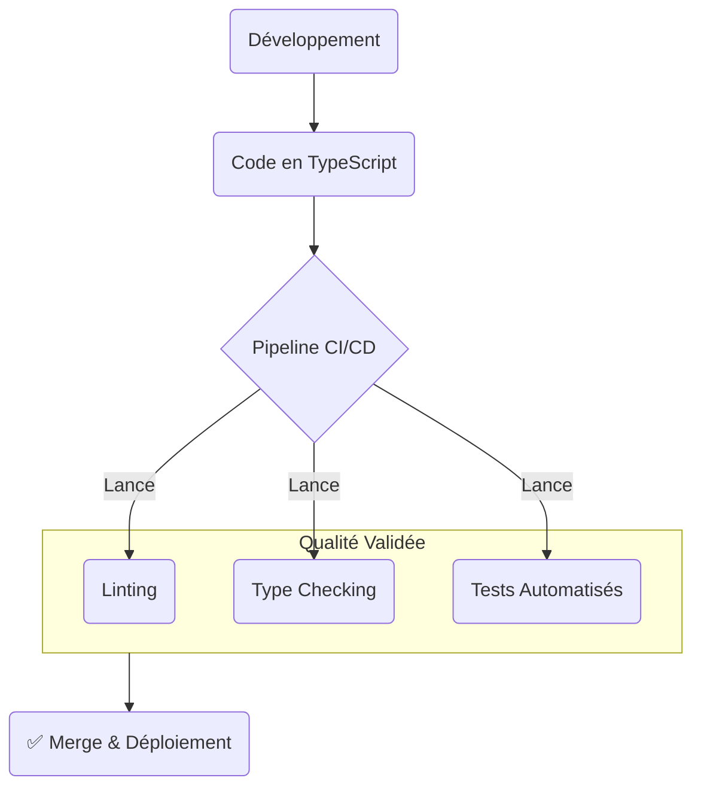

#### DR017 : Standards de Qualité Intégrés

> Statut : Adopté

##### Décision

La qualité n'est pas une option. Tout le code produit doit respecter les standards suivants :

1. **TypeScript Stricte :** Le typage doit être utilisé de manière exhaustive pour garantir la sécurité de type.
2. **Tests Automatisés :** Chaque fonctionnalité doit être couverte par une pyramide de tests appropriée (unitaires, intégration, et E2E pour les flux critiques).

##### Contexte

Notre base de code utilise déjà TypeScript, mais nous avons des zones critiques sans tests, comme le helper `useSync.ts` (complexité 58, tests skippés). De plus, les documents sur le `Walking Skeleton` insistent sur le fait que les tests et le pipeline CI/CD sont des éléments **non négociables** de la "Definition of Done". Il est temps de formaliser cette exigence pour toute l'équipe.

##### Alternatives considérées

- **Rendre les tests optionnels :** Rejeté. C'est la recette garantie pour augmenter la dette technique, ralentir le développement à long terme et perdre la confiance dans notre capacité à livrer sans régressions.

##### Justification

- **TypeScript** réduit les bugs au moment de la compilation, pas en production. Il sert de documentation vivante et améliore radicalement l'expérience de développement (auto-complétion, refactoring sûr).
- **Les Tests Automatisés** sont notre filet de sécurité. Ils nous permettent de refactoriser et d'ajouter des fonctionnalités avec la confiance que nous n'avons rien cassé. Ils sont la base de l'intégration et du déploiement continus.

##### Diagramme

Extrait de code

##### Actions à implémenter

1. La résolution de la dette technique sur `useSync.ts` doit impérativement inclure une couverture de tests complète.
2. Les revues de code (Pull Requests) devront systématiquement vérifier la présence et la pertinence des tests.

##### Output

Une base de code plus fiable, plus facile à maintenir et une plus grande confiance lors des mises en production.