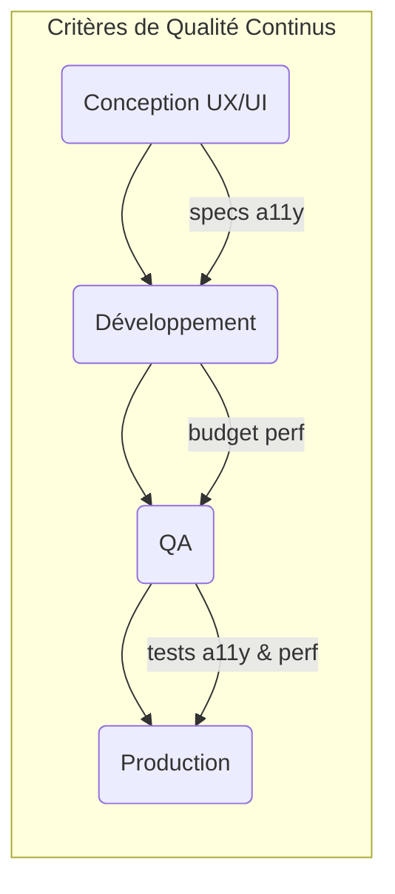

#### DR018 : Performance et Accessibilité dès la Conception

> Statut : Adopté

##### Décision

La **performance** et l'**accessibilité (a11y)** ne sont pas des tâches à faire "plus tard". Elles sont des critères d'acceptation fondamentaux et doivent être intégrées dès la phase de conception (maquettes) et tout au long du développement de chaque fonctionnalité.

##### Contexte

Notre audit a révélé des problèmes de performance critiques qui impactent directement l'expérience utilisateur, notamment le temps de démarrage de la page `HOME` (P95 de 6s, avec un "skeleton blocking" de 19s). Parallèlement, le module `ACCESSIBILITY` est cité comme étant bien conçu, montrant que nous avons les compétences mais que nous ne les appliquons pas de manière systématique.

##### Alternatives considérées

- **Optimiser à la fin :** Attendre que les utilisateurs se plaignent pour corriger les problèmes de performance ou d'accessibilité. Rejeté car il est 10 à 100 fois plus coûteux de corriger ces problèmes en production qu'en phase de conception.

##### Justification

- **Expérience Utilisateur :** La vitesse est une fonctionnalité. Une application lente ou inutilisable par une partie de la population (handicap) est une application de mauvaise qualité.
- **Impact Métier :** La performance a un impact direct sur la rétention et la conversion. L'accessibilité est une obligation légale et éthique qui élargit notre audience.
- **Efficacité :** Penser à ces aspects en amont coûte beaucoup moins cher. Par exemple, concevoir un composant en pensant aux lecteurs d'écran est trivial ; le rendre accessible après coup peut nécessiter une refonte complète.

##### Diagramme

Extrait de code

##### Actions à implémenter

1. Les User Stories doivent inclure des critères d'acceptation liés à la performance (ex: "le temps de chargement ne doit pas dépasser X ms") et à l'accessibilité (ex: "tous les éléments interactifs doivent être atteignables au clavier").
2. Le chantier prioritaire sur la performance du module `HOME` doit être lancé immédiatement.

##### Output

Des produits de meilleure qualité, plus inclusifs, et qui ravissent nos utilisateurs.