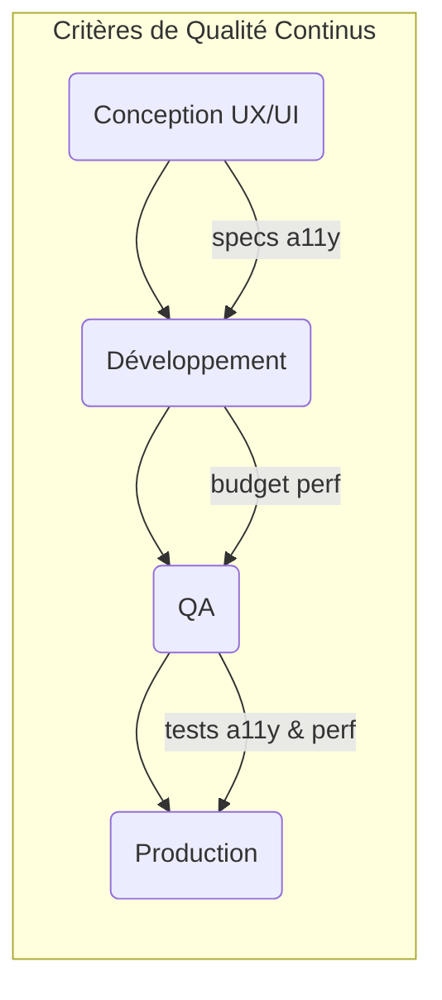

# DR018 : Performance et Accessibilité dès la Conception

> Statut : Adopté

## Décision

La **performance** et l'**accessibilité (a11y)** ne sont pas des tâches à faire "plus tard". Elles sont des critères d'acceptation fondamentaux et doivent être intégrées dès la phase de conception (maquettes) et tout au long du développement de chaque fonctionnalité.

### Principes et Patterns pour Performance et Accessibilité

#### **Pain points adressés**

- **✅ Bundle Android 18.7MB → objectif <15MB** : Architecture optimisée pour réduire le bundle
- **✅ Performance P95 ~4s → objectif <2s** : Patterns optimisés pour améliorer le temps de chargement et les performances d’affichages générales
- **✅ Accessibilité manquante** : Standards RGAA intégrés par le design, elle est intégrée dès la conception de l'architecture, pas ajoutée après coup
- **Responsabilité** : Respecter les objectifs Vision 2025 par notre design architectural
- **Colocation** : Standards appliqués dans chaque composant et feature
- **Utilisation typique** : RGAA AA, performance <2s, bundle <15MB android

#### **Composition > props drilling :**

```tsx
// ✅ Composition simple et performance
const Container: FunctionComponent<{ subtitle: string }> = ({ subtitle }) => {
  const onPress = useOnPress()
  const title = useGetTitle()

  return (
    <View>
      <Title>{title}</Title>
      {subtitle && <Text>{subtitle}</Text>}
      <Button title="action" onPress={onPress} />
    </View>
  )
}
```

#### **Anti-patterns à éviter pour Performance et Accessibilité**

```tsx
// ❌ Anti-pattern : Props drilling + re-renders excessifs
const Container: FunctionComponent = () => {
  const [user, setUser] = useState()
  const [theme, setTheme] = useState()
  const [analytics, setAnalytics] = useState()

  return (
    <ArtistSection
      user={user}
      theme={theme}
      analytics={analytics}
      onUserUpdate={setUser}
      onThemeChange={setTheme}
    />
  )
}

const ArtistSection = ({ user, theme, analytics, onUserUpdate, onThemeChange }) => {
  return (
    <ArtistCard
      user={user}
      theme={theme}
      analytics={analytics}
      onUserUpdate={onUserUpdate}
      onThemeChange={onThemeChange}
    />
  )
}

// Chaque changement user/theme re-render toute la hiérarchie

// ❌ Anti-pattern : Accessibilité comme afterthought
const OfferCard = ({ title, price }) => {
  return (
    <Pressable onPress={handlePress}>
      <Image source={offerImage} />
      <Text>{title}</Text>
      <Text>{price}€</Text>
      {/* Pas de labels, pas de roles, pas de hints */}
    </Pressable>
  )
}
```

#### **Problèmes générés :**

- Performance dégradée par re-renders inutiles
- Bundle alourdi par props drilling
- Accessibilité impossible à rattraper sans refactor complet
- Maintenance complexifiée par couplages

### Synergies avec les autres DRs (DR011 à DR017)

Les principes énoncés dans les autres Décisions d'Architecture (DRs) contribuent de manière significative à l'atteinte des objectifs de performance et d'accessibilité définis dans ce DR018. Une application rigoureuse de ces DRs est essentielle pour construire une application rapide, légère et inclusive.

- **DR011 : Séparation des états (Serveur vs Client)**
  - **Impact Performance :** L'utilisation de React Query pour l'état serveur (caching intelligent, revalidation en arrière-plan) et de Zustand pour l'état client (sélections optimisées, prévention des re-renders inutiles) réduit drastiquement les temps de chargement et améliore la fluidité de l'interface utilisateur.
  - **Impact Accessibilité :** Une UI plus rapide et réactive améliore l'expérience des utilisateurs d'assistances technologiques. Une gestion d'état claire facilite la mise en œuvre d'interactions accessibles et prévisibles.

- **DR012 : Extraire la logique métier dans des fonctions pures**
  - **Impact Performance :** Les fonctions pures, combinées à `useMemo`, permettent d'éviter les re-calculs coûteux, optimisant ainsi les performances. La séparation de la logique métier de l'UI favorise un rendu plus efficace des composants.
  - **Impact Accessibilité :** Une logique métier isolée et testable rend le code plus maintenable, ce qui facilite l'intégration et la vérification des fonctionnalités d'accessibilité.

- **DR013 : Isolation des effets de bord**
  - **Impact Performance :** L'encapsulation des effets de bord (analytics, storage) dans des hooks dédiés empêche les re-renders inattendus et les blocages du thread principal, assurant une meilleure réactivité de l'interface.
  - **Impact Accessibilité :** Des effets de bord contrôlés et explicites garantissent un flux d'application prévisible, essentiel pour les utilisateurs d'assistances technologiques. Cela simplifie également la gestion des annonces d'accessibilité.

- **DR014 : Séparation UI / Logique / Navigation**
  - **Impact Performance :** Cette séparation réduit le "prop drilling" et la complexité des "god components", permettant aux composants UI de se re-rendre moins fréquemment et aux composants conteneurs d'optimiser la préparation des données.
  - **Impact Accessibilité :** Une architecture modulaire facilite l'implémentation et la vérification des fonctionnalités d'accessibilité, en permettant de se concentrer sur les préoccupations d'accessibilité à la bonne couche.

- **DR015 : Injection de Dépendances via Context**
  - **Impact Performance :** En limitant l'usage de React Context à l'injection de dépendances stables, ce DR élimine les "explosions de contextes" et les re-renders en cascade, améliorant significativement les performances de rendu.
  - **Impact Accessibilité :** Un arbre de composants stable et prévisible est une base solide pour une UI accessible. La DI simplifie le mocking des services, y compris ceux liés à l'accessibilité, pour des tests plus fiables.

- **DR016 : Logiques portées par le Backend**
  - **Impact Performance :** Le déplacement de la logique métier complexe et de l'orchestration API vers le backend réduit la charge de traitement côté client, le nombre d'appels réseau et la taille du bundle, contribuant directement à des temps de chargement plus rapides et un bundle Android plus léger.
  - **Impact Accessibilité :** Un client plus léger et plus rapide offre une expérience utilisateur plus fluide pour tous, y compris les personnes en situation de handicap. La simplification du client permet aux développeurs de mieux se concentrer sur l'accessibilité.

- **DR017 : Standards de Qualité Intégrés**
  - **Impact Performance :** Un code de haute qualité, bien typé (TypeScript) et rigoureusement testé (stratégie de tests, checklist de PR) est moins sujet aux bugs et aux régressions qui dégradent la performance.
  - **Impact Accessibilité :** TypeScript et des tests robustes (y compris E2E simulant les interactions utilisateur) sont cruciaux pour garantir l'accessibilité. La checklist de PR encourage la vérification systématique des tests, ce qui doit inclure les aspects d'accessibilité.

```mermaid
graph TD
    subgraph Objectifs DR018
        Perf[Performance]
        A11y[Accessibilité]
    end

    subgraph DRs Contributifs
        DR011[DR011: Séparation États Serveur/Client]
        DR012[DR012: Logique Métier Pure]
        DR013[DR013: Isolation Effets de Bord]
        DR014[DR014: Séparation UI/Logique/Nav]
        DR015[DR015: Injection Dépendances Context]
        DR016[DR016: Logiques Backend]
        DR017[DR017: Standards Qualité Intégrés]
    end

    DR011 -- Optimisation Renders & Cache --> Perf
    DR011 -- UI Réactive & Prévisible --> A11y

    DR012 -- Calculs Efficaces --> Perf
    DR012 -- Code Maintenable --> A11y

    DR013 -- Réactivité UI & Prévisibilité --> Perf
    DR013 -- Flux App Prévisible --> A11y

    DR014 -- Moins de Re-renders & Modularité --> Perf
    DR014 -- Implémentation A11y Facilitée --> A11y

    DR015 -- Réduction Re-renders --> Perf
    DR015 -- Stabilité Composants --> A11y

    DR016 -- Client Léger & Moins d'Appels --> Perf
    DR016 -- Expérience Fluide --> A11y

    DR017 -- Code Fiable & Testé --> Perf
    DR017 -- Vérification A11y --> A11y
```



## Contexte

Notre audit a révélé des problèmes de performance critiques qui impactent directement l'expérience utilisateur, notamment le temps de démarrage de la page `HOME` (P95 de 6s, avec un "skeleton blocking" de 19s). Parallèlement, le module `ACCESSIBILITY` est cité comme étant bien conçu, montrant que nous avons les compétences mais que nous ne les appliquons pas de manière systématique.

## Alternatives considérées

- **Optimiser à la fin :** Attendre que les utilisateurs se plaignent pour corriger les problèmes de performance ou d'accessibilité. Rejeté car il est 10 à 100 fois plus coûteux de corriger ces problèmes en production qu'en phase de conception.

## Justification

- **Expérience Utilisateur :** La vitesse est une fonctionnalité. Une application lente ou inutilisable par une partie de la population (handicap) est une application de mauvaise qualité.
- **Impact Métier :** La performance a un impact direct sur la rétention et la conversion. L'accessibilité est une obligation légale et éthique qui élargit notre audience.
- **Efficacité :** Penser à ces aspects en amont coûte beaucoup moins cher. Par exemple, concevoir un composant en pensant aux lecteurs d'écran est trivial ; le rendre accessible après coup peut nécessiter une refonte complète.

## Diagramme

Extrait de code



## Actions à implémenter

1. Les User Stories doivent inclure des critères d'acceptation liés à la performance (ex: "le temps de chargement ne doit pas dépasser X ms") et à l'accessibilité (ex: "tous les éléments interactifs doivent être atteignables au clavier").
2. Le chantier prioritaire sur la performance du module `HOME` doit être lancé immédiatement.

## Output

Des produits de meilleure qualité, plus inclusifs, et qui ravissent nos utilisateurs. Les exemples de code fournis dans ce document illustrent les patterns à suivre et les anti-patterns à éviter. Le refactoring des anti-patterns identifiés est essentiel pour atteindre nos objectifs de performance, de taille de bundle et d'accessibilité.
