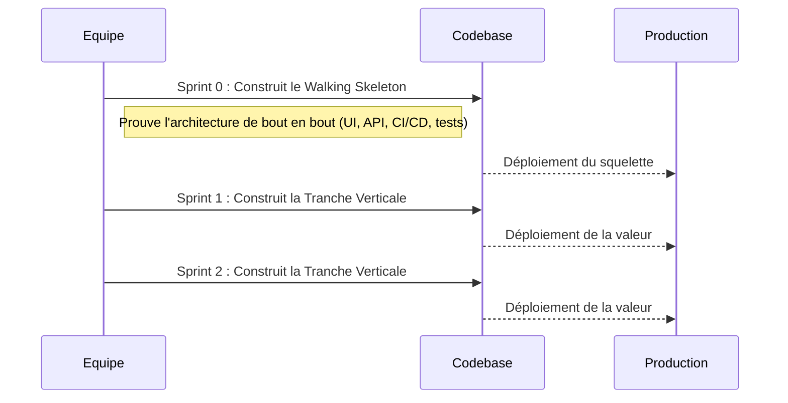

# DR019 : Walking Skeleton & Slicing Vertical

> Statut : Adopté

## Décision

Toute refonte ou nouvelle fonctionnalité majeure sera développée en suivant une stratégie en deux phases :

1. **Phase 1 : Le Walking Skeleton.** Construire une version squelettique mais fonctionnelle de bout en bout pour valider l'architecture.
2. **Phase 2 : Le Découpage Vertical (Vertical Slicing).** Livrer la fonctionnalité par tranches de valeur complètes et testables.

## Contexte

Les projets de refonte échouent souvent à cause d'hypothèses architecturales erronées découvertes trop tard, ou d'intégrations "Big Bang" catastrophiques. Nous avons besoin d'une méthode pour dérisquer nos initiatives et livrer de la valeur de manière continue.

## Alternatives considérées

- **Approche "Big Bang" :** Refactoriser un module entier en une seule fois. Rejeté car c'est une approche à très haut risque, qui retarde la livraison de valeur et rend les retours en arrière difficiles.
- **Découpage Horizontal :** Construire par couches techniques (d'abord toute l'UI, puis toute la logique...). Rejeté car c'est un anti-pattern agile qui retarde l'intégration et la livraison de valeur réelle.

## Justification

- Le **Walking Skeleton** est notre assurance-vie architecturale. Il prouve que notre plan est viable sur un périmètre minuscule avant de nous engager massivement. Son produit est la **confiance**. Il ne doit pas être confondu avec un MVP, qui vise à valider un marché.
- Le **Découpage Vertical** est notre métronome de livraison. Chaque tranche est un incrément de logiciel fonctionnel qui apporte de la valeur à l'utilisateur, permettant d'obtenir des retours rapides et de réduire les risques en continu.

### Illustration des Principes et Refactoring

Ce document illustre directement les principes du Walking Skeleton et du Découpage Vertical à travers les diagrammes suivants.

- **Code qui suit ce principe :** Le diagramme de Gantt "Création d'un Nouveau Module (Ex: 'Gestion de Profil')" détaille un exemple concret de développement par tranches verticales, où chaque sprint ajoute une valeur fonctionnelle testable, en commençant par un Walking Skeleton. C'est un exemple de code qui, une fois implémenté selon ces étapes, suivrait ce principe.
- **Code qui ne suit pas ce principe :** Les "Alternatives considérées" (Approche "Big Bang" et Découpage Horizontal) décrivent les anti-patterns. Tout code développé en suivant ces approches ne respecterait pas ce principe. Un exemple serait un module où l'UI est entièrement développée avant toute logique métier ou connexion API, ou un refactoring massif sans livraison incrémentale.
- **Exemple dans le code pour illustrer ce principe :** Le diagramme de Gantt sert d'exemple détaillé pour illustrer comment un nouveau module est construit en respectant le Walking Skeleton et le Découpage Vertical.

* **Illustration du refactoring :** Le processus décrit par le Walking Skeleton et le Découpage Vertical est en soi une approche de refactoring pour les fonctionnalités majeures ou les modules existants. Plutôt qu'un "Big Bang" refactor, il s'agit de déconstruire la refonte en petites tranches gérables, comme illustré par les sprints du diagramme de Gantt. Par exemple, si un module existant devait être refactorisé pour la "Gestion de Profil", il serait décomposé en ces mêmes sprints, remplaçant progressivement l'ancienne implémentation par les nouvelles tranches verticales.

Pour une illustration concrète de l'application de ce principe de découpage vertical et de l'évolution du code à travers les différentes étapes, veuillez consulter le document détaillé : [Application du DR019 au module GenericHome (exemple-sf-ws.md)](../architecture/exemple-sf-ws.md).

### Application Incrémentale des DRs et Validation du Découpage

L'application du Walking Skeleton et du Découpage Vertical implique une intégration progressive des principes définis dans les autres DRs. Il est important de noter que chaque tranche ne vise pas une conformité totale à tous les DRs dès le départ, mais une livraison incrémentale de valeur et une amélioration continue de la qualité.

**Analyse des Découpages 1, 2 et 3 :**

- **Découpage 1 (Walking Skeleton) :** Se concentre sur la validation architecturale (feature flag, structure minimale). Il ne vise pas encore l'application détaillée des DRs de qualité de code, mais prouve la faisabilité technique du chemin choisi.
- **Découpage 2 (Tranche Verticale #1 - Affichage et Pagination) :** Applique principalement **DR011 (Séparation des états - React Query)** pour la gestion de l'état serveur et la pagination. À ce stade, d'autres principes comme l'extraction des fonctions pures (DR012), l'isolation des effets de bord (DR013) ou la séparation UI/Logique (DR014) ne sont pas encore pleinement appliqués. C'est un choix délibéré pour maintenir la tranche petite et livrer rapidement une fonctionnalité de base.
- **Découpage 3 (Tranche Verticale #2 - Optimisation de la Logique et Séparation des Responsabilités) :** Vient compléter le découpage précédent en appliquant de manière plus approfondie les principes de **DR012 (Fonctions pures)**, **DR013 (Isolation des effets de bord)**, **DR014 (Séparation UI/Logique/Navigation)** et **DR022 (SRP)**. C'est dans cette tranche que le code devient plus modulaire, testable et maintenable.

**Pourquoi le Découpage 2 ne respecte pas tous les principes ?**

Le Découpage 2 ne respecte pas encore tous les principes des DRs (DR012, DR013, DR014, etc.) car son objectif principal est de livrer la fonctionnalité de base d'affichage et de pagination de manière fonctionnelle et rapide. Tenter d'appliquer tous les principes de manière exhaustive dès cette tranche rendrait la tranche trop complexe, retarderait la livraison de valeur et irait à l'encontre de l'agilité prônée par le découpage vertical. La conformité complète est un objectif progressif, atteint sur plusieurs tranches.

**Validité du Découpage en Tranches :**

Oui, le découpage en ces trois tranches est pertinent et conforme à l'esprit du DR019 :
- Chaque tranche délivre un incrément tangible et testable.
- Le processus commence par une validation architecturale (Walking Skeleton).
- Les principes des DRs sont appliqués progressivement, permettant au code d'évoluer vers une meilleure qualité et conformité.
- Cette approche évite les refactorings "Big Bang" en décomposant le travail en étapes gérables et à valeur ajoutée.

### Utilisation de DR022 (Principe de Responsabilité Unique - SRP)

- **Application dans les découpages :**
  - **Découpage 2 :** Le principe de SRP n'est pas encore pleinement respecté. Le composant `GenericHomeModern.tsx` à ce stade est encore un composant "god" qui gère à la fois la logique de données, la logique de pagination, et le rendu de l'UI.
  - **Découpage 3 :** Le SRP est **correctement et explicitement appliqué**. L'exemple montre comment le composant monolithique est décomposé :
    - `shouldDisplayVideoCarouselInHeader.ts` : Fonction pure avec une seule responsabilité (calculer un booléen).
    - `useTrackAllModulesSeen.ts` : Hook dédié avec une seule responsabilité (tracking analytics).
    - `useHomeViewModel.ts` : Hook avec la responsabilité unique de gérer la logique de la vue et de préparer les données.
    - `HomeView.tsx` : Composant de présentation pur avec la responsabilité unique de rendre l'UI.
    - `HomeListHeader.tsx` : Composant de présentation pour l'en-tête de la liste.
    - Cette décomposition est une application directe et réussie du SRP.

- **DR022 doit-il toujours être respecté ?**
    Oui, le Principe de Responsabilité Unique (DR022) est un principe fondamental qui **doit toujours être visé**. C'est une pierre angulaire d'une architecture propre, de la maintenabilité et de la testabilité du code. Cependant, dans le cadre d'un développement incrémental (comme le découpage vertical), il peut y avoir des déviations temporaires. Il est acceptable qu'une tranche intermédiaire ne respecte pas encore parfaitement le SRP, *à condition qu'il y ait un plan pour le refactoriser dans les tranches suivantes* (comme démontré par le passage du Découpage 2 au Découpage 3). Le SRP est un principe directeur pour l'amélioration continue, et non une exigence absolue à chaque étape minuscule du développement. Les violations du SRP sont souvent la cause des "pain points" que les autres DRs cherchent à résoudre (composants complexes, tests difficiles, re-renders inutiles).

## Diagramme

Extrait de code



```mermaid
gantt
    title Création d'un Nouveau Module (Ex: "Gestion de Profil")
    dateFormat  Sprint-W
    axisFormat %s-%e
    %% Le Walking Skeleton ne livre pas de valeur métier, mais de la confiance technique.
    %% C'est une assurance contre les risques architecturaux.
    section Sprint 0 : Walking Skeleton (Validation Technique)
    Initialisation             :active, 0-S0, 1w
    Créer la structure du dossier `features/profile` : after 0-S0, 2d
    Configurer la navigation de base (1 écran)    : after 0-S0, 3d
    Créer un hook React Query (mocké) pour les données : after 0-S0, 2d
    Livrable Clé : Test E2E du flux minimal passe : crit, 0-S4, 1d
    Livrable Clé : Pipeline CI/CD est au vert     : crit, 0-S4, 1d

    %% Chaque tranche est une part complète du gâteau, traversant toutes les couches
    %% techniques pour apporter de la valeur observable à l'utilisateur.
    section Sprint 1 : Tranche #1 (Happy Path - Consultation)
    Développer l'UI d'affichage du profil       : 1-S0, 2d
    Connecter au vrai endpoint API via React Query : 1-S2, 2d
    Isoler la logique de formatage dans `useProfileLogic()` : 1-S4, 1d
    Livrable Clé : L'utilisateur peut voir ses informations : crit, 1-S4, 1d

    section Sprint 2 : Tranche #2 (Modification du profil)
    Créer le formulaire de modification (UI)  : 2-S0, 2d
    Utiliser Zustand (`useProfileFormStore`) pour l'état du formulaire : 2-S2, 2d
    Implémenter la mutation React Query (`useUpdateProfile`) : 2-S3, 2d
    Livrable Clé : L'utilisateur peut modifier son nom et son avatar : crit, 2-S4, 1d

    section Sprint 3 : Tranche #3 (Gestion des erreurs)
    Ajouter l'affichage des erreurs de validation : 3-S0, 2d
    Gérer les états d'erreur de la mutation API    : 3-S2, 1d
    Isoler le tracking dans `useProfileAnalytics()`  : 3-S3, 1d
    Livrable Clé : L'utilisateur voit un message clair si la modification échoue : crit, 3-S4, 1d
```

## Actions à implémenter

1. Organiser un atelier de découpage pour chaque nouvelle épopée afin de définir le Walking Skeleton et les tranches verticales.
2. Le "Definition of Done" d'un Walking Skeleton inclut obligatoirement un test de bout en bout (E2E) qui passe et un pipeline CI/CD fonctionnel.

## Output

Un processus de développement prévisible et à faible risque qui livre de la valeur de manière itérative.
