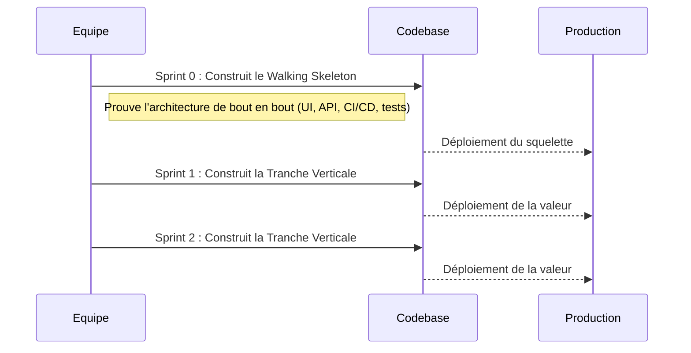

# DR019 : Walking Skeleton & Slicing Vertical

> Statut : Adopté

## Décision

Toute refonte ou nouvelle fonctionnalité majeure sera développée en suivant une stratégie en deux phases :

1. **Phase 1 : Le Walking Skeleton.** Construire une version squelettique mais fonctionnelle de bout en bout pour valider l'architecture.
2. **Phase 2 : Le Découpage Vertical (Vertical Slicing).** Livrer la fonctionnalité par tranches de valeur complètes et testables.

## Contexte

Les projets de refonte échouent souvent à cause d'hypothèses architecturales erronées découvertes trop tard, ou d'intégrations "Big Bang" catastrophiques. Nous avons besoin d'une méthode pour dérisquer nos initiatives et livrer de la valeur de manière continue.

## Alternatives considérées

- **Approche "Big Bang" :** Refactoriser un module entier en une seule fois. Rejeté car c'est une approche à très haut risque, qui retarde la livraison de valeur et rend les retours en arrière difficiles.
- **Découpage Horizontal :** Construire par couches techniques (d'abord toute l'UI, puis toute la logique...). Rejeté car c'est un anti-pattern agile qui retarde l'intégration et la livraison de valeur réelle.

## Justification

- Le **Walking Skeleton** est notre assurance-vie architecturale. Il prouve que notre plan est viable sur un périmètre minuscule avant de nous engager massivement. Son produit est la **confiance**. Il ne doit pas être confondu avec un MVP, qui vise à valider un marché.
- Le **Découpage Vertical** est notre métronome de livraison. Chaque tranche est un incrément de logiciel fonctionnel qui apporte de la valeur à l'utilisateur, permettant d'obtenir des retours rapides et de réduire les risques en continu.

## Diagramme

Extrait de code



```mermaid
gantt
    title Création d'un Nouveau Module (Ex: "Gestion de Profil")
    dateFormat  Sprint-W
    axisFormat %s-%e
    %% Le Walking Skeleton ne livre pas de valeur métier, mais de la confiance technique.
    %% C'est une assurance contre les risques architecturaux.
    section Sprint 0 : Walking Skeleton (Validation Technique)
    Initialisation             :active, 0-S0, 1w
    Créer la structure du dossier `features/profile` : after 0-S0, 2d
    Configurer la navigation de base (1 écran)    : after 0-S0, 3d
    Créer un hook React Query (mocké) pour les données : after 0-S0, 2d
    Livrable Clé : Test E2E du flux minimal passe : crit, 0-S4, 1d
    Livrable Clé : Pipeline CI/CD est au vert     : crit, 0-S4, 1d

    %% Chaque tranche est une part complète du gâteau, traversant toutes les couches
    %% techniques pour apporter de la valeur observable à l'utilisateur.
    section Sprint 1 : Tranche #1 (Happy Path - Consultation)
    Développer l'UI d'affichage du profil       : 1-S0, 2d
    Connecter au vrai endpoint API via React Query : 1-S2, 2d
    Isoler la logique de formatage dans `useProfileLogic()` : 1-S4, 1d
    Livrable Clé : L'utilisateur peut voir ses informations : crit, 1-S4, 1d

    section Sprint 2 : Tranche #2 (Modification du profil)
    Créer le formulaire de modification (UI)  : 2-S0, 2d
    Utiliser Zustand (`useProfileFormStore`) pour l'état du formulaire : 2-S2, 2d
    Implémenter la mutation React Query (`useUpdateProfile`) : 2-S3, 2d
    Livrable Clé : L'utilisateur peut modifier son nom et son avatar : crit, 2-S4, 1d

    section Sprint 3 : Tranche #3 (Gestion des erreurs)
    Ajouter l'affichage des erreurs de validation : 3-S0, 2d
    Gérer les états d'erreur de la mutation API    : 3-S2, 1d
    Isoler le tracking dans `useProfileAnalytics()`  : 3-S3, 1d
    Livrable Clé : L'utilisateur voit un message clair si la modification échoue : crit, 3-S4, 1d
```

## Actions à implémenter

1. Organiser un atelier de découpage pour chaque nouvelle épopée afin de définir le Walking Skeleton et les tranches verticales.
2. Le "Definition of Done" d'un Walking Skeleton inclut obligatoirement un test de bout en bout (E2E) qui passe et un pipeline CI/CD fonctionnel.

## Output

Un processus de développement prévisible et à faible risque qui livre de la valeur de manière itérative.
