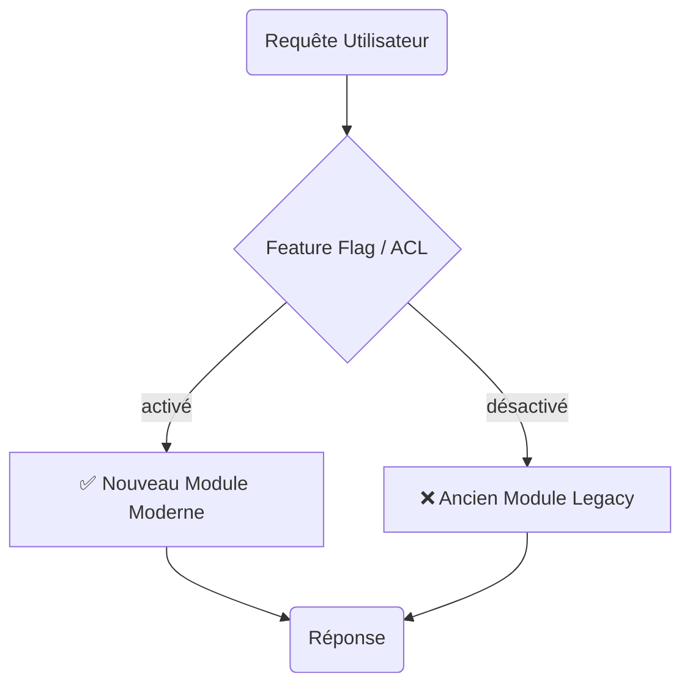
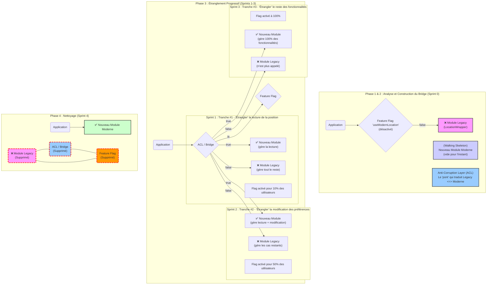

#### DR020 : Méthodologie de Refactorisation Legacy (Strangler Fig)

> Statut : Adopté

##### Décision

Nous adoptons officiellement le **pattern Strangler Fig (Figuier Étrangleur)** pour moderniser nos modules legacy. La transition se fera via un **Anti-Corruption Layer (ACL)** et sera contrôlée par des **feature flags**.

##### Contexte

Des modules critiques comme `LocationWrapper` (113 usages), `SearchWrapper` (173 usages) et `AuthWrapper` (46 usages) sont trop couplés et risqués pour être remplacés en une seule fois. Nous avons besoin d'une méthode de migration progressive qui garantit la stabilité et permet un rollback instantané.

##### Alternatives considérées

- **Réécriture "stop-the-world" :** Mettre en pause le développement de fonctionnalités pour réécrire le module. Rejeté car cela bloque la livraison de valeur métier et le risque d'échec est très élevé.
- **Refactoring sur place :** Modifier le code legacy directement. Rejeté car cela risque de propager la complexité et ne permet pas de valider la nouvelle architecture en parallèle.
- **Refactoring par couche technique** : mettre à jour tous les appels réseaux, puis tous les contextes, puis… . Rejecté car cela bloque la livraison de valeur métier et si on doit s’arrêter plus tôt rien ne sera fait.

##### Justification

Le pattern Strangler Fig est la méthode la plus sûre pour moderniser un système en production.

- **Faible risque :** L'ancien système continue de fonctionner pendant que le nouveau est construit et validé.
- **Déploiement progressif :** Les feature flags nous permettent de rediriger le trafic périmètre par périmètre (ex: d'abord la Recherche, puis la Home), et même de faire des tests A/B.
- **Rollback immédiat :** Si un problème survient, il suffit de désactiver un feature flag pour revenir à l'ancien système.
- **L'ACL** protège notre nouveau code des concepts et de la complexité du legacy.

##### Diagramme

Extrait de code

##### Actions à implémenter

1. Le module `LocationWrapper` sera le projet pilote pour cette méthodologie.
2. Le processus suivra 4 phases : Analyse (1j), Construction du nouveau code + ACL (2j), Étranglement progressif (2-3j), Nettoyage (1j).
3. Créer des templates de code pour l'ACL et les hooks de "bridge" afin d'accélérer les futures migrations.

##### Output

Une feuille de route claire et sécurisée pour démanteler notre dette technique sans mettre en péril la production.
