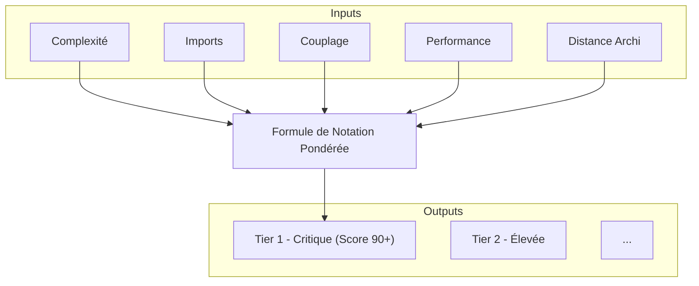

#### DR021 : Métriques de Santé des Modules

> Statut : Adopté

##### Décision

Nous utilisons une **formule de notation pondérée** pour évaluer la santé de chaque module et prioriser objectivement nos efforts de refactorisation. Les modules sont classés en "Tiers de Priorité".

##### Contexte

Avec 34 modules, il est difficile de décider où concentrer nos efforts de refactorisation. Les décisions basées sur l'intuition ou uniquement sur le nombre de bugs sont souvent inefficaces car elles traitent les symptômes et non les causes profondes.

##### Alternatives considérées

- **Prioriser par "feeling" ou "douleur" ressentie :** Rejeté car subjectif et non défendable.
- **Prioriser uniquement par impact business :** Rejeté car cela peut ignorer des bombes à retardement techniques qui finiront par impacter tout le produit.

##### Justification

- **Approche data-driven :** Une formule nous donne un cadre objectif et quantifiable pour comparer les modules.
- **Vision holistique :** La formule prend en compte plusieurs facettes de la dette technique, pas seulement la complexité du code.
- **Priorisation stratégique :** Elle nous a permis d'identifier les "God Modules" (`HOME`, `NAVIGATION`, `OFFER`) qui représentent un risque systémique et doivent être traités en priorité.

La formule est a affiner mais celle du POC était : `Score = (Complexité * 0.40) + (Imports * 0.25) + (Couplage * 0.20) + (Performance * 0.10) + (Distance Architecturale * 0.05)`

##### Diagramme

Extrait de code

##### Actions à implémenter

1. Maintenir et mettre à jour le classement des modules chaque trimestre.
2. La feuille de route de la dette technique doit se concentrer en priorité sur les modules de Tier 1 et 2.
3. Utiliser ce score pour justifier les chantiers de refactorisation auprès du produit et du management.

##### Output

Un outil de priorisation objectif pour guider notre stratégie de réduction de la dette technique.