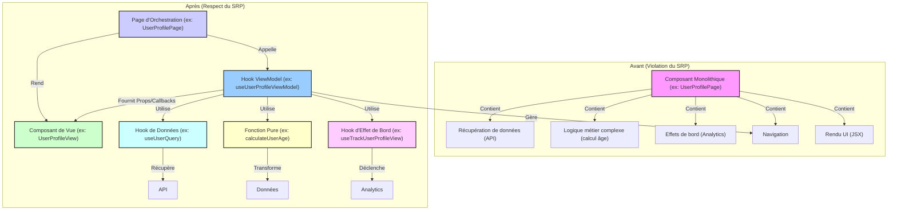

# DR022 : Principe de Responsabilité Unique (SRP)

> Statut : Adopté

## Décision

Chaque composant, hook ou fonction doit avoir une **unique et bien définie responsabilité**. Un composant doit se concentrer sur le rendu, un hook sur une logique spécifique (état, effet de bord, calcul), et une fonction sur une tâche atomique. Un module ne doit pas connaître les détails d'implémentation de ses dépendances, mais seulement leur intention.

## Contexte

Des composants ou fonctions monolithiques qui gèrent trop de responsabilités sont difficiles à comprendre, à tester et à maintenir. Ils entraînent un couplage fort et une faible réutilisabilité. Par exemple, un composant qui à la fois récupère des données, les transforme, gère l'état de l'UI, et envoie des événements analytics viole le SRP.

## Justification

- **Clarté et Lisibilité :** Un code avec des responsabilités claires est plus facile à lire et à comprendre.
- **Testabilité :** Des unités de code plus petites et focalisées sont beaucoup plus simples à tester unitairement.
- **Maintenabilité :** Les changements dans une responsabilité n'affectent pas les autres, réduisant le risque de régressions.
- **Réutilisabilité :** Des unités de code avec une seule responsabilité sont plus faciles à réutiliser dans différents contextes.
- **Découplage :** Le code devient moins dépendant des détails d'implémentation, ce qui facilite les évolutions.

## Diagramme : Séparation des responsabilités (SRP)



Pour des exemples concrets d'application de ce principe, y compris un refactoring pas à pas d'un module legacy, veuillez consulter le document [exemple.md](../architecture/exemple.md).```
