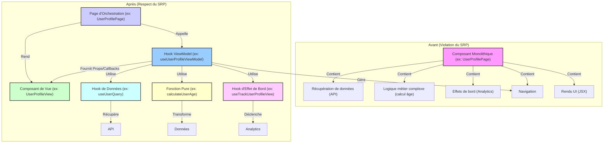

# DR022 : Principe de Responsabilité Unique (SRP)

> Statut : Adopté

## Décision

Chaque composant, hook ou fonction doit avoir une **unique et bien définie responsabilité**. Un composant doit se concentrer sur le rendu, un hook sur une logique spécifique (état, effet de bord, calcul), et une fonction sur une tâche atomique. Un module ne doit pas connaître les détails d'implémentation de ses dépendances, mais seulement leur intention.

## Contexte

Des composants ou fonctions monolithiques qui gèrent trop de responsabilités sont difficiles à comprendre, à tester et à maintenir. Ils entraînent un couplage fort et une faible réutilisabilité. Par exemple, un composant qui à la fois récupère des données, les transforme, gère l'état de l'UI, et envoie des événements analytics viole le SRP.

## Justification

- **Clarté et Lisibilité :** Un code avec des responsabilités claires est plus facile à lire et à comprendre.
- **Testabilité :** Des unités de code plus petites et focalisées sont beaucoup plus simples à tester unitairement.
- **Maintenabilité :** Les changements dans une responsabilité n'affectent pas les autres, réduisant le risque de régressions.
- **Réutilisabilité :** Des unités de code avec une seule responsabilité sont plus faciles à réutiliser dans différents contextes.
- **Découplage :** Le code devient moins dépendant des détails d'implémentation, ce qui facilite les évolutions.

## Diagramme : Séparation des responsabilités (SRP)



## Exemple de Refactoring : `UserProfilePage` (Composant monolithique)

Cet exemple illustre comment un composant qui viole le SRP en gérant la récupération de données, la logique métier, les effets de bord et la navigation peut être décomposé en unités respectant le SRP, en s'appuyant sur les principes de DR011, DR012, DR013 et DR014.

**Avant (Anti-pattern : `UserProfilePage.tsx` monolithique) :**

```typescript
// ❌ Anti-pattern: Violation du SRP - UserProfilePage.tsx
import React, { useEffect, useState, useMemo } from 'react';
import { View, Text, Button, Image, ActivityIndicator } from 'react-native';
import { useNavigation } from '@react-navigation/native';
import { api } from 'api/api'; // Supposons une API pour récupérer l'utilisateur
import { analytics } from 'libs/analytics/provider'; // Supposons un service d'analytics

function UserProfilePage({ userId }) {
  const navigation = useNavigation();
  const [user, setUser] = useState(null);
  const [isLoading, setIsLoading] = useState(true);
  const [error, setError] = useState(null);

  // 1. Récupération des données (Effet de bord / Logique serveur)
  useEffect(() => {
    const fetchUser = async () => {
      try {
        const userData = await api.getUser(userId);
        setUser(userData);
      } catch (err) {
        setError(err);
      } finally {
        setIsLoading(false);
      }
    };
    fetchUser();
  }, [userId]);

  // 2. Logique métier de dérivation d'état (Calcul de l'âge)
  const userAge = useMemo(() => {
    if (!user?.birthDate) return 'N/A';
    const today = new Date();
    const birthDate = new Date(user.birthDate);
    let age = today.getFullYear() - birthDate.getFullYear();
    const m = today.getMonth() - birthDate.getMonth();
    if (m < 0 || (m === 0 && today.getDate() < birthDate.getDate())) {
      age--;
    }
    return age;
  }, [user]);

  // 3. Effet de bord (Analytics)
  useEffect(() => {
    if (user) {
      analytics.track('user_profile_viewed', { userId: user.id, age: userAge });
    }
  }, [user, userAge]);

  // 4. Logique de navigation
  const handleEditProfile = () => {
    navigation.navigate('EditProfile', { userId });
  };

  if (isLoading) return <ActivityIndicator />;
  if (error) return <Text>Erreur: {error.message}</Text>;
  if (!user) return null;

  // 5. Rendu de l'UI
  return (
    <View>
      <Text>Nom: {user.name}</Text>
      <Text>Email: {user.email}</Text>
      <Text>Âge: {userAge}</Text>
      <Image source={{ uri: user.avatar }} />
      <Button title="Modifier le profil" onPress={handleEditProfile} />
    </View>
  );
}
```

**Après (Bonne pratique : Respect du SRP) :**

```typescript
// ✅ Bonne pratique: Respect du SRP

// Fichier : src/features/user/helpers/calculateUserAge.ts (Fonction pure - [DR012](./DR012%20%20Extraire%20la%20logique%20métier%20dans%20des%20fonctions%20pures.md))
export function calculateUserAge(birthDate: string): number | 'N/A' {
  if (!birthDate) return 'N/A';
  const today = new Date();
  const dateOfBirth = new Date(birthDate);
  let age = today.getFullYear() - dateOfBirth.getFullYear();
  const m = today.getMonth() - dateOfBirth.getMonth();
  if (m < 0 || (m === 0 && today.getDate() < dateOfBirth.getDate())) {
    age--;
  }
  return age;
}

// Fichier : src/features/user/hooks/useUserQuery.ts (Hook de données - [DR011](./DR011%20%20Séparation%20des%20états%20(Serveur%20vs%20Client).md))
import { useQuery } from '@tanstack/react-query';
import { api } from 'api/api';

export function useUserQuery(userId: string) {
  return useQuery({
    queryKey: ['user', userId],
    queryFn: () => api.getUser(userId),
  });
}

// Fichier : src/features/user/hooks/useTrackUserProfileView.ts (Hook d'effet de bord - [DR013](./DR013%20%20Isolation%20des%20effets%20de%20bord.md))
import { useEffect } from 'react';
import { analytics } from 'libs/analytics/provider';

export function useTrackUserProfileView(userId: string, userAge: number | 'N/A') {
  useEffect(() => {
    if (userId) {
      analytics.track('user_profile_viewed', { userId, age: userAge });
    }
  }, [userId, userAge]);
}

// Fichier : src/features/user/hooks/useUserProfileViewModel.ts (ViewModel - [DR014](./DR014%20%20Séparation%20UI%20%20Logique%20%20Navigation.md))
import { useMemo, useCallback } from 'react';
import { useNavigation } from '@react-navigation/native';
import { useUserQuery } from './useUserQuery';
import { calculateUserAge } from '../helpers/calculateUserAge';
import { useTrackUserProfileView } from './useTrackUserProfileView';

export function useUserProfileViewModel(userId: string) {
  const navigation = useNavigation();
  const { data: user, isLoading, error } = useUserQuery(userId);

  const userAge = useMemo(() => calculateUserAge(user?.birthDate), [user?.birthDate]);

  useTrackUserProfileView(user?.id, userAge); // Utilisation du hook d'effet de bord

  const handleEditProfile = useCallback(() => {
    navigation.navigate('EditProfile', { userId });
  }, [navigation, userId]);

  return {
    user,
    isLoading,
    error,
    userAge,
    handleEditProfile,
  };
}

// Fichier : src/features/user/components/UserProfileView.tsx (Composant de Vue - DR014)
import React from 'react';
import { View, Text, Button, Image, ActivityIndicator } from 'react-native';

// --- Définitions simplifiées pour l'exemple ---
type UserProfileViewProps = {
  user: any; // Type User réel
  isLoading: boolean;
  error: any; // Type Error réel
  userAge: number | 'N/A';
  onEditProfile: () => void;
}
// --- Fin définitions simplifiées ---

export function UserProfileView({ user, isLoading, error, userAge, onEditProfile }) {
  if (isLoading) return <ActivityIndicator />;
  if (error) return <Text>Erreur: {error.message}</Text>;
  if (!user) return null;

  return (
    <View>
      <Text>Nom: {user.name}</Text>
      <Text>Email: {user.email}</Text>
      <Text>Âge: {userAge}</Text>
      <Image source={{ uri: user.avatar }} />
      <Button title="Modifier le profil" onPress={onEditProfile} />
    </View>
  );
}

// Fichier : src/features/user/pages/UserProfilePage.tsx (Composant d'orchestration)
import React from 'react';
import { useUserProfileViewModel } from 'features/user/hooks/useUserProfileViewModel';
import { UserProfileView } from 'features/user/components/UserProfileView';

function UserProfilePage({ route }) {
  const { userId } = route.params;
  const { user, isLoading, error, userAge, handleEditProfile } = useUserProfileViewModel(userId);

  return (
    <UserProfileView
      user={user}
      isLoading={isLoading}
      error={error}
      userAge={userAge}
      onEditProfile={handleEditProfile}
    />
  );
}
```
