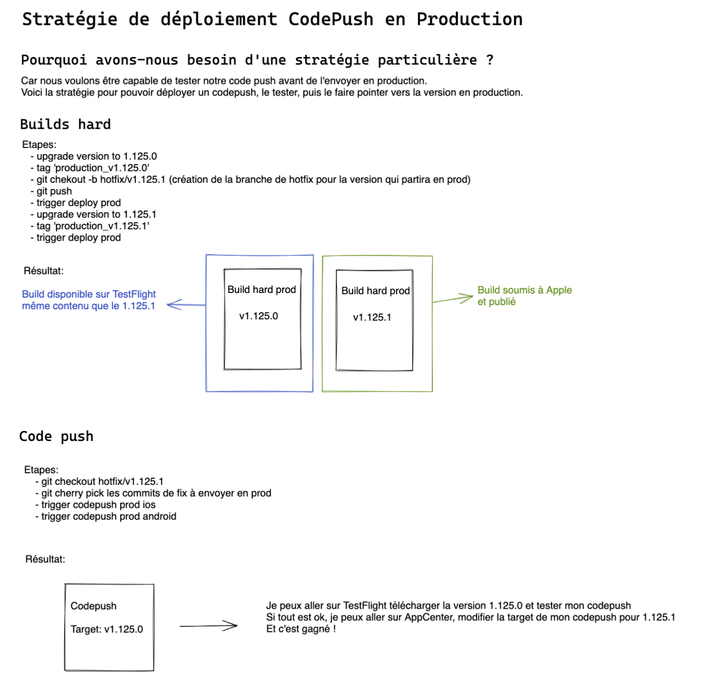

# DEPLOY APP

## Testing & Staging: Deploy to AppCenter

Download the apps:

- hyperurl.co/pc-testing
- hyperurl.co/pc-staging

Or https://appcenter.ms/orgs/pass-Culture/apps/passculture-<ENV:testing|staging>-<PLATFORM:ios|android>

### Soft deploy (Code Push)

Most of the time, on testing, you didn't change anything in the native code. If you changed only javascript code, deploy will be **automatic** on CircleCI (deploy-soft-testing job).
Then the build is faster as only the javascript code is published.

The download and installation of the modification will be automatic when you open the app.

- Troubleshoot:
  If you don't see your changes, try to check if the codepush was well installed. To do so go to "CheatCodes", and click on the "check update" button. If it displays "no update found" you are up to date, otherwise it will donwload the update and tell you to go to AppCenter download last hard version.

### Hard deploy

If I modified native code, I need to hard deploy:

- `yarn trigger:testing:deploy`

#### Deploy to staging

We do it once a week at the end of an iteration.

When you want to deploy the current version of master in staging, you can run the following command:

`yarn trigger:staging:deploy`

## Production: Deploy to App Store / Google Play Store

### Deploy hard

For the moment production deployment is not available on the CD (coming soon), we do it locally.
To deploy to production:

- `yarn upgrade:production:version`

/!\ DO NOT DEPLOY IOS & ANDROID SIMULTANEOUSLY

- Android: `yarn trigger:production:deploy:android`
- IOS: `yarn trigger:production:deploy:ios`

### Deploy CodePush

#### Stratégie

#### How to

/!\ DO NOT DEPLOY CODEPUSH IOS & ANDROID SIMULTANEOUSLY

- `git checkout hotfix/vX.X.X` (X.X.X version currently in production)
- cherry-pick all fix commits
- git push
- wait for the CI to be green
- deploy:

  1. Android: `yarn trigger:production:codepush:android`

  2. When android finished only, IOS: `yarn trigger:production:codepush:ios`
