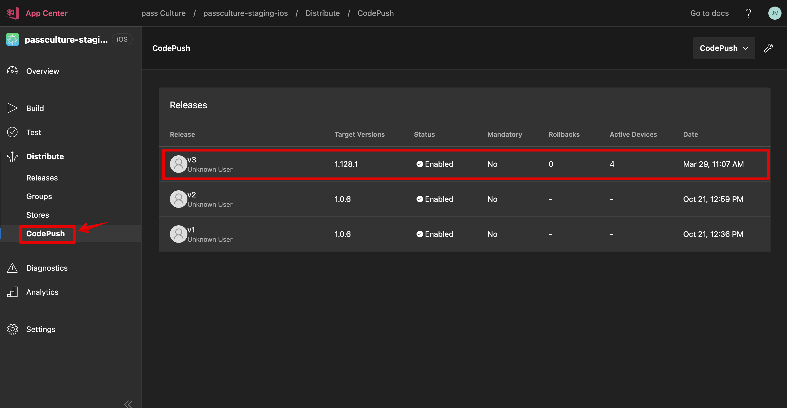

## ⚙️ Deployment process

See [notion documentation][1] for more information.

We use 3 environments for the mobile application: `testing` > `staging` > `production`.

There are two types of deployments: **soft** and **hard**:

- a **soft** deployment is for most of the time, when only the javascript code has changed
- a **hard** deployment is required if the native code has changed:
  - environment variable changed or new
  - new native library
  - new build step
  - ...

### Testing

You can review & download the **testing** apps on Appcenter for [iOS][2] & [Android][3] of using this [url][4].

#### ⚡️ Soft deploy (automatic)

Most of the time, when developing a feature, you probably didn't change the native code: if you changed only javascript code, the deployment to the testing application will be **automatic** on CircleCI (see `deploy-soft-testing` job).

Then the build is faster as only the javascript code is published. The download and installation of the modification will be automatic when you open the app.

##### Troubleshooting

  
I don't see my changes on testing

If you don't see your changes, try to check if the codepush was correctly downloaded. To do so go to "CheatCodes", and click on the "check update" button.

3 possibilities:

- it displays "no update found": you are up-to-date
- it shows "New version available on AppCenter" you need to go to http://hyperurl.co/pc-testing
- it downloads the update and restart the app

#### Hard deploy (manual)

If I modified native code, I need to hard deploy:

- `yarn trigger:testing:deploy:patch`

This will bump the patch number, create a tag `testing/vX.X.X+1` and push it.
CircleCI will detect the tag and launch the lanes `deploy-android-testing-hard` & `deploy-ios-testing-hard` (see `.circleci/config.yml` file).

### Staging (MES)

You can review & download the **staging** apps on AppCenter for [iOS][5] & [Android][6] of using this [url][7].

#### Hard deploy (once a week, manual)

When you want to deploy the current version of `master` in staging, you can run the following commands:

- `yarn trigger:staging:deploy`

This will bump the `minor` version, create a tag `vX.X+1.X` and push it.

- or `trigger:staging:deploy:patch`

This will bump the `patch` version, create a tag `patch/vX.X.X+1` and push it.
CircleCI will detect the tag `patch/vX.X.X` and launch the lanes `deploy-ios-staging-hard` & `deploy-android-staging-hard` (see `.circleci/config.yml` file)

#### Patch staging with additional commits

Pull master to make sure you have all the commits you need to patch.
Checkout the tag you want to start from.

- `git checkout vX.X.X`
- list all commits you want to patch to your tag.
- run `git cherry-pick <commit-hash>` for all commits **in the order they were merged to `master`** to avoid conflicts.
- build and deploy the patch by running the following script: `trigger:staging:deploy:patch`

### Production (MEP)

#### Hard deploy (when MEP wanted, manual)

- Know which version (and then tag) you want to deploy. If you patched a version Staging, it could be `patch/v1.X.Y`

- `yarn trigger:production:deploy <tag>`

This will create a tag `prod-hard-deploy`. CircleCI will detect the tag and launch the lane `deploy-android-production-hard` & `deploy-ios-production-hard` (see `.circleci/config.yml` file)

### Hotfix

#### When

⚠️ Only if there is a bug really urgent in production, that we need to fix very quickly.
If not urgent, it is better to release a new version.

#### How

- List all tags of the version `X.X.X`, tags of type: `vX.X.X-Y` (`git fetch --tag`and then `git tag`)
- Checkout on the tag with the biggest Y (if no tag with Y, checkout on `vX.X.X`)
- Cherry-pick all the commits of the feature `git cherry-pick <commit-hash>`
- ⚠️ do not update package.json version number for a code push (the code push targets only one version)
- check if tests are OK `yarn test`
- `git tag vX.X.X-(Y+1)`
- `git tag hotfix-staging-vX.X.X-(Y+1)`
- `git push origin hotfix-staging-vX.X.X-(Y+1)`: this will deploy it to `staging`
- `git push origin vX.X.X-(Y+1)`
- Validate the fix with the PO on staging app (version X.X.X)
- If it is OK for the PO, deploy it to production:
- `git tag hotfix-production-vX.X.X-(Y+1)`
- `git push origin hotfix-production-vX.X.X-(Y+1)`: this will deploy it to `production`
- ⚠️ check your code push targets the actual production version (one code push targets only one version)
- ⚠️ Do not forget to create a pull request from your branch to `master` to retrieve fixes on master branch

#### Troubleshooting

  
I don't see my CodePush on staging/prod app

  
Check if you can find it on AppCenter. Example for [staging iOS][8].

[1]: https://www.notion.so/passcultureapp/Processus-d-ploiement-MES-MEP-App-Native-bc75cbf31d6146ee88c8c031eb14b655
[2]: https://appcenter.ms/orgs/pass-Culture/apps/passculture-testing-ios
[3]: https://appcenter.ms/orgs/pass-Culture/apps/passculture-testing-android
[4]: hyperurl.co/pc-testing
[5]: https://appcenter.ms/orgs/pass-Culture/apps/passculture-staging-ios
[6]: https://appcenter.ms/orgs/pass-Culture/apps/passculture-staging-android
[7]: hyperurl.co/pc-staging
[8]: https://appcenter.ms/orgs/pass-Culture/apps/PassCulture-staging-ios/distribute/code-push
