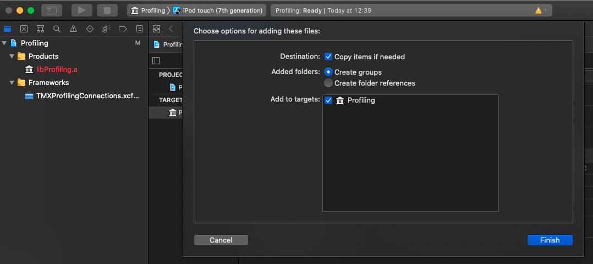
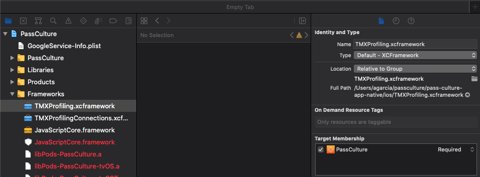

# ThreatMetrix SDK installation

Before integrating the SDK, please get familiar with developing a [native module](https://reactnative.dev/docs/native-modules-intro).

We will install the SDK as a local module or library inside our app. It would probably work just as well with a npm package, but we would have to configue the CI as such. And for the sake of simplicity, we'll just keep it local.

So let's create the module.

### Create the local module

In the following, "Application" = your react native application and "Module" the library created for profiling.
Inside your application, create a directory `packages`. You will create the module inside. You can choose to create the module where you want. For clarity, we'll create it inside `./packages`.

Next install [`create-react-native-module`](https://www.npmjs.com/package/create-react-native-module).

```bash
$ yarn add global react-native-cli
$ yarn global add create-react-native-module
$ create-react-native-module profiling  # This will create the module react-native-profiling
$ cd react-native-profiling && yarn
```

You can choose whichever name for your module. We'll stick with profiling.
Now, the module by default provides us with a native function `sampleMethod`. Let's try to make this works.

### Making the local module work

The code in java for this function can be found in `packages/react-native-profiling/android/src/main/java/com/reactlibrary/ProfilingModule.java` and looks like that:

```java
    @ReactMethod
    public void sampleMethod(String stringArgument, int numberArgument, Callback callback) {
        // TODO: Implement some actually useful functionality
        callback.invoke("Received numberArgument: " + numberArgument + " stringArgument: " + stringArgument);
    }
```

In javascript, we will just call it like that:

```javascript
import { NativeModules } from 'react-native'

const { Profiling } = NativeModules
Profiling.sampleMethod('hello', 23, console.log) // and this will print "Received numberArgument: 23  stringArgument: hello"
```

The equivalent method for iOS will be in `packages/react-native-profiling/ios/Profiling.m`

First, we need to install the module into our application by adding it to the `package.json` as a local module.

```json
    "react-native-profiling": "file:./packages/react-native-profiling",
```

And run

```bash
$ yarn  # to install react-native-profiling
$ cd ios && bundle exec pod install && cd ..  # to install the new pod for iOS
$ yarn start && yarn start --reset-cache  # restart the metro server (due to patched package conflicts)
```

Make sure you can build for iOS and Android. You may need to enable `inlineRequires` in your metro.config.js.

✅ Check: invoke the function `sampleMethod`:

```javascript
import Profiling from 'react-native-profiling'

Profiling.sampleMethod('hello', 23, console.log)
```

### Move to typescript

Let's change the extension of `index.js` into `.ts` and add some types.
When you make a change to the module, you need to bump its version (inside `react-native-profiling/package.json`) and update it from your application:

```bash
$ yarn upgrade react-native-profiling
$ cd ios && bundle exec pod install && cd ..
```

Now our IDE recognises `react-native-profiling` as a typed module 🎉.

So far, we have a working local module, let's adapt the native code so that it does what we want.
We'll start with Android

### Android

First, download the archives `TMXProfiling.aar` and `TMXProfilingConnections.aar` and place them inside `react-native-profiling/android/libs`.
Make sure the `packages/react-native-profiling/android/build.gradle` recognises those archives by adding:

- `flatDir { dirs project( ':react-native-profiling' ).file( 'libs' ) }` to your appplication's `android/build.gradle`,
- `flatDir { dirs 'libs' }` to the repositories section of your module,
- and `implementation(name:'TmxProfiling', ext:'aar')` && `implementation(name:'TmxProfilingConnections', ext:'aar')` to the dependencies section of the module.

Next, remove the `sampleMethod` from `ProfilingModule.java` and replace it by the actual profiling method:

```java
    @ReactMethod
    public void profileDevice(String strDevice, final Callback callback) {
        TMXProfilingConnections tmxConn = new TMXProfilingConnections();
        tmxConn.setConnectionTimeout(30, TimeUnit.SECONDS);
        tmxConn.setRetryTimes(2);
        TMXConfig tmxConfig = new TMXConfig();
        tmxConfig.setContext(this.reactContext)
            .setOrgId("<org_id>")
            .setFPServer("<enhanced-profiling-domain>")
            .setProfilingConnections(tmxConn)
            .setProfileTimeout(30, TimeUnit.SECONDS);

        List<String> m_customMobileList = new ArrayList<String>();
        m_customMobileList.add("React Native TMX libs 6.0");
        TMXProfiling.getInstance().init(tmxConfig);
        TMXProfiling.getInstance().profile((new TMXProfilingOptions()).setCustomAttributes(m_customMobileList), ( new TMXEndNotifier() {
            @Override
            public void complete(TMXProfilingHandle.Result result) {
                System.out.println("Profiling Status: " +result.getStatus() + "  session_id: "+ result.getSessionID());
                callback.invoke(result.getSessionID());
            }
        }));
    }
```

✅ Check: Make sure that you can call `profileDevice` from your Android application:

After bumping the version of the module, upgrading it and rebuilding the project:

```javascript
Profiling.profileDevice('device', (sessionId) => console.log(sessionId)) // This should console.log the session id (ex: 5396838fd816f243bd6262142442e202)
```

### iOS

This part may be tricky, so first make sure that you can build and run the app for iOS with the module but without profiling yet.
Download the SDK `TMXProfiling.xcframework` and `TMXProfilingConnections.xcframework`.
Open the `Profiling.xcodeproj` with Xcode and add those frameworks under "Link Binary with Libraries" ("Profiling" > "Target" > "Build Phases").



To make sure that your xcode build will find those frameworks, add them to your application's framework as well.



Finally adapt the code in `Profiling.m` by replacing the `sampleMethod` with this code:

```objectivec
RCT_EXPORT_METHOD(profileDevice:(NSString *)strDevice callback: (RCTResponseSenderBlock)mycallback)
{
    TMXProfilingConnections *tcn = [[TMXProfilingConnections alloc] init];
    tcn.connectionTimeout = 30;  // Default value is 10 seconds
    tcn.connectionRetryCount = 2;  // Default value is 0 (no retry)

    [[TMXProfiling sharedInstance] configure:@{
        TMXOrgID:@"<org_id>",
        TMXFingerprintServer:@"<enhanced-profiling-domain>",
        TMXProfilingConnectionsInstance:tcn
    }];

    NSArray *customAttributes = @[@"attribute 1", @"attribute 2"];

    TMXProfileHandle *profileHandle = [[TMXProfiling sharedInstance] profileDeviceUsing:@{TMXCustomAttributes : customAttributes} callbackBlock:^(NSDictionary * _Nullable result) {
        TMXStatusCode statusCode = [[result valueForKey:TMXProfileStatus] integerValue];

        NSLog(@"Profile completed with: %s and session ID: %@", statusCode == TMXStatusCodeOk ? "OK"
              : statusCode == TMXStatusCodeNetworkTimeoutError ? "Timed out"
              : statusCode == TMXStatusCodeConnectionError     ? "Connection Error"
              : statusCode == TMXStatusCodeHostNotFoundError   ? "Host not found error"
              : statusCode == TMXStatusCodeInternalError       ? "Internal Error"
              : statusCode == TMXStatusCodeInterruptedError    ? "Interrupted"
              : "other",
              [result valueForKey:TMXSessionID]
        );
    }];

    // Session id can be collected here (to use in API call (AKA session query))
    NSLog(@"Session id is %@", profileHandle.sessionID);
    mycallback(@[profileHandle.sessionID]);
}
```

After bumping the version number of your library, you should be able to build and run your application.

✅ Check: Make sure that you can call `profileDevice` from your iOS application.

### Environment variables

We still have to fill in `<org_id>` and `<enhanced-profiling-domain>` for both iOS and Android.
I had some issues trying to pass the BuildConfig from the env variables to the native module following [react-native-config](https://github.com/bamlab/react-native-config). It worked for iOS but not for Android.
As a result, we will pass those variables as parameters to the function `profileDevice`. Thus we have to change its signature.

For Android:

```java
    public void profileDevice(String orgId, String fpServer, final Callback callback) {
```

and for iOS:

```objectivec
RCT_EXPORT_METHOD(profileDevice:(NSString *)orgId fpServer:(NSString *)fpServer callback:(RCTResponseSenderBlock)mycallback)
```

That means we can now call from our application:

```javascript
Profiling.profileDevice(env.TMX_ORG_ID, env.TMX_FFP_SERVER, (sessionId) => console.log(sessionId))
```
