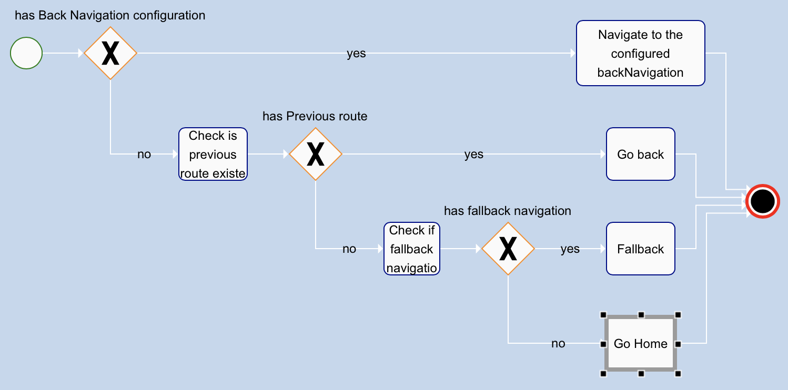

# Back Navigation

## Usage

Let say we went from page A to page B and we want to go back.

But, on going back we want to apply a specific task. That means, we want to go back in A within a context.

To do that, we give relevant informations to the destination page (B) that we will need to get back the previous state of A.

```ts
navigate('PageB', {

  ...pageBParameters,

  backNavigation: {
    from: 'PageA',
    params: {
      // protect against a potential evolution of the current route (PageA) params
      ...params,
      contextualParameter: ...
    },
  },
})
```

Now, in B we just call useBackNavigation:

```tsx
  const complexGoBack = useBackNavigation<'PageB'>()

  return <View onClick={complexGoBack}>
```

## The back navigation function BPMN


