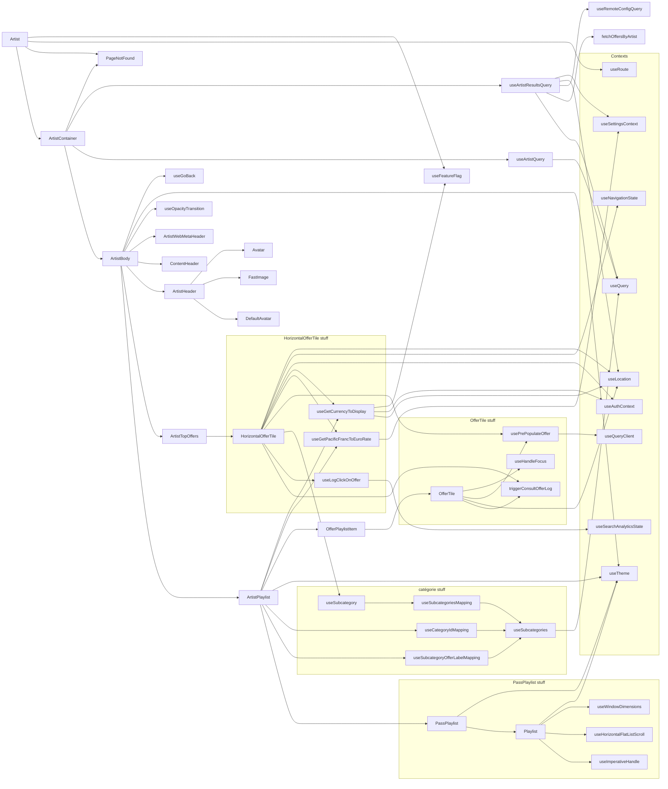

```mermaid
flowchart LR
    %% subgraph "features artist"
        Artist --> useFeatureFlag
        Artist --> useRoute
        Artist --> PageNotFound
        Artist --> ArtistContainer
        ArtistContainer --> PageNotFound
        ArtistContainer --> useArtistResultsQuery
        ArtistContainer --> useArtistQuery --> useQuery
        ArtistContainer --> ArtistBody
        ArtistBody --> useGoBack
        ArtistBody --> useTheme
        ArtistBody --> useOpacityTransition
        ArtistBody --> ArtistWebMetaHeader
        ArtistBody --> ContentHeader
        ArtistBody --> ArtistHeader
        ArtistHeader --> Avatar
        ArtistHeader --> FastImage
        ArtistHeader --> DefaultAvatar
        ArtistBody --> ArtistTopOffers --> HorizontalOfferTile
        ArtistBody --> ArtistPlaylist
        ArtistPlaylist --> OfferPlaylistItem --> OfferTile
        ArtistPlaylist --> useTheme
        ArtistPlaylist --> useGetCurrencyToDisplay
        ArtistPlaylist --> useGetPacificFrancToEuroRate
        ArtistPlaylist --> useCategoryIdMapping
        ArtistPlaylist --> useSubcategoryOfferLabelMapping
        ArtistPlaylist --> PassPlaylist
    %% end
    useArtistResultsQuery --> useSettingsContext
    useArtistResultsQuery --> useLocation
    useArtistResultsQuery --> useRemoteConfigQuery
    useArtistResultsQuery --> fetchOffersByArtist
    useArtistResultsQuery --> useQuery
    useGetCurrencyToDisplay --> useFeatureFlag
    useGetCurrencyToDisplay --> useAuthContext
    useGetCurrencyToDisplay --> useLocation

    subgraph "Contexts"
        %% subgraph "légitime"
            useTheme
            useNavigationState
            useQuery
            useRoute
            useQueryClient
        %% end

        %% subgraph "à supprimer"
            useAuthContext
            useLocation
            useSettingsContext
            useSearchAnalyticsState
        %% end
    end

    subgraph "catégorie stuff"
        useSubcategories --> useQuery
        useSubcategory --> useSubcategoriesMapping --> useSubcategories
        useCategoryIdMapping --> useSubcategories
        useSubcategoryOfferLabelMapping --> useSubcategories
    end

    subgraph "OfferTile stuff"
        OfferTile --> useHandleFocus
        OfferTile --> usePrePopulateOffer
        OfferTile --> useLocation
        OfferTile --> triggerConsultOfferLog
    end

    subgraph "HorizontalOfferTile stuff"
        HorizontalOfferTile --> useLocation
        HorizontalOfferTile --> useNavigationState
        HorizontalOfferTile --> useAuthContext
        HorizontalOfferTile --> useGetCurrencyToDisplay
        HorizontalOfferTile --> useGetPacificFrancToEuroRate --> useSettingsContext
        HorizontalOfferTile --> usePrePopulateOffer --> useQueryClient
        HorizontalOfferTile --> useSubcategory
        HorizontalOfferTile --> useLogClickOnOffer --> useSearchAnalyticsState
        HorizontalOfferTile --> triggerConsultOfferLog
    end

    subgraph "PassPlaylist stuff"
        PassPlaylist --> useTheme
        PassPlaylist --> Playlist
        Playlist --> useTheme
        Playlist --> useWindowDimensions
        Playlist --> useHorizontalFlatListScroll
        Playlist --> useImperativeHandle
    end
```
