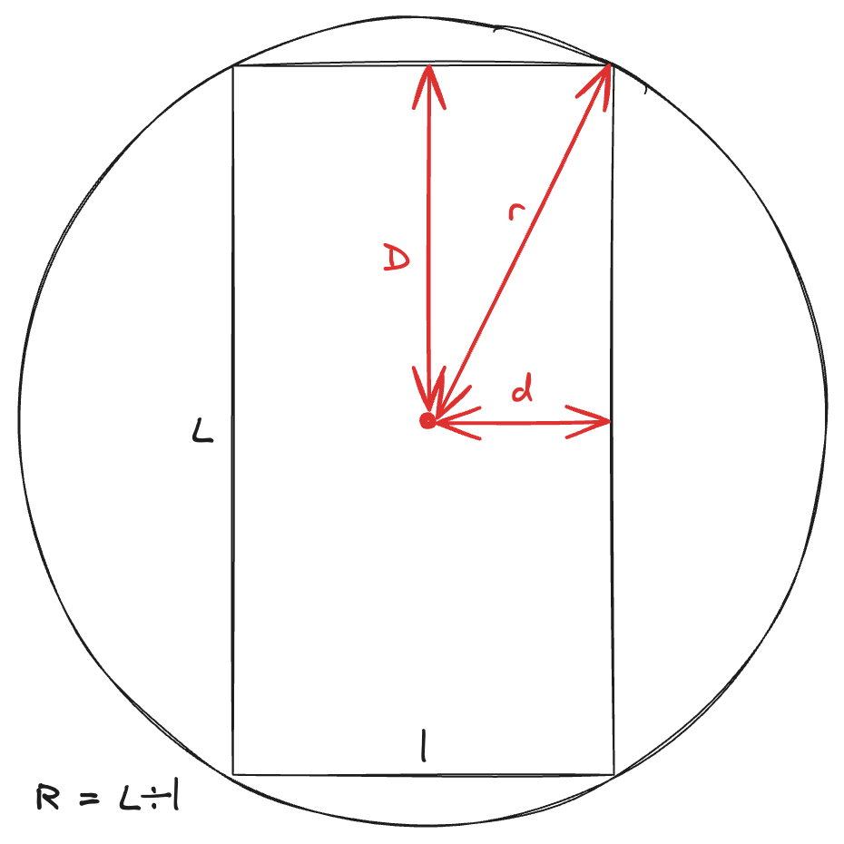

# Calculs liés à la carte des lieux

Soit $r$, le rayon autour duquel on veut récupérer les points. Soit $D$ la distance verticale sur l'écran, et $d$ la distance horizontale. Soit $R$ le ratio de l'écran (vertical / horizontal).

D'après la définition du ratio, on a :

$$
\begin{equation}
R = \frac{D}{d}
\end{equation}
$$

D'après le théorème de Pythagore, on a :

$$
\begin{equation}
r^2 = D^2 + d^2
\end{equation}
$$

Après [simplification](https://www.wolframalpha.com/input?i=solve+%7BR%3DD%2Fd%2C+r%5E2%3DD%5E2%2Bd%5E2%2C+D%2C+d%7D), on obtient :

$$
\begin{equation}
\boxed{d = \frac{r}{\sqrt{R^2 + 1}}}
\end{equation}
$$
$$
\begin{equation}
\boxed{D = \frac{r \times R}{\sqrt{R^2 + 1}}}
\end{equation}
$$

## Démonstration

On a un système de deux équations à deux inconnues.

$$
\begin{cases}
R = \frac{D}{d}\\
r^2 = D^2 + d^2
\end{cases}
$$

On peut isoler $D$ dans l'équation $(1)$ :

$$D = R \times d$$

En remplaçant dans l'équation $(2)$, on obtient :

$$r^2 = (R \times d)^2 + d^2$$
$$r^2 = R^2 \times d^2 + d^2$$
$$r^2 = (R^2 + 1) \times d^2$$

On peut isoler alors $d$ :

$$d^2 = \frac{r^2}{R^2 + 1}$$
$$d = \sqrt{\frac{r^2}{R^2 + 1}}$$

$$
d = \frac{r}{\sqrt{R^2 + 1}}
$$

Et en remplaçant dans l'équation de $D$, on obtient :

$$
D = \frac{r \times R}{\sqrt{R^2 + 1}}
$$
