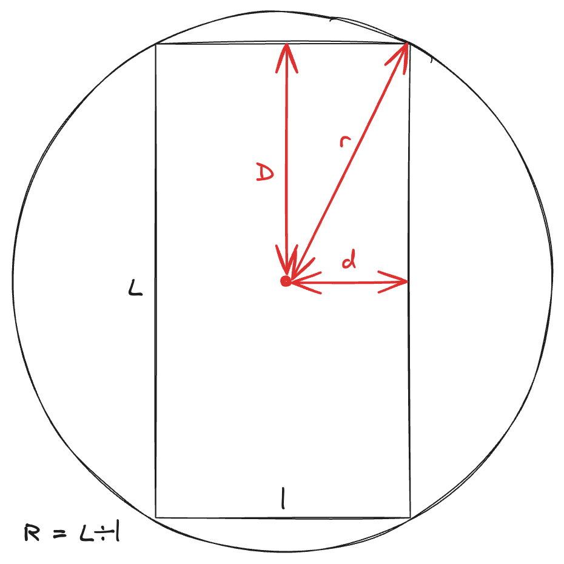

# Calculs liés à la carte des lieux

Soit $r$, le rayon autour duquel on veut récupérer les points. Soit $D$ la distance verticale sur l'écran, et $d$ la distance horizontale. Soit $R$ le ratio de l'écran (vertical / horizontal).

D'après la définition du ratio, on a :

$$
\begin{equation}
R = \frac{D}{d}
\end{equation}
$$

D'après le théorème de Pythagore, on a :

$$
\begin{equation}
r^2 = D^2 + d^2
\end{equation}
$$

On a donc un système de deux équations à deux inconnues. On peut isoler $D$ dans l'équation $(1)$ :

$$D = R \cdot d$$

En remplaçant dans l'équation $(2)$, on obtient :

$$r^2 = (R \cdot d)^2 + d^2$$
$$r^2 = R^2 \cdot d^2 + d^2$$
$$r^2 = (R^2 + 1) \cdot d^2$$

On peut isoler alors $d$ :

$$d^2 = \frac{r^2}{R^2 + 1}$$
$$d = \sqrt{\frac{r^2}{R^2 + 1}}$$

$$
\begin{equation}
d = \frac{r}{\sqrt{R^2 + 1}}
\end{equation}
$$

Et en remplaçant dans l'équation de $D$, on obtient :

$$
\begin{equation}
D = \frac{r \cdot R}{\sqrt{R^2 + 1}}
\end{equation}
$$
