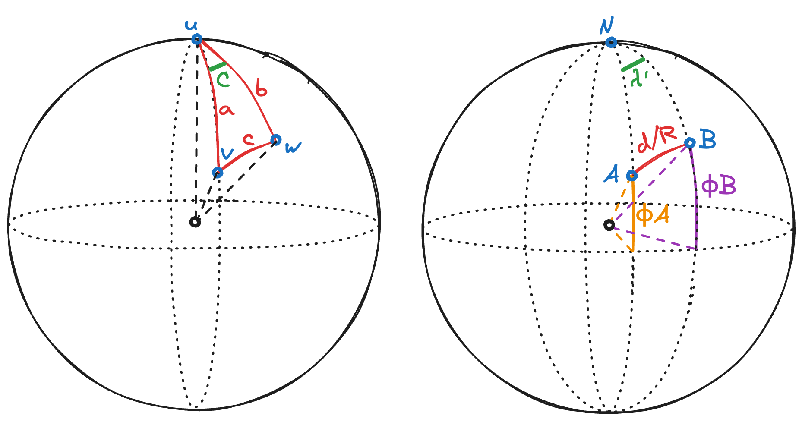

# Calcul de la distance du grand cercle entre deux points

## Formule

Soit deux points $A$ et $B$ de latitudes $\phi_A$, $\phi_B$, et longitudes $\lambda_A$, $\lambda_B$ respectivement. Soit $R$ le rayon de la Terre. La distance du grand cercle $d$ entre ces deux points est donnée par la formule suivante :

$$\begin{equation}
d = R \times \arccos[\sin(\phi_A)\sin(\phi_B) + \cos(\phi_A)\cos(\phi_B)\cos(\lambda_B - \lambda_A)]
\end{equation}$$

## Preuve

Appliquons à notre problème la [loi des cosinus en géométrique sphérique](https://en.wikipedia.org/wiki/Spherical_law_of_cosines) :

$$\begin{equation}
\cos(c) = \cos(a)\cos(b) + \sin(a)\sin(b)\cos(C)
\end{equation}$$

Dans notre cas, prenons $u$ le pôle Nord, $v$ notre point $A$ et $w$ notre point $B$. On a donc :

- $a = 90° - \phi_A$ et $b = 90° - \phi_B$ (la latitude se mesurant par rapport à l'équateur)
- $C = \lambda_B - \lambda_A$ (par définition de la longitude)
- $c$ est l'angle entre $A$ et $B$ par rapport au centre de la Terre, donc $d = c \times R$, donc $c = \frac{d}{R}$

En remplaçant dans $(2)$, on obtient :

$$
\cos(\frac{d}{R}) = \cos(\frac{\pi}{2} - \phi_A)\cos(\frac{\pi}{2} - \phi_B) + \sin(\frac{\pi}{2} - \phi_A)\sin(\frac{\pi}{2} - \phi_B)\cos(\lambda_B - \lambda_A)
$$

D'après les formules de trigonométrie suivantes :

- $\cos(\frac{\pi}{2} - x) = \sin(x)$
- $\sin(\frac{\pi}{2} - x) = \cos(x)$

On obtient :

$$
\cos(\frac{d}{R}) = \sin(\phi_A)\sin(\phi_B) + \cos(\phi_A)\cos(\phi_B)\cos(\lambda_B - \lambda_A)
$$

Enfin, en prenant l'arc cosinus des deux côtés, puis en multipliant par $R$, on obtient bien la formule $(1)$.
